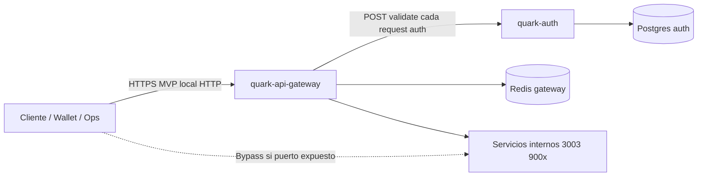

# 2.8 — Threat model de Auth (a chequiar)

**Tarea BA:** Threat model de Auth (STRIDE-lite) · **Estado entrega:** ✓ DONE (jun 2026)  
**Auditoría:** no existía documento formal en el repo; este archivo consolida el modelo de amenazas del subsistema **quark-auth + perímetro gateway** para el MVP, cruzando riesgos con mitigaciones ya implementadas y residuales documentados en 2.3, 2.6 y 2.7.

**Criterio BA (demo):** *Riesgos priorizados con mitigaciones documentadas* — cumplido en formato STRIDE-lite; la revisión formal con seguridad/BA y el hardening pendiente quedan como gaps.

---

## Alcance y activos

### Componentes en alcance

- **quark-auth** (`:3001`): emisión y validación de JWT, API keys, tenants/apps, RBAC en endpoints propios.
- **quark-api-gateway** (`:3000`): `AuthGuard`, proxy a auth, rate limit post-auth, helmet.
- **Persistencia:** Postgres (`apps`, `api_keys`, `revoked_tokens`, `tenants`).
- **Redis (gateway):** cuotas por tenant, no validación de tokens.

### Fuera de alcance (referencia cruzada)

- Wallet, OID4VC directo a issuer/verifier/holder (puertos 900x sin JWT).
- Threat model de KMS/identity-core (épica 6).
- CI/CD y secretos en pipeline (1.2 BACKLOG).

### Activos a proteger

| Activo | Ubicación | Impacto si se compromete |
|--------|-----------|--------------------------|
| `clientSecret` / hash | Postgres `apps` | Emisión de JWT como la app |
| API keys (hash + prefijo) | Postgres `api_keys` | Acceso con scopes de la key |
| `JWT_SECRET` | Env auth | Firma arbitraria de tokens |
| JWT en tránsito | Cliente ↔ gateway | Suplantación de tenant |
| Payload JWT (`tenantId`, `scopes`, `jti`) | Bearer header | Escalada horizontal/vertical |
| Metadatos de tenant/cuota | JWT + validate response | Abuso de cuota o enumeración |

### Límites de confianza

**Supuesto MVP:** tráfico productivo entra por gateway; puertos internos en red cerrada. Si se expone `:3001` o `:900x` sin mTLS, varias mitigaciones del perímetro dejan de aplicar.

---

## Modelo STRIDE-lite

Leyenda: **Mitigado** (controles en código hoy) · **Parcial** · **Abierto** (sin control o solo documental).

### S — Spoofing (suplantación de identidad)

| Amenaza | Vector | Estado | Mitigación actual |
|---------|--------|--------|-------------------|
| S1 — JWT falso | Atacante firma token sin secreto | Mitigado | HMAC con `JWT_SECRET`; `jwt.verify` en validate |
| S2 — Robo de clientSecret | Phishing, logs, repo | Parcial | bcrypt en reposo; seed dev documentado en `auth-gateway-mvp.md` (solo dev) |
| S3 — Robo de API key | Leak en cliente, logs | Parcial | Hash bcrypt; prefijo 16 chars para lookup; revocación `DELETE /keys/:id` |
| S4 — Suplantar tenant en downstream | Headers inventados | Abierto | Gateway no inyecta `X-Tenant-Id` firmado; downstream no valida JWT (ver 2.3) |
| S5 — Caller falso a validate | POST directo a auth:3001 | Parcial | Misma lógica que gateway; sin mTLS entre GW↔auth |

### T — Tampering (alteración)

| Amenaza | Vector | Estado | Mitigación actual |
|---------|--------|--------|-------------------|
| T1 — Alterar claims JWT | Modificar payload | Mitigado | Firma invalida en verify |
| T2 — MITM en token/credenciales | Red no TLS | Abierto | MVP local HTTP; prod debe usar TLS terminado en ingress |
| T3 — Manipular scopes en emisión | Body `scopes` malicioso | Mitigado | `resolveRequestedScopes` filtra a subconjunto de `allowedScopes` |
| T4 — Downgrade auth en ruta | Quitar Bearer en proxy | Mitigado | Rutas `requiresAuth: true` exigen validate exitoso |

### R — Repudiation (repudio)

| Amenaza | Vector | Estado | Mitigación actual |
|---------|--------|--------|-------------------|
| R1 — Negar emisión de token | Sin traza de quién pidió token | Parcial | `x-correlation-id` en gateway; auth no audita cada `issue` a operations |
| R2 — Negar uso de API key | Sin log por keyId | Parcial | Gateway `AuditInterceptor`; no hay ledger en auth por `apiKeyId` |
| R3 — Revocación JWT sin prueba | Tabla `revoked_tokens` vacía | Abierto | Infra de revocación sin writer (2.6 gap) |

### I — Information disclosure (divulgación)

| Amenaza | Vector | Estado | Mitigación actual |
|---------|--------|--------|-------------------|
| I1 — Enumeración de clientId | Respuestas distintas en login | Mitigado | Mensaje genérico `Invalid credentials` |
| I2 — Filtrar existencia de key | Prefijo API key | Parcial | Lookup por prefijo; timing bcrypt |
| I3 — Secret por defecto en prod | `JWT_SECRET` default | Abierto | `change-me-in-production` si falta env (2.7) |
| I4 — Introspect expone contexto | `GET /introspect` | Parcial | Mismo contexto que validate; sin auth extra en endpoint |
| I5 — Credenciales dev en docs | `auth-gateway-mvp.md` | Aceptado | Documentado solo para entorno local |

### D — Denial of service

| Amenaza | Vector | Estado | Mitigación actual |
|---------|--------|--------|-------------------|
| D1 — Fuerza bruta en `/token` | clientSecret / apiKey | Abierto | Sin rate limit en ruta pública `/auth` (2.7) |
| D2 — Agotar auth vía gateway | Cada request → validate HTTP | Parcial | JWT verify barato; coste de red; sin cache 2.5 |
| D3 — bcrypt DoS | Muchos compares en API key | Parcial | Cost 10; sin límite de intentos |
| D4 — Abuso de cuota tenant | Tráfico autenticado masivo | Mitigado | `TenantRateLimitInterceptor` + metadatos en JWT |
| D5 — Payload grande | Body enorme | Mitigado | Gateway 2 MB; auth sin límite propio |

### E — Elevation of privilege

| Amenaza | Vector | Estado | Mitigación actual |
|---------|--------|--------|-------------------|
| E1 — Pedir scopes no permitidos | `scopes` en token request | Mitigado | Filtro `resolveRequestedScopes`; vacío → 401 |
| E2 — Wildcard `*` en allowedScopes | Tenant admin mal configurado | Parcial | `hasScope` admite `*`; depende de seed/ops |
| E3 — Usar JWT válido en ruta admin | Token wallet en `/issuers` | Abierto | Gateway no evalúa scopes (2.3 P1) |
| E4 — Escalar vía optional auth | Token inválido en ruta pública | Parcial | Rutas públicas ignoran fallo validate; no elevan privilegio |
| E5 — Crear tenants sin permiso | `POST /tenants` | Mitigado | `tenants:create` en auth vía `ScopesGuard` |
| E6 — JWT robado vigente hasta exp | Sin revocación activa | Abierto | Sin `POST /revoke` (2.6) |

---

## Riesgos priorizados (top 8)

| Prio | ID | Riesgo | Prob. × impacto | Acción recomendada |
|------|-----|--------|-----------------|-------------------|
| **P0** | E3 | Token válido accede a cualquier ruta protegida del gateway sin chequeo de scope | Alta × Alta | Scopes en `routes.config` + 403 en `AuthGuard` |
| **P0** | D1 | Fuerza bruta en emisión de token | Media × Alta | Rate limit `/v1/auth/*` en gateway |
| **P1** | E6 / R3 | JWT comprometido irreversible hasta `exp` | Media × Alta | `POST /v1/auth/revoke` + opcional Redis 2.5 |
| **P1** | S4 | Bypass de gateway a servicios internos | Baja × Crítica | Red privada + guards o mTLS en 900x/3003 |
| **P1** | I3 | Secreto JWT débil en producción | Baja × Crítica | Fail-fast si secret default en `NODE_ENV=production` |
| **P2** | D2 | Latencia/carga por validate síncrono | Alta × Media | Cache validate (2.5) o JWT local en gateway con JWKS |
| **P2** | T2 | MITM fuera de TLS | Media × Alta | TLS en ingress; HSTS vía helmet |
| **P3** | R1 | Auditoría incompleita de emisión | Media × Baja | Evento `auth.token.issued` a operations |

---

## Controles implementados (resumen)

Lo ya entregado en tareas 2.1–2.7 cubre la mayoría de amenazas **dentro de auth** y del **perímetro HTTP del gateway**:

- **Identidad:** client credentials + API keys; JWT con `iss`/`aud`/`exp`/`jti`.
- **Almacenamiento:** bcrypt en secretos y keys; keys revocables y con `expires_at`.
- **Autorización en auth:** RBAC por scopes en tenants y keys.
- **Perímetro:** auth obligatoria en rutas configuradas; helmet y límites de body en gateway.
- **Abuso:** rate limit por tenant post-autenticación.
- **Trazabilidad:** `x-correlation-id` propagado (1.5).

El hueco sistemático es **autorización en el gateway** (E3) y **protección de la superficie de emisión de credenciales** (D1).

---

## Gaps detectados (a chequiar)

### 1. Sin documento STRIDE en `quark-auth/`

Este archivo vive en `docs/a-chequiar/` del repo padre. Falta enlace desde `quark-auth/README.md` y posible copia/resumen en `docs/` estable (no solo auditoría).

**Cierre sugerido:** sección “Security / Threat model” en README del submodule con link aquí.

### 2. Sin revisión formal firmada

No hay registro de revisión por equipo de seguridad o BA (fecha, versión, aprobador).

**Cierre sugerido:** entrada en `roadmap-cierre-pendientes` o acta breve en `instructions/`.

### 3. Amenazas abiertas ya trazadas en otras tareas

| Gap | Tarea relacionada |
|-----|-------------------|
| RBAC gateway | 2.3 |
| Revocación JWT | 2.6 |
| Rate limit `/token`, helmet auth, CORS | 2.7 |
| Cache validate | 2.5 |
| Bypass puertos internos | 2.3, `deuda-tecnica/funcionalidades-pendientes.md` |

No bloquean el cierre de 2.8 como **modelo documentado**; sí son **residuos de riesgo** aceptados para MVP o a planificar.

### 4. `synchronize: true` en no-producción

TypeORM puede alterar schema en dev; riesgo operativo si se despliega mal configurado.

**Cierre sugerido:** migraciones explícitas y `synchronize: false` en todos los entornos productivos.

### 5. Introspect sin política de exposición

`GET /v1/auth/introspect` devuelve contexto completo con solo Bearer. Útil en dev; en prod conviene restringir red o deshabilitar.

---

## Situación por capa (resumen)

El **threat model MVP** asume **gateway como único punto de entrada** y **auth como autoridad de identidad**. Las amenazas críticas residuales son de **autorización insuficiente en gateway** y **ataques de volumen contra `/token`**, no de ausencia total de controles en auth.

Para producción BA, el paso siguiente natural es cerrar **P0** (scopes en gateway + rate limit en auth) antes de exponer el SCI a Internet.

---

## Prioridad de cierre opcional

**P0 — Implementar** mitigaciones E3 y D1 (alineado con 2.3 y 2.7).

**P1 — Revocación JWT** y enforcement de `JWT_SECRET` en prod.

**P2 — Publicar** threat model en README auth + revisión firmada.

**P3 — Reevaluar** introspect, cache 2.5 y guards en servicios internos si cambia el modelo de despliegue.

---

## Referencias

- [`2.3-verificacion-jwt-rbac.md`](./2.3-verificacion-jwt-rbac.md)
- [`2.6-politica-expiracion-tokens.md`](./2.6-politica-expiracion-tokens.md)
- [`2.7-hardening-autenticacion.md`](./2.7-hardening-autenticacion.md)
- [`2.5-cache-tokens-redis.md`](./2.5-cache-tokens-redis.md)
- [`../auth-gateway-mvp.md`](../auth-gateway-mvp.md)
- `quark-auth/source/src/tokens/tokens.service.ts`
- `quark-auth/source/src/common/auth/scope.utils.ts`
- `quark-api-gateway/source/src/common/guards/auth.guard.ts`
- `quark-api-gateway/source/src/config/routes.config.ts`
