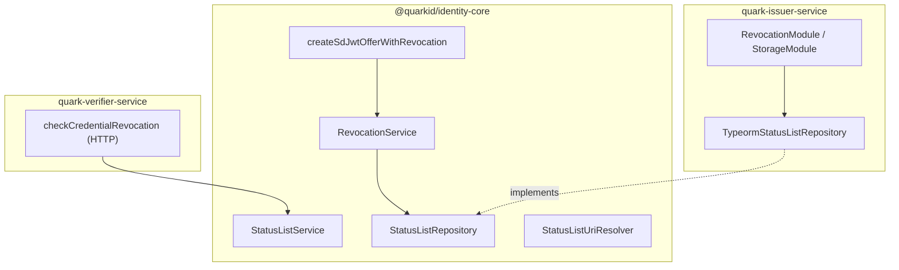

# Fases: Status list storage (revocación TSL)

## Objetivo

Alinear la persistencia de **Token Status List** con el mismo patrón que records: port en `@quarkid/identity-core`, conexión y adapter en el **servicio consumidor** (hoy solo el issuer escribe; verifier y holder solo leen por HTTP).

## Situación actual

```
identity-core
  ├── RevocationService / StatusListService  (lógica)
  └── StatusListRepository              (port; hoy `IStatusListRepository` en código)

quark-issuer-service
  ├── TypeormStatusListRepository            (impl Postgres)
  ├── TypeORM entities (status_lists, status_list_revocations)
  └── RevocationIssuerService                (wrapper Nest + KMS Credo)
```

- La bitstring y auditoría viven en tablas TypeORM separadas de `records` Credo.
- `OpenId4VcService` llama `allocateIndex` fuera del flujo `createSdJwtOffer` del core.
- Verifier/holder no persisten StatusList; consultan JWT por URI.

## Arquitectura objetivo



## Alcance por rol

| Rol | Persistencia | Lectura |
|-----|--------------|---------|
| **Issuer** | Sí (`StatusListRepository`) | Publica JWT firmado (`GET .../status-list/:vct`) |
| **Verifier** | No | Fetch HTTP + decode (`StatusListService`) |
| **Holder** | No | Fetch HTTP opcional (wallet / servicio) |

No se prevé Mongo/SQLite para StatusList en MVP: el modelo es relacional (constraints, contadores, auditoría). PostgreSQL es el backend natural; el port permite otro SQL si hiciera falta.

## Fases

### Fase 1 — Unificar URI y firmar con resolver

**identity-core**

1. Crear `StatusListUriResolver` (sustituye `buildStatusListUri` hardcodeado).
2. `RevocationService` recibe resolver por constructor o config de agente.
3. Implementación issuer: URL HTTP `PUBLIC_BASE_URL/v1/issuers/{walletId}/revocation/status-list/{vct}`.

**Criterio de done**

- `status_list.uri` en credencial = `sub` del JWT de StatusList.

---

### Fase 2 — Inyectar repositorio desde issuer (como records)

**identity-core**

- `RevocationAgentConfig { repository, uriResolver, messaging? }`
- Token DI o parámetro en funciones de alto nivel.

**issuer**

- `StatusListStorageModule` en `source/src/storage/` (junto a `RecordStorageModule`), no bajo `revocation/`.
- `TypeormStatusListRepository` / `PostgresStatusListStorage` registrado en Nest vía ese módulo.
- `RevocationIssuerModule` solo inyecta `STATUS_LIST_STORAGE`.
- Conectar `MessagingService` (hoy `undefined` en `revocation.module.ts`).

**Criterio de done**

- Eventos `credential.revoked` publicados en RabbitMQ.

---

### Fase 3 — Emisión integrada en core

**identity-core**

- `createSdJwtOfferWithRevocation(agent, config, options)`:
  - `allocateIndex` → `createSdJwtOffer` con `status` embebido.

**issuer**

- `OpenId4VcService` reduce a una llamada core.
- `RevocationIssuerService` solo expone endpoints admin (`revoke`, `GET jwt`).

**Criterio de done**

- E2E OID4VCI sin llamar `allocateIndex` manualmente desde Nest.

---

### Fase 4 — Pool compartido con records (opcional)

Un solo `DataSource` / `Pool` Nest para:

- `RecordStorage` (tablas `records`)
- `StatusListRepository` (tablas `status_lists`)

Migraciones versionadas en issuer (sustituir `synchronize` en producción).

**Criterio de done**

- Una URL de DB en issuer para dominio identidad completo (records + keys + status list), con schemas o prefijos claros.

---

### Fase 5 — Verificación en verifier (sin DB)

**identity-core**

- `StatusListVerifierService` (fetch + decode + check índice).
- `getVerificationResultWithRevocationCheck` post-OID4VP.

**verifier**

- Integrar en `GET openid4vc/session/:id`.
- Endpoints `/revocation/*` quedan debug/admin.

**Criterio de done**

- Presentación rechazada o marcada si credencial revocada.

---

### Fase 6 — Holder / wallet (sin DB en holder-service)

**identity-core** (TS para holder-service; Dart para quark-wallet)

- `checkCredentialRevocationStatus(credentialJwt)`.
- UI: badge revocada al listar credenciales.

**Criterio de done**

- Wallet advierte antes de presentar credencial revocada.

---

### Fase 7 — Hardening

- Verificación criptográfica JWT StatusList (`StatusListSignatureError`, `StatusListExpiredError`).
- Transacción allocate + offer (misma DB, dos repos).
- Cache TTL en verifier (Redis opcional, no obligatorio).

## Riesgos

| Riesgo | Mitigación |
|--------|------------|
| Índice asignado sin credencial emitida | Transacción o job de reconciliación |
| URI distinta entre entornos | `StatusListUriResolver` por env |
| Doble persistencia Credo + TypeORM | Mantener separación: Credo solo referencia `{idx,uri}` |

## Referencias

- [01-record-storage-fases.md](./01-record-storage-fases.md)
- [03-kms-storage-fases.md](./03-kms-storage-fases.md)
- `packages/identity-core/src/revocation/`
- `quark-issuer-service/source/src/revocation/`
