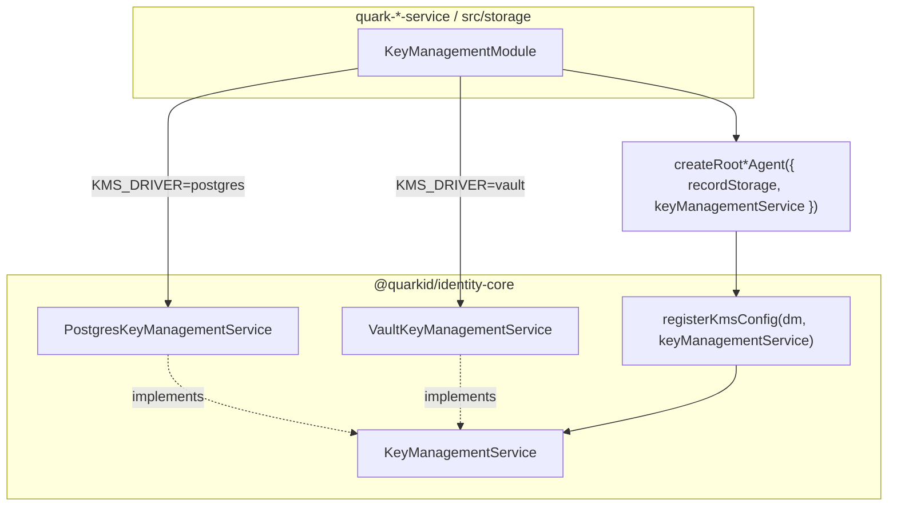

# Fases: KMS (KeyManagementService) — alineado a Record / StatusList

## Objetivo

Tratar el KMS con la **misma arquitectura conjunta** que records y StatusList:

| | Records | StatusList | KMS |
|---|---------|------------|-----|
| Contrato | `RecordStorage` | `StatusListStorage` | `KeyManagementService` |
| Adapter PG | `PostgresRecordStorage(pool)` | `PostgresStatusListStorage(pool)` | `PostgresKeyManagementService(pool, scope)` |
| Otro adapter | Mongo/SQLite (futuro) | — | `VaultKeyManagementService` (prod / compose local) |
| Nest | `src/storage/*-storage.module.ts` | igual | `src/storage/key-management.module.ts` |
| Quién elige backend | Nest (env / factory) | Nest | Nest (`KMS_DRIVER`) — **no** el core |

identity-core **no** bifurca por `mode`. Recibe la instancia ya construida, igual que `registerRecordConfig(dm, recordStorage)`.

## Situación actual (post-inyección Nest)

```
Nest KeyManagementModule (KMS_DRIVER)
  ├── postgres → PostgresKeyManagementService(pool)
  └── vault    → VaultKeyManagementService(addr, token, mount)
       ↓
createRoot*Agent({ recordStorage, keyManagementService })
       ↓
registerKmsConfig(dm, keyManagementService)
buildKeyManagementModule(keyManagementService)
```

`KmsConfig` / `kms.mode` eliminados del bootstrap. El driver lo elige Nest con `KMS_DRIVER` (`postgres` \| `vault`). No hay driver HTTP `external`.

## Arquitectura



### Destino producción: Vault Transit

- Claves no salen de Vault.
- Nest instancia `VaultKeyManagementService(addr, token, mount)`.
- Docker compose local: servicios `vault` + `vault-init` (habilita Transit); issuer/verifier/holder con `KMS_DRIVER=vault`.
- Postgres KMS: alternativa comentada en compose / `.env.example` (dev sin Vault).

## Contrato: `KeyManagementService`

Port Quark exportado desde `@quarkid/identity-core` (mismo rol que `RecordStorage` / `StatusListStorage`): `createKey`, `sign`, `verify`, key agreement, `getPublicKey`, `deleteKey`, `backend`, etc.

Compatible con el backend de Credo-TS (el agente lo registra internamente); en la API Quark el nombre del contrato es siempre **`KeyManagementService`**, no el namespace de Credo.

Un contrato, N adapters — igual que `RecordStorage` + `PostgresRecordStorage`. No inventar `KmsBackend`.

Adapters Quark:

1. **`PostgresKeyManagementService`** — tabla `keys`; constructor `(pool: Pool, walletId/scope)`.
2. **`VaultKeyManagementService`** — Transit; constructor `(baseUrl, token, transitPath?)`.

## Fases (estado)

| Fase | Contenido | Estado |
|------|-----------|--------|
| 0 | Inventario operaciones / paths Vault | Hecho |
| 1 | Port + `Postgres*` / `Vault*` en core | Hecho |
| 2 | `registerKmsConfig` / `buildKeyManagementModule` por inyección | Hecho |
| 3 | Nest `KeyManagementModule` + tokens | Hecho |
| 4 | Vault en factory Nest + compose local | Hecho |
| 5 | Runbook migración Postgres→Vault; domain-key vía mismo port | Pendiente / parcial |

### Nest `KeyManagementModule` (referencia)

En `src/storage/` (junto a record y status-list):

- Token `KEY_MANAGEMENT_SERVICE`.
- Factory: `KMS_DRIVER=postgres|vault`.
- Postgres: pool propio (`POSTGRES_KMS_DATABASE_URL`) o shared con records.
- Vault: `VAULT_ADDR`, `VAULT_TOKEN`, `VAULT_TRANSIT_MOUNT` (default `transit`).
- `AppModule` importa el módulo; `main.ts` pasa la instancia al agent bootstrap.

## Relación con records y status list

| Componente | Nest folder | Port | Notas |
|------------|-------------|------|-------|
| Records | `storage/` | `RecordStorage` | Hecho |
| StatusList | `storage/` | `StatusListStorage` | Hecho (issuer) |
| KMS | `storage/` | `KeyManagementService` | Hecho |
| Revocation domain | `revocation/` | consume StatusList + agent.kms | Sin pools; módulo plano en core |

Misma instancia Postgres en dev OK (ports distintos). Vault = proceso aparte.

## Riesgos

| Riesgo | Mitigación |
|--------|------------|
| Latencia Vault | HA Transit; timeouts + ready probe |
| Frankenstein de nombres (`KmsBackend`) | Prohibido en docs/código nuevo |
| Domain-key con Pool propio | Unificar al service inyectado (aún Postgres-only) |
| `importKey` en Vault | No implementado; generar con `createKey` |

## Referencias

- Plan de implementación: `.claude/ai-work-flow-registry/plans/QUARK-PENDING-kms-storage-inyeccion_2026-08-04_10-43-37.md`
- Records: `packages/identity-core/src/record/`
- StatusList: `packages/identity-core/src/revocation/` (`status-list-storage.interface.ts`, `postgres-status-list.storage.ts`)
- Nest: `quark-issuer-service/source/src/storage/`
- [01-record-storage-fases.md](./01-record-storage-fases.md)
- [02-status-list-storage-fases.md](./02-status-list-storage-fases.md)
- [Referencia KMS](../../packages/identity-core/docs/06-reference/02-kms.md)
