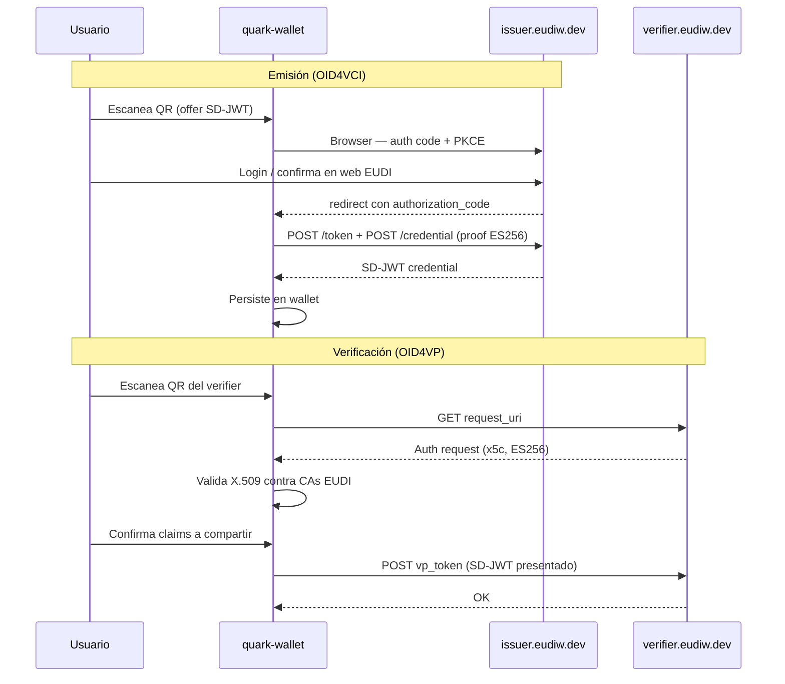

# quark-wallet — Compatibilidad con issuer y verifier EUDI

Documento general: objetivo, contexto, decisión de arquitectura y plan de trabajo para que **quark-wallet** (holder mobile) interoperé con la infraestructura de referencia europea (`issuer.eudiw.dev` / `verifier.eudiw.dev`).

---

## Objetivo

Permitir que un usuario con **quark-wallet**:

1. **Reciba credenciales** emitidas por el issuer de referencia EUDI (OID4VCI, formato SD-JWT, firma ES256).
2. **Presente credenciales** ante el verifier de referencia EUDI (OID4VP, autenticación del verifier vía X.509).

Referencias públicas:

| Servicio | URL |
|---|---|
| Issuer (UI + metadata) | `https://issuer.eudiw.dev` |
| Verifier (UI) | `https://verifier.eudiw.dev/home` |
| Metadata OID4VCI | `https://issuer.eudiw.dev/.well-known/openid-credential-issuer` |

Repos de referencia (clonados en `local/repos-externos/`):

- `eudi-srv-web-issuing-eudiw-py` — issuer
- `eudi-srv-verifier-endpoint` / `eudi-web-verifier` — verifier
- `eudi-app-android-wallet-ui` — wallet Android de referencia (análisis de trust)

---

## Dirección del flujo

Este documento cubre:

```
quark-wallet  →  EUDI Issuer / EUDI Verifier
```

El camino inverso (EUDI Wallet como holder, servicios Quark como issuer/verifier) está documentado aparte — ver sección [Verificación E2E](#verificación-e2e-qué-está-probado).

Ver [eudi-referencia-issuer-verifier.md](./eudi-referencia-issuer-verifier.md) y [quark-verifier-x5c.md](./quark-verifier-x5c.md) para el setup del verifier Quark (x5c + CA).

---

## Verificación E2E: qué está probado

Matriz de interoperabilidad real (no hipótesis de protocolo):

| Flujo | Estado | Notas |
|---|---|---|
| EUDI Wallet → `quark-issuer-service` (OID4VCI) | **Verificado** | Emisión SD-JWT ES256 |
| EUDI Wallet → `quark-verifier-service` (OID4VP) | **Verificado** | Requiere verifier en modo x5c + CA Quark en trust store de la EUDI Wallet |
| `quark-wallet` → `issuer.eudiw.dev` (OID4VCI) | **No verificado** | Brechas: auth code, posible attestation |
| `quark-wallet` → `verifier.eudiw.dev` (OID4VP) | **No verificado** | Brecha: `TrustConfig` no inyectado |

**Este documento y sus anexos cubren solo las filas pendientes** (`quark-wallet` como holder frente a infra EUDI). El ecosistema Quark como issuer/verifier frente a EUDI Wallet **ya funciona** en emisión y verificación.

---

## ¿Se puede usar la infra pública EUDI o hay que self-hostear?

### Respuesta corta

**Sí, se puede usar la infra pública de referencia** (`issuer.eudiw.dev` / `verifier.eudiw.dev`) **sin levantar issuer/verifier propios** para empezar a probar interoperabilidad.

**Self-hostear** los repos EUDI solo es necesario si:

- Se necesita control total del flujo (por ejemplo, forzar `pre-authorized_code` en lugar de `authorization_code`).
- Se quiere un entorno aislado (CI/CD sin dependencia de internet).
- Se trabaja el camino inverso: que la **EUDI Android Wallet** confíe en un **issuer/verifier Quark** (ahí sí hay allowlist y trust store hardcodeados en la wallet EUDI).

Ver [eudi-trusted-list-analisis.md](./eudi-trusted-list-analisis.md).

### Qué significa "prod" en EUDI

| Entorno | Rol |
|---|---|
| `issuer.eudiw.dev` / `verifier.eudiw.dev` | Implementación de **referencia** de la Comisión Europea — piso de interoperabilidad para pruebas |
| `dev.*-backend.eudiw.dev` | Backends alternativos (a veces con autenticación adicional) |
| Wallets nacionales eIDAS (futuro) | Producción real por país — LOTL/TSL/IACA (no implementado en la wallet de referencia actual) |

No son wallets ciudadanas en producción nacional; son el estándar técnico contra el que conviene validar quark-wallet.

---

## Restricciones según quién es el holder

| Restricción | EUDI Android Wallet (holder) | quark-wallet (holder) |
|---|---|---|
| Allowlist de URLs de issuers | Sí — hardcodeada por build flavor | **No** — acepta cualquier offer del QR |
| Trust store de verifiers (X.509) | Sí — CAs en `res/raw/*.pem` | Configurable vía `TrustConfig` (hoy no inyectado) |
| LOTL/TSL dinámico | No implementado | No implementado (MVP) |

**Conclusión:** quark-wallet no necesita estar en una "trusted list" de emisores para recibir credenciales EUDI. Sí necesita configurar confianza del **verificador** para OID4VP.

---

## Estado actual

### Lo que ya existe

| Componente | Estado |
|---|---|
| `identity-core-dart` — OID4VCI (pre-auth, tx_code, auth code API) | Implementado |
| `identity-core-dart` — OID4VP (resolve + share) | Implementado |
| `identity-core-dart` — SD-JWT VC (`dc+sd-jwt`) | Implementado |
| `identity-core-dart` — Claves ES256 / P-256 | Implementado |
| `identity-core-dart` — `TrustConfig` (X.509 + EUDI RP) | Implementado (MVP) |
| `quark-wallet` — Flujo OID4VCI UI (pre-auth) | Implementado |
| `quark-wallet` — Flujo OID4VP UI | Implementado |
| `quark-wallet` — `TrustConfig` inyectado | **Implementado** (CAs EUDI en assets) |
| `quark-wallet` — Flujo `authorization_code` (browser + PKCE) | **Implementado** (WebView + `prepareAuthCodeFlow`) |
| `identity-core-dart` — mDoc (`mso_mdoc`) | Fuera de scope |
| `identity-core-dart` — `attest_jwt_client_auth` | No implementado |

### Código relevante hoy

`quark-wallet` abre sesión sin trust:

```dart
// quark-wallet/lib/core/providers/wallet_notifier.dart
final session = await _service.create(
  walletId: kWalletId,
  pin: pin,
  directory: _directory,
);
```

OID4VCI solo usa pre-authorized:

```dart
// quark-wallet/lib/features/protocol_flows/oid4vci/providers/oid4vci_provider.dart
final result = await session.openid4vci.acquireCredentials(
  resolvedOffer: offer,
  txCode: txCode,
);
```

---

## Brechas a cerrar (dos frentes)

### Frente 1 — Verificación (OID4VP + TrustConfig)

El verifier EUDI firma el authorization request con **certificado X.509** (`x5c`), no con `did:`. quark-wallet debe inyectar los certificados raíz EUDI en `TrustConfig.trustedRootCertificates`.

**Documento detallado:** [quark-wallet-eudi-oid4vp-trust-config.md](./quark-wallet-eudi-oid4vp-trust-config.md)

| Área | Esfuerzo estimado |
|---|---|
| SDK: exponer `TrustConfig` en `WalletService` | 0.5–1 día |
| quark-wallet: assets PEM + wiring | 1–2 días |
| Test E2E presentación | 0.5 día |

### Frente 2 — Emisión (OID4VCI + authorization code)

El issuer EUDI (`issuer.eudiw.dev`) genera offers con flujo **authorization code** + PKCE. quark-wallet debe abrir browser, capturar redirect y llamar `acquireCredentialsWithAuthCode`.

**Documento detallado:** [quark-wallet-eudi-oid4vci-auth-code.md](./quark-wallet-eudi-oid4vci-auth-code.md)

| Área | Esfuerzo estimado |
|---|---|
| Detección de `Oid4VciFlow.authCode` + UI browser | 2–4 días |
| Deep link / intent filter (Android + iOS) | 0.5 día |
| Test E2E emisión SD-JWT | 0.5 día |

### Riesgo adicional — Client attestation

El token endpoint EUDI anuncia `attest_jwt_client_auth`. Si el issuer **exige** attestation (no solo la acepta como opción), el flujo fallará en `POST /token` aunque el auth code esté implementado.

Ver [attestation-based-detalle.md](./attestation-based-detalle.md). Estimación si hace falta: 3–5 días adicionales en `identity-core-dart`.

---

## Estimación total

| Trabajo | Días dev | Bloqueante |
|---|---|---|
| TrustConfig + CAs EUDI (OID4VP) | 1–2 | Sí para VP |
| Auth code + browser (OID4VCI) | 2–4 | Sí para VCI |
| Test E2E contra eudiw.dev | 1 | — |
| Client attestation (si aplica) | 3–5 | Tal vez |
| **Total (sin attestation)** | **~4–7 días** | |

---

## Flujo E2E objetivo



---

## Restricciones de credenciales

El issuer EUDI ofrece dos familias de formato:

| Formato | Ejemplos | quark-wallet |
|---|---|---|
| `dc+sd-jwt` | PID SD-JWT, diploma, IBAN, tax | **Soportado** |
| `mso_mdoc` | PID mDoc, mDL, COR | **No soportado** (Fase 4 SDK) |

Para interoperar con `issuer.eudiw.dev`, elegir credenciales **SD-JWT** en la UI del issuer.

---

## Orden de implementación recomendado

1. **TrustConfig + OID4VP** — bloque más chico; permite validar presentación si ya hay una credencial SD-JWT (emitida por otro medio o tras completar el frente 2).
2. **Auth code + OID4VCI** — desbloquea emisión directa desde `issuer.eudiw.dev`.
3. **Test E2E** — emitir `eu.europa.ec.eudi.pid_vc_sd_jwt` → presentar en `verifier.eudiw.dev`.
4. **Attestation** — solo si el paso 2 falla en token por política del issuer.

---

## Qué NO implica este trabajo

- Levantar `eudi-srv-web-issuing-eudiw-py` ni verifier propios (opcional, no obligatorio).
- Modificar ni recompilar la EUDI Android Wallet.
- Implementar LOTL/TSL/IACA dinámico.
- Cambios en `quark-issuer-service` ni `quark-verifier-service`.
- Soporte mDoc en esta iteración.

---

## Documentos relacionados

| Documento | Contenido |
|---|---|
| [quark-wallet-eudi-oid4vp-trust-config.md](./quark-wallet-eudi-oid4vp-trust-config.md) | Detalle OID4VP + TrustConfig + CAs EUDI |
| [quark-wallet-eudi-oid4vci-auth-code.md](./quark-wallet-eudi-oid4vci-auth-code.md) | Detalle OID4VCI + authorization code + PKCE |
| [eudi-referencia-issuer-verifier.md](./eudi-referencia-issuer-verifier.md) | Metadata y protocolo del issuer/verifier EUDI |
| [eudi-trusted-list-analisis.md](./eudi-trusted-list-analisis.md) | Restricciones de la EUDI Android Wallet |
| [attestation-based-detalle.md](./attestation-based-detalle.md) | Client attestation en OID4VCI |
| [packages/identity-core-dart/docs/05-reference/05-trust.md](../../packages/identity-core-dart/docs/05-reference/05-trust.md) | API `TrustConfig` del SDK |
| [packages/identity-core-dart/docs/07-limitations.md](../../packages/identity-core-dart/docs/07-limitations.md) | Limitaciones conocidas (X.509 MVP, EUDI RP MVP) |
| [docs/plan-verificacion-eudi-wallet.md](../plan-verificacion-eudi-wallet.md) | Plan histórico Fase 1 (Quark verifier) / Fase 2 (quark-wallet) |

---

*Última actualización: junio 2026*
