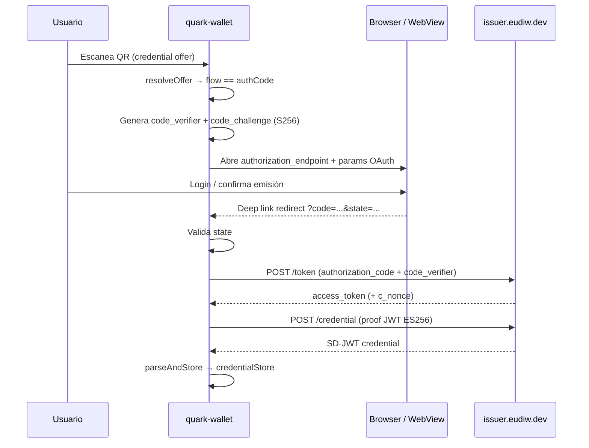

# quark-wallet — OID4VCI y authorization code contra issuer EUDI

Documento detallado del **Frente 2**: recibir credenciales SD-JWT desde el issuer de referencia EUDI (`issuer.eudiw.dev`) usando el flujo **authorization code** con PKCE.

**Documento general:** [quark-wallet-compatibilidad-eudi-overview.md](./quark-wallet-compatibilidad-eudi-overview.md)

---

## Problema

### Qué flujo usa el issuer EUDI

El issuer de referencia europeo (`issuer.eudiw.dev`) expone metadata OAuth con:

- `grant_types_supported`: incluye `authorization_code` (no lista `urn:ietf:params:oauth:grant-type:pre-authorized_code` en el authorization server metadata).
- `token_endpoint_auth_methods_supported`: `public`, `attest_jwt_client_auth`.
- `code_challenge_methods_supported`: `S256` (PKCE obligatorio en la práctica).

La UI web del issuer genera credential offers que requieren que el usuario:

1. Escanee el QR con la wallet.
2. Sea redirigido al **authorization endpoint** del issuer (login / confirmación en browser).
3. Complete el flujo OAuth y reciba un `authorization_code` vía redirect.
4. La wallet intercambie el code por `access_token` y solicite la credencial con proof ES256.

### Qué hace quark-wallet hoy

`Oid4VciNotifier.accept()` solo llama:

```dart
await session.openid4vci.acquireCredentials(
  resolvedOffer: offer,
  txCode: txCode,
);
```

Eso implementa únicamente:

- `Oid4VciFlow.preAuth` — pre-authorized code sin tx_code.
- `Oid4VciFlow.preAuthWithTxCode` — pre-authorized code con PIN de transacción.

**No maneja `Oid4VciFlow.authCode`.** Si el offer del issuer EUDI es authorization code, el flujo falla con `StateError` o error equivalente al intentar `acquireCredentials` sin grant pre-authorized.

### Qué ya tiene el SDK

`identity-core-dart` expone `acquireCredentialsWithAuthCode()` con la API documentada en [02-oid4vci.md](../../packages/identity-core-dart/docs/04-flows/02-oid4vci.md).

**Responsabilidad de la app (quark-wallet):**

- Generar par PKCE (`code_verifier`, `code_challenge`).
- Abrir browser en el `authorization_endpoint`.
- Capturar redirect con `code`.
- Llamar al SDK con `authorizationCode`, `codeVerifier`, `redirectUri`, `clientId` (opcional).

El SDK **no** abre browser ni genera PKCE.

---

## Solución objetivo



---

## Detección del flujo en el offer

Tras `resolveOffer` o `invitation.resolve`, inspeccionar:

```dart
final offer = ...; // ResolvedCredentialOffer

switch (offer.flow) {
  case Oid4VciFlow.preAuth:
  case Oid4VciFlow.preAuthWithTxCode:
    // flujo actual — acquireCredentials
    break;
  case Oid4VciFlow.authCode:
    // nuevo flujo — browser + acquireCredentialsWithAuthCode
    break;
}
```

**Punto de bifurcación recomendado:** `Oid4VciNotifier.accept()` o un estado intermedio `Oid4VciAuthCodeState` antes de adquirir credenciales.

---

## Cambios en quark-wallet

### 1. Estados del flujo OID4VCI

Agregar estados al sealed class en `oid4vci_provider.dart`:

| Estado | Cuándo |
|---|---|
| `Oid4VciAuthCodeBrowserState` | Offer es `authCode`; se muestra WebView o se lanza browser externo |
| `Oid4VciAuthCodeWaitingState` | Esperando redirect (opcional, si browser externo) |

Flujo de pantallas:

```
VerifyIssuerSlide → PreviewSlide → [AuthCodeBrowserSlide] → Acquiring → Success
```

Para `preAuth` / `preAuthWithTxCode`, el camino actual no cambia.

---

### 2. PKCE — generación

La app debe generar antes de abrir el authorization endpoint:

```dart
import 'dart:convert';
import 'dart:math';
import 'package:crypto/crypto.dart';

String generateCodeVerifier() {
  final random = Random.secure();
  final bytes = List<int>.generate(32, (_) => random.nextInt(256));
  return base64Url.encode(bytes).replaceAll('=', '');
}

String computeCodeChallenge(String verifier) {
  final digest = sha256.convert(utf8.encode(verifier));
  return base64Url.encode(digest.bytes).replaceAll('=', '');
}
```

Guardar `codeVerifier` en memoria del notifier (o estado seguro de sesión) hasta completar el token exchange. **No persistir** en disco.

Generar también `state` aleatorio para CSRF y validarlo en el redirect.

---

### 3. Construcción de la authorization URL

Parámetros típicos (derivados del `ResolvedCredentialOffer` y metadata del issuer):

| Parámetro | Origen |
|---|---|
| `response_type` | `code` |
| `client_id` | Del offer o metadata; puede ser vacío en flujo public |
| `redirect_uri` | URI registrado en la app (deep link) |
| `scope` | `openid` + credential scopes del offer |
| `state` | Generado por la app |
| `code_challenge` | S256 del verifier |
| `code_challenge_method` | `S256` |
| `authorization_details` | Si el offer lo incluye (OID4VCI) |

El SDK puede exponer helpers para armar la URL; si no, construir desde `offer.authorizationServerMetadata` y campos del offer resuelto.

**Endpoint base:** `https://issuer.eudiw.dev/oidc/authorization` (ver metadata OAuth del issuer).

---

### 4. Browser / WebView

Dos opciones:

| Opción | Pros | Contras |
|---|---|---|
| `webview_flutter` in-app | Control del redirect; UX integrada | Manejo de cookies, SSL pinning |
| `url_launcher` + deep link | Más simple; usa browser del sistema | Usuario sale de la app |

**Recomendación para MVP:** WebView in-app con interceptación de navegación al `redirect_uri`:

```dart
NavigationDelegate(
  onNavigationRequest: (request) {
    if (request.url.startsWith(redirectUri)) {
      final uri = Uri.parse(request.url);
      final code = uri.queryParameters['code'];
      final state = uri.queryParameters['state'];
      // validar state, llamar acquireCredentialsWithAuthCode
      return NavigationDecision.prevent;
    }
    return NavigationDecision.navigate;
  },
)
```

---

### 5. Deep link / redirect URI

Definir un scheme exclusivo de la app, por ejemplo:

```
com.quarkid.wallet://oid4vci/callback
```

#### Android (`AndroidManifest.xml`)

```xml
<intent-filter>
  <action android:name="android.intent.action.VIEW" />
  <category android:name="android.intent.category.DEFAULT" />
  <category android:name="android.intent.category.BROWSABLE" />
  <data
    android:scheme="com.quarkid.wallet"
    android:host="oid4vci"
    android:path="/callback" />
</intent-filter>
```

#### iOS (`Info.plist`)

```xml
<key>CFBundleURLTypes</key>
<array>
  <dict>
    <key>CFBundleURLSchemes</key>
    <array>
      <string>com.quarkid.wallet</string>
    </array>
  </dict>
</array>
```

Si se usa solo WebView in-app, el deep link puede no ser necesario (el WebView intercepta el redirect). Mantener deep link como fallback para browser externo.

---

### 6. Llamada al SDK tras el redirect

```dart
final result = await session.openid4vci.acquireCredentialsWithAuthCode(
  resolvedOffer: offer,
  authorizationCode: code,
  codeVerifier: savedCodeVerifier,
  redirectUri: 'com.quarkid.wallet://oid4vci/callback',
  clientId: offer.clientId, // si el issuer lo requiere
);
```

Post-proceso igual al flujo actual: enriquecer credenciales con metadata del offer (`CredentialUiMapper`) y transicionar a `Oid4VciSuccessState`.

---

### 7. Archivos a crear o modificar

| Archivo | Cambio |
|---|---|
| `lib/features/protocol_flows/oid4vci/providers/oid4vci_provider.dart` | Bifurcación `authCode`, PKCE, llamada `acquireCredentialsWithAuthCode` |
| `lib/features/protocol_flows/oid4vci/slides/auth_code_browser_slide.dart` | Nueva pantalla WebView (o launcher) |
| `lib/features/protocol_flows/oid4vci/oid4vci_flow_screen.dart` | Mapear nuevo estado en `switch` |
| `lib/core/oauth/pkce.dart` | Helpers `generateCodeVerifier` / `computeCodeChallenge` |
| `pubspec.yaml` | Dependencia `webview_flutter` y/o `url_launcher`, `crypto` |
| `android/app/src/main/AndroidManifest.xml` | Intent filter (si deep link) |
| `ios/Runner/Info.plist` | URL scheme (si deep link) |

---

## Credenciales soportadas del issuer EUDI

Elegir en la UI del issuer solo formatos **`dc+sd-jwt`**:

| Configuration ID | Formato | quark-wallet |
|---|---|---|
| `eu.europa.ec.eudi.pid_vc_sd_jwt` | SD-JWT PID | Sí |
| `eu.europa.ec.eudi.diploma_vc_sd_jwt` | SD-JWT diploma | Sí |
| `eu.europa.ec.eudi.iban_sd_jwt_vc` | SD-JWT IBAN | Sí |
| `eu.europa.ec.eudi.pid_mdoc` | mDoc | **No** |
| `eu.europa.ec.eudi.mdl_mdoc` | mDoc mDL | **No** |

El proof del holder debe ser **ES256** (P-256). El SDK negocia esto según `proof_signing_alg_values_supported` del issuer.

---

## Riesgo: client attestation

### Qué es

El authorization server EUDI anuncia `token_endpoint_auth_methods_supported: ["public", "attest_jwt_client_auth"]`.

- **`public`:** el cliente puede obtener token sin attestation (suficiente para MVP si el issuer lo permite).
- **`attest_jwt_client_auth`:** el cliente debe presentar JWT de attestation del dispositivo/app.

### Cómo detectar si bloquea

Tras implementar auth code, si `POST /token` retorna:

```json
{ "error": "invalid_client", "error_description": "...attestation..." }
```

o la wallet EUDI de referencia exige attestation en el mismo offer, hay que implementar client attestation en `identity-core-dart`.

Ver [attestation-based-detalle.md](./attestation-based-detalle.md).

### Trabajo adicional si aplica

| Tarea | Días estimados |
|---|---|
| Generación de client attestation JWT (Android Keystore / iOS) | 2–3 |
| Integración en `Oid4VciService` token request | 1–2 |
| Tests contra issuer EUDI | 1 |
| **Total attestation** | **3–5** |

**No incluir en el MVP** hasta confirmar fallo en token.

---

## Alternativa: self-host issuer con pre-authorized code

Si auth code + browser resulta demasiado costoso para una demo rápida:

1. Levantar `eudi-srv-web-issuing-eudiw-py` desde `local/repos-externos`.
2. Configurar offers con grant `pre-authorized_code`.
3. quark-wallet usa el flujo actual (`acquireCredentials`) sin cambios.

**Trade-off:** no valida interoperabilidad contra `issuer.eudiw.dev` público; sí desbloquea demos internas.

---

## Plan de prueba

### Prerrequisitos

- quark-wallet con flujo auth code implementado.
- Dispositivo con HTTPS a `issuer.eudiw.dev`.

### Pasos

1. Abrir `https://issuer.eudiw.dev` en desktop.
2. Seleccionar credencial **SD-JWT** (ej. PID SD-JWT).
3. Generar QR de credential offer.
4. Escanear con quark-wallet.
5. Confirmar issuer en `VerifyIssuerSlide` → `PreviewSlide`.
6. Completar login en browser/WebView del issuer.
7. Verificar redirect capturado y transición a `Acquiring`.
8. Verificar credencial en home de quark-wallet (card con metadata del issuer).
9. (Opcional) Presentar en `verifier.eudiw.dev` — requiere Frente 1 (TrustConfig).

### Criterios de aceptación

- [ ] Offers con `Oid4VciFlow.authCode` no fallan con `StateError` de pre-auth.
- [ ] PKCE S256 aceptado por issuer (`POST /token` 200).
- [ ] Proof ES256 aceptado (`POST /credential` 200).
- [ ] SD-JWT persistido y visible en UI.
- [ ] Errores de usuario (canceló browser, state inválido) muestran mensaje claro.

### Errores frecuentes

| Síntoma | Causa probable |
|---|---|
| `StateError` pre-authorized | No se bifurcó a `authCode` |
| `invalid_grant` en token | `code_verifier` no coincide con challenge; code expirado |
| `redirect_uri_mismatch` | URI distinta entre auth request y token request |
| Error en credential | Proof no ES256; formato mDoc pedido |
| Token 401 / invalid_client | Attestation requerida |
| TLS error en dev | Cert no confiable (usar dispositivo real, no proxy mal configurado) |

---

## Checklist de implementación

- [x] Detectar `Oid4VciFlow.authCode` en notifier
- [x] Helpers PKCE (`code_verifier`, `code_challenge`, `state`) — en `identity-core-dart`
- [x] Pantalla WebView (`AuthCodeBrowserSlide`)
- [x] `acquireCredentialsWithAuthCode` integrado
- [x] Enriquecimiento metadata OAuth AS cuando falta `token_endpoint` (issuer EUDI)
- [ ] Deep link Android/iOS en manifest (opcional; WebView intercepta redirect)
- [ ] Test E2E: emitir PID SD-JWT desde `issuer.eudiw.dev`
- [ ] Documentar si attestation es necesaria (resultado del test token)

---

## Estimación

| Tarea | Días |
|---|---|
| PKCE + bifurcación notifier | 0.5–1 |
| WebView / browser slide | 1–2 |
| Deep link + plataforma | 0.5 |
| Integración SDK + enriquecimiento UI | 0.5–1 |
| Test E2E + fixes | 0.5–1 |
| **Total (sin attestation)** | **3–5** |

---

## Comparación de flujos OID4VCI en quark-wallet

| Flujo | Grant OAuth | UI extra | Issuer EUDI público |
|---|---|---|---|
| `preAuth` | `pre-authorized_code` | Ninguna | No (típico) |
| `preAuthWithTxCode` | `pre-authorized_code` + tx_code | Input PIN | No |
| `authCode` | `authorization_code` + PKCE | Browser / WebView | **Sí** |

---

## Referencias

- [OpenID for Verifiable Credential Issuance](https://openid.net/specs/openid-4-verifiable-credential-issuance-1_0.html)
- [eudi-referencia-issuer-verifier.md](./eudi-referencia-issuer-verifier.md) — endpoints y metadata EUDI
- [packages/identity-core-dart/docs/04-flows/02-oid4vci.md](../../packages/identity-core-dart/docs/04-flows/02-oid4vci.md)
- [attestation-based-detalle.md](./attestation-based-detalle.md)
- Repo issuer: [eudi-srv-web-issuing-eudiw-py](https://github.com/eu-digital-identity-wallet/eudi-srv-web-issuing-eudiw-py)

---

*Última actualización: junio 2026*
