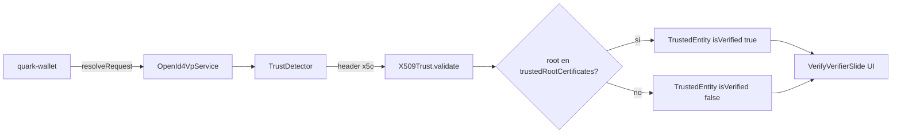

# quark-wallet — OID4VP y TrustConfig para verifier EUDI

Documento detallado del **Frente 1**: presentar credenciales SD-JWT desde quark-wallet ante el verifier de referencia EUDI (`verifier.eudiw.dev`), configurando confianza del verifier vía certificados X.509.

**Documento general:** [quark-wallet-compatibilidad-eudi-overview.md](./quark-wallet-compatibilidad-eudi-overview.md)

---

## Problema

### Cómo se autentica el verifier EUDI

El verifier de referencia EUDI **no usa `did:`** como `client_id` en el authorization request OID4VP. Firma el JWT del request con un certificado X.509 incluido en el header `x5c` y se identifica con esquemas:

- `X509SanDns` — `client_id` = DNS del Subject Alternative Name del certificado leaf.
- `X509Hash` — `client_id` = hash del certificado.

La EUDI Android Wallet lo refleja en su configuración:

```kotlin
configureOpenId4Vp {
    withClientIdSchemes(listOf(
        ClientIdScheme.X509SanDns,
        ClientIdScheme.X509Hash
    ))
}
```

### Qué pasa hoy en quark-wallet

1. `WalletService.create()` / `unlock()` **no aceptan `TrustConfig`**.
2. Sin `TrustConfig`, `OpenId4VpService.resolveRequest()` no ancla la cadena X.509 contra CAs de confianza.
3. `CredentialsForRequest.trustedEntity` queda en `null` o con `isVerified: false` sin metadata útil del verifier.
4. El flujo OID4VP **puede continuar** (la evaluación de confianza es informativa, no bloquea), pero la UX muestra un verifier "no verificado" y en algunos escenarios la validación estructural puede ser insuficiente.

### Referencia: qué hace la EUDI Wallet

Bundlea certificados raíz en `resources-logic/src/main/res/raw/*.pem` y los pasa a `configureReaderTrustStore`. Ver [eudi-trusted-list-analisis.md](./eudi-trusted-list-analisis.md).

quark-wallet debe replicar ese conjunto de CAs vía `TrustConfig.trustedRootCertificates`.

---

## Solución objetivo



---

## Certificados raíz EUDI a incluir

Extraer de `local/repos-externos/eudi-app-android-wallet-ui/resources-logic/src/main/res/raw/` (o del repo upstream en GitHub):

| Archivo PEM | Entidad |
|---|---|
| `pidissuerca02_eu.pem` | Unión Europea |
| `pidissuerca02_cz.pem` | República Checa |
| `pidissuerca02_ee.pem` | Estonia |
| `pidissuerca02_lu.pem` | Luxemburgo |
| `pidissuerca02_nl.pem` | Países Bajos |
| `pidissuerca02_pt.pem` | Portugal |
| `pidissuerca02_ut.pem` | Desarrollo / UT |
| `dc4eu.pem` | DC4EU |
| `r45_staging.pem` | R45 Staging |

Para interoperar con `verifier.eudiw.dev` en pruebas, el mínimo suele ser **`pidissuerca02_ut.pem`** y/o **`pidissuerca02_eu.pem`**. En producción conviene bundleear el set completo que usa la wallet de referencia.

### Formato esperado por el SDK

`TrustConfig.trustedRootCertificates` espera certificados en **base64 DER** (estándar o base64url, con o sin padding):

```dart
TrustConfig(
  trustedRootCertificates: [
    'MIIBxTCCAWugAwIBAgI...', // DER del .pem sin headers
  ],
)
```

Script de conversión (referencia):

```bash
openssl x509 -in pidissuerca02_eu.pem -outform DER | base64 -w 0
```

---

## Cambios por capa

### 1. `identity-core-dart` — Exponer `TrustConfig` en `WalletService`

**Problema actual:** la única vía limpia para inyectar trust es `WalletSession.fromRecordStore(trustConfig: ...)`, que obliga al integrador a replicar manualmente la derivación Argon2id del PIN (ver [05-trust.md](../../packages/identity-core-dart/docs/05-reference/05-trust.md)).

**Cambio propuesto:**

```dart
// wallet_service.dart
Future<WalletSession> create({
  required String walletId,
  required String pin,
  required String directory,
  bool preferHardwareKms = false,
  TrustConfig? trustConfig,  // nuevo
}) async { ... }

Future<WalletSession> unlock({
  required String walletId,
  required String pin,
  required String directory,
  bool preferHardwareKms = false,
  TrustConfig? trustConfig,  // nuevo
}) async { ... }
```

Pasar `trustConfig` al factory interno que crea `WalletSession` / `OpenId4VpService`.

**Archivos afectados:**

| Archivo | Cambio |
|---|---|
| `lib/src/wallet/wallet_service.dart` | Parámetro `trustConfig` en `create` / `unlock` |
| `lib/src/wallet/wallet_session.dart` | Asegurar propagación a `OpenId4VpService` |
| `docs/05-reference/05-trust.md` | Actualizar sección "inyección vía WalletService" |
| `docs/07-limitations.md` | Marcar limitación #10 como resuelta o mitigada |

**Tests:** unit test que verifica que `trustConfig` llega a `OpenId4VpService` al crear sesión.

---

### 2. `quark-wallet` — Assets y configuración

#### 2.1 Copiar PEMs como assets Flutter

```
quark-wallet/assets/trust/eudi/
  pidissuerca02_eu.pem
  pidissuerca02_ut.pem
  ... (resto según política)
```

Registrar en `pubspec.yaml`:

```yaml
flutter:
  assets:
    - assets/trust/eudi/
```

#### 2.2 Loader de certificados

Crear un helper (por ejemplo `lib/core/trust/eudi_trust_config.dart`) que:

1. Lee los `.pem` desde assets en tiempo de arranque o primera sesión.
2. Convierte cada PEM a base64 DER.
3. Retorna `TrustConfig(trustedRootCertificates: [...])`.

Opcional: `eudiTrustAnchorUrl` para OpenID Federation si el verifier EUDI migra a `eudiRpAuthentication` (hoy el verifier de referencia usa principalmente X.509).

#### 2.3 Wiring en `WalletNotifier`

```dart
// wallet_notifier.dart
final _eudiTrust = EudiTrustConfigLoader(); // singleton o provider

Future<void> create(String pin) async {
  final trustConfig = await _eudiTrust.load();
  final session = await _service.create(
    walletId: kWalletId,
    pin: pin,
    directory: _directory,
    trustConfig: trustConfig,
  );
  ...
}
```

Mismo patrón en `unlock()`.

**Alternativa sin cambio en SDK (workaround):** usar `WalletSession.fromRecordStore` replicando Argon2id — **no recomendado** por fragilidad y duplicación de lógica de PIN.

---

### 3. UI — Sin cambios estructurales

`VerifyVerifierSlide` ya consume `request.trustedEntity`:

```dart
final rp = request.trustedEntity?.relyingParty;
final name = rp?.organizationName ?? rp?.domain ?? request.verifierClientId;
final isVerified = request.trustedEntity?.isVerified ?? false;
```

Con `TrustConfig` correcto, debería mostrar:

- Nombre / dominio del verifier (desde SAN DNS del certificado).
- Badge "verificado" cuando `isVerified == true`.

**Mejora opcional de UX:** si `isVerified == false` y el verifier es un host `*.eudiw.dev`, mostrar advertencia explícita antes de `confirmVerifier`.

---

## Flujo técnico OID4VP (referencia)

```
1. Usuario escanea QR → openid4vp://?request_uri=https://verifier.eudiw.dev/...

2. quark-wallet → GET request_uri
   ← Authorization Request JWT (header: { alg: ES256, x5c: [leaf, intermediate, ...] })

3. TrustDetector detecta x5c → TrustMechanismType.x509

4. X509Trust.validate():
   - Validez temporal del leaf cert
   - client_id coincide con SAN URI o SAN DNS del leaf
   - Continuidad estructural issuer[i] == subject[i+1]
   - Si trustedRootCertificates no vacío: root debe estar en la lista

5. Matching local: credenciales SD-JWT del wallet vs presentation_definition

6. Usuario confirma → POST response_uri
   - vp_token: SD-JWT con disclosures seleccionados
   - presentation_submission

7. Verifier valida firma issuer + binding holder (cnf) + presentation_definition
```

---

## Limitaciones conocidas (post-implementación)

| Limitación | Impacto | Mitigación futura |
|---|---|---|
| X.509 sin verificación criptográfica de firmas de cadena | Atacante podría fabricar cadena estructuralmente coherente | Root pinning reduce riesgo; implementar `_validChain` con verificación de firma |
| EUDI RP Federation sin verificar JWT | Solo relevante si verifier usa OpenID Federation en lugar de x5c | Completar cadena hasta trust anchor |
| `TrustConfig` estático en build | Nuevos CAs EUDI requieren actualizar app | Remote config o actualización de assets |
| Sin mDoc | Verifier puede pedir credenciales mDoc que quark-wallet no tiene | Fuera de scope; usar descriptores SD-JWT |

Ver [packages/identity-core-dart/docs/07-limitations.md](../../packages/identity-core-dart/docs/07-limitations.md) limitaciones #2 y #3.

---

## Plan de prueba

### Prerrequisitos

- quark-wallet con al menos una credencial SD-JWT en el wallet (emitida por EUDI issuer, Quark issuer, o import de prueba).
- Dispositivo o emulador con acceso HTTPS a `verifier.eudiw.dev`.

### Pasos

1. Abrir `https://verifier.eudiw.dev/home` en desktop.
2. Seleccionar tipo de credencial SD-JWT compatible (ej. PID SD-JWT) y atributos a solicitar.
3. Generar QR de presentación.
4. Escanear con quark-wallet.
5. Verificar en `VerifyVerifierSlide`:
   - Nombre o dominio del verifier visible.
   - `isVerified == true` (badge verificado).
6. Confirmar y compartir claims.
7. Verificar en la UI del verifier que los claims aparecen validados.

### Criterios de aceptación

- [ ] `trustedEntity` no es `null` para requests con `x5c` de verifier EUDI.
- [ ] `trustedEntity.isVerified == true` con CAs bundleados.
- [ ] Presentación aceptada por `verifier.eudiw.dev` (vp_token válido).
- [ ] Flujo completo sin crash ni error de red/TLS.

### Errores frecuentes

| Síntoma | Causa probable |
|---|---|
| `trustedEntity == null` | `TrustConfig` no inyectado |
| `isVerified: false` con CA correcta | Root DER mal convertido; SAN no coincide con `client_id` |
| "No tenés las credenciales requeridas" | Wallet sin SD-JWT del tipo pedido (o pidió mDoc) |
| Error TLS | Dispositivo no confía en cert del verifier (raro en eudiw.dev) |

---

## Checklist de implementación

- [x] `WalletService` acepta `TrustConfig` en `create` / `unlock`
- [ ] Tests unitarios SDK para propagación de trust
- [x] PEMs EUDI en `quark-wallet/assets/trust/eudi/`
- [x] `EudiTrustConfigLoader` convierte PEM → base64 DER
- [x] `WalletNotifier` pasa `trustConfig` al abrir sesión
- [x] Documentación SDK actualizada (limitación #10)
- [ ] Test E2E: presentar SD-JWT en `verifier.eudiw.dev`

---

## Estimación

| Tarea | Días |
|---|---|
| SDK: `TrustConfig` en `WalletService` | 0.5–1 |
| Assets + loader + wiring quark-wallet | 1 |
| Test E2E + ajustes UI | 0.5–1 |
| **Total** | **1.5–2.5** |

---

## Referencias

- [OpenID for Verifiable Presentations](https://openid.net/specs/openid-4-verifiable-presentations-1_0.html)
- [quark-verifier-x5c.md](./quark-verifier-x5c.md) — configuración x5c en Quark verifier (camino inverso)
- [packages/identity-core-dart/docs/04-flows/03-oid4vp.md](../../packages/identity-core-dart/docs/04-flows/03-oid4vp.md)
- [packages/identity-core-dart/docs/05-reference/05-trust.md](../../packages/identity-core-dart/docs/05-reference/05-trust.md)

---

*Última actualización: junio 2026*
