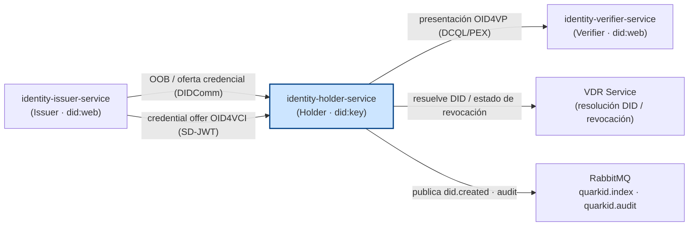
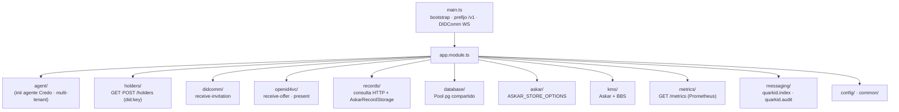

# identity-holder-service

Servicio NestJS de prueba para el rol **Holder** del stack QuarkID 2.0.

Consume `@identity/core` para inicializar un agente Credo-TS como holder (`did:key`, Ed25519) multi-tenant: recibe invitaciones OOB DIDComm (offer/request integrado vía listeners), ejecuta el flujo OID4VCI (SD-JWT), presenta credenciales OID4VP (DCQL/PEX) al verifier, consulta records Credo, expone métricas Prometheus y publica eventos a RabbitMQ.

> Servicio de prueba/integración del rol Holder en QuarkID 2.0. No forma parte del stack productivo.

---

## Responsabilidades

- Inicializar el agente Credo como holder (`did:key`) en modo **multi-tenant**; los holders se crean dinámicamente vía `POST /v1/holders`.
- Recibir invitaciones OOB DIDComm (`receive-invitation`); conexión, offer y proof vía listeners de identity-core.
- Ejecutar el flujo **OID4VCI** (recibir oferta SD-JWT con pre-authorized code).
- Presentar credenciales **OID4VP** (DCQL/PEX) al verifier.
- Consultar records Credo por tenant (conexiones, credenciales, exchanges).
- Exponer métricas Prometheus en `/metrics`.
- Publicar eventos a RabbitMQ (exchanges `quarkid.index` y `quarkid.audit`).

## Arquitectura

`identity-holder-service` actúa como wallet/holder (`did:key`, Ed25519) dentro del ecosistema QuarkID 2.0. Recibe credenciales del issuer por dos vías — DIDComm (OOB) y OID4VCI (SD-JWT pre-authorized) —, presenta credenciales al verifier vía OID4VP (DCQL/PEX), resuelve DIDs y consulta el estado de revocación contra el VDR Service, y publica eventos a RabbitMQ (`quarkid.index` y `quarkid.audit`). Es multi-tenant: cada holder se da de alta dinámicamente vía `POST /v1/holders`.

### Diagrama 1 — Ecosistema (resaltando holder)



### Diagrama 2 — Módulos internos



> `agent/`, `common/` y `config/` son directorios funcionales, no módulos NestJS.

## Stack / Tecnologías

- NestJS 10 + TypeScript
- `@identity/core` (wrapper Credo-TS)
- `amqplib` + `amqp-connection-manager` (RabbitMQ)
- `ws` (WebSocket — transporte DIDComm)
- `prom-client` (métricas Prometheus)
- KMS: Askar + sidecar BBS (`BbsKeyManagementService`)
- Records Credo: `AskarRecordStorage` vía `RecordStorageModule`

> No usa TypeORM. Postgres: pool compartido (BBS) + store Askar (misma `DATABASE_URL`).

## Estructura de archivos

```
source/src/
├── agent/              # Inicialización del agente Credo (holder · did:key · multi-tenant)
├── app.controller.ts   # /health, /health/ready, /:walletId/did.json
├── common/             # logger, interceptors, exception filter, global-prefix
├── config/             # environment.config, index
├── database/           # DATABASE_POOL (pg compartido)
├── askar/              # ASKAR_STORE_OPTIONS (bóveda Askar)
├── kms/                # Askar primario + BbsKeyManagementService
├── holders/            # GET·POST /holders (alta dinámica de holders)
├── didcomm/            # POST /:walletId/didcomm/receive-invitation (plano, como issuer/verifier)
├── openid4vc/          # POST /:walletId/openid4vc/receive-offer · /present
├── records/            # GET /:walletId/records/* (HTTP) + RecordStorageModule (AskarRecordStorage)
├── metrics/            # GET /metrics (Prometheus, sin prefijo /v1)
├── messaging/
│   ├── messaging.service.ts          # publish a quarkid.index
│   ├── messaging.constants.ts        # routing keys y payload types
│   ├── audit-messaging.service.ts    # publish a quarkid.audit
│   ├── audit-messaging.module.ts
│   └── audit.interceptor.ts          # APP_INTERCEPTOR global
├── app.module.ts       # ConfigModule + módulos de dominio
└── main.ts             # bootstrap con global prefix /v1 + DIDComm WS
```

## Variables de entorno

Copiar `source/.env.example` a `source/.env` y completar. Las variables se cargan vía `@nestjs/config` en `source/src/config/environment.config.ts`.

### HTTP y agente

| Variable       | Default                              | Descripción                                                                  |
| -------------- | ------------------------------------ | ---------------------------------------------------------------------------- |
| `PORT`         | `9005`                               | Puerto HTTP del servicio (compartido con el WebSocket DIDComm).             |
| `SERVICE_HOST` | `localhost`                          | Host lógico del servicio.                                                   |
| `LOG_LEVEL`    | `INFO`                               | Nivel de log: `DEBUG` \| `INFO` \| `WARN` \| `ERROR`.                       |
| `BASE_URL`     | `http://identity-holder-service:9005`   | Endpoint DIDComm anunciado en el DID.                                       |

### Persistencia / KMS

| Variable                    | Default    | Descripción                                                              |
| --------------------------- | ---------- | ------------------------------------------------------------------------ |
| `DATABASE_URL`              | —          | Postgres (Askar store, BBS).                                             |
| `ASKAR_STORE_KEY`           | —          | Passphrase Askar (obligatoria).                                          |
| `ASKAR_STORE_ID`            | —          | ID store Askar; default = nombre de DB en `DATABASE_URL`.                |
| `DATABASE_URL`              | —          | **Obligatoria.** Postgres del servicio.                                  |

### Otros

| Variable          | Default                 | Descripción                                                                 |
| ----------------- | ----------------------- | --------------------------------------------------------------------------- |
| `VDR_SERVICE_URL` | `http://localhost:4003` | URL del VDR service (resolución DID y estado de revocación).                |
| `NODE_ENV`        | —                       | Si es distinto de `production`, activa `useHttpForWebDid=true`.             |
| `WALLET_ORIGIN`   | `*`                     | Orígenes CORS permitidos (`*` o lista separada por comas).                  |
| `RABBITMQ_URL`    | `amqp://localhost:5672` | URL del broker RabbitMQ.                                                    |

## Levantar en local

El código y el `package.json` viven en `source/`. Ejecutar desde ese subdirectorio:

```bash
cd source
cp .env.example .env
npm install
npm run start:dev
```

Scripts disponibles (`source/package.json`):

| Script               | Comando                  | Descripción                          |
| -------------------- | ------------------------ | ------------------------------------ |
| `npm run build`      | `tsc -p tsconfig.json`   | Compila a `dist/`.                   |
| `npm run start:dev`  | `ts-node src/main.ts`    | Arranque en desarrollo.              |
| `npm run start:prod` | `node dist/main.js`      | Arranque sobre el build compilado.   |
| `npm start`          | `ts-node src/main.ts`    | Alias de arranque.                   |

El servicio expone HTTP en `PORT` (default `9005`) bajo el prefijo global `/v1` (excepto `GET /metrics`, que queda en la raíz) y comparte el mismo puerto para el WebSocket DIDComm (registrado en `main.ts`).

## Endpoints

Las rutas efectivas llevan el prefijo global `/v1` (configurado en `main.ts`), **excepto `GET /metrics`** que queda en la raíz.

### Raíz / salud

| Método | Path               | Descripción                                                                                 |
| ------ | ------------------ | ------------------------------------------------------------------------------------------- |
| `GET`  | `/v1/health`       | Health check. Devuelve `{ ok: true }`.                                                      |
| `GET`  | `/v1/health/ready` | Readiness. Devuelve `{ ready: true, timestamp }`; `503` si el agente raíz no se inicializó. |
| `GET`  | `/v1/:walletId/did.json` | DID Document (`did:key`) del holder.                                                   |
| `GET`  | `/metrics`         | Métricas Prometheus. **Sin** prefijo `/v1`. `Content-Type: text/plain; version=0.0.4`.      |

### Holders

| Método | Path           | Descripción                                                                                                              |
| ------ | -------------- | ------------------------------------------------------------------------------------------------------------------------ |
| `GET`  | `/v1/holders`  | Lista los holders disponibles en este proceso.                                                                          |
| `POST` | `/v1/holders`  | Da de alta un holder. Body `{ holderId }` (validado contra `WALLET_ID_REGEX`). Devuelve `{ holderId, tenantId, did, recordsCreated }`. |

### DIDComm (`/v1/holders/:walletId/didcomm`)

| Método | Path                                               | Descripción                                                                 |
| ------ | -------------------------------------------------- | --------------------------------------------------------------------------- |
| `POST` | `/v1/holders/:walletId/didcomm/receive-invitation` | Recibe invitación OOB. Body `{ invitationUrl }`. Devuelve `{ ok, outOfBandRecordId }`. |

Conexiones y credenciales: usar `GET /v1/holders/:walletId/records?type=...` (ver módulo `records/`).

### OpenID4VC (`/v1/holders/:walletId/openid4vc`)

| Método | Path                                              | Descripción                                                                            |
| ------ | ------------------------------------------------- | -------------------------------------------------------------------------------------- |
| `POST` | `/v1/holders/:walletId/openid4vc/receive-offer`   | Recibe oferta OID4VCI (pre-authorized). Body `{ offerUri }`. Devuelve `{ credentials, deferredCredentials }`. |
| `POST` | `/v1/holders/:walletId/openid4vc/present`         | Presenta credenciales OID4VP al verifier. Body `{ requestUri }`. Devuelve `{ ok, verifierResponse? }`. |

### Records (`/v1/holders/:walletId/records`)

| Método | Path                                                            | Descripción                                                                                       |
| ------ | -------------------------------------------------------------- | ------------------------------------------------------------------------------------------------- |
| `GET`  | `/v1/holders/:walletId/records/types`                          | Lista los tipos de record consultables.                                                          |
| `GET`  | `/v1/holders/:walletId/records?type=&query=&page=&limit=`      | Lista records paginados. `type` obligatorio, `page` default 1, `limit` default 20 (máx 100).     |
| `GET`  | `/v1/holders/:walletId/records/:recordType/:recordId`         | Obtiene un record específico por tipo y ID.                                                       |

## Eventos RabbitMQ

Dos exchanges, definidos en `source/src/messaging/messaging.constants.ts`.

### Exchange `quarkid.audit` (vía `AuditMessagingService`)

| Routing Key       | Payload (`type`)    | Origen                                                                                                      |
| ----------------- | ------------------- | ----------------------------------------------------------------------------------------------------------- |
| `audit.operation` | `AuditEventPayload` | `AuditInterceptor` global (`APP_INTERCEPTOR` en `app.module.ts`) — un evento por cada request HTTP.        |

### Exchange `quarkid.index` (vía `MessagingService`)

| Routing Key    | Payload (`type`)   | Origen                                                                              |
| -------------- | ------------------ | ----------------------------------------------------------------------------------- |
| `did.created`  | `DidEventPayload`  | Publicado al crear un holder (`POST /v1/holders`).                                  |
| `did.resolved` | `DidEventPayload`  | Definido como routing key, pero **no-op** en este servicio (no se publica).        |
| `did.reported` | `DidEventPayload`  | Definido como routing key, pero **no-op** en este servicio (no se publica).        |

## Health checks

| Método | Path               | Descripción                                                                                          |
| ------ | ------------------ | ---------------------------------------------------------------------------------------------------- |
| `GET`  | `/v1/health`       | Health check simple. Devuelve `{ ok: true }`.                                                       |
| `GET`  | `/v1/health/ready` | Readiness. Devuelve `{ ready: true, timestamp }`; responde `503` si el agente raíz no se inicializó. |

## Pruebas

No hay suite de tests automatizados en este servicio aún.
