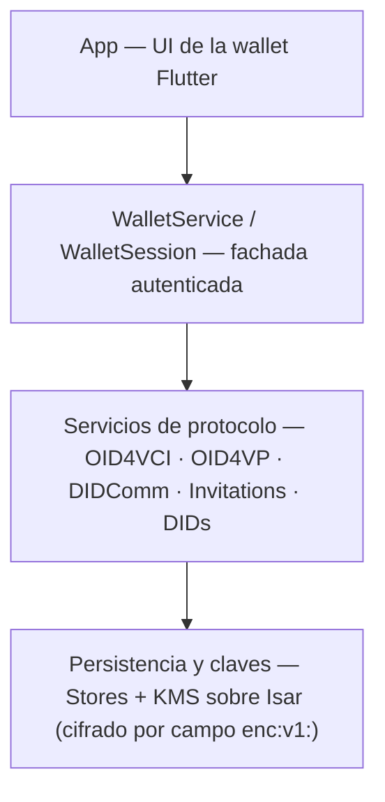
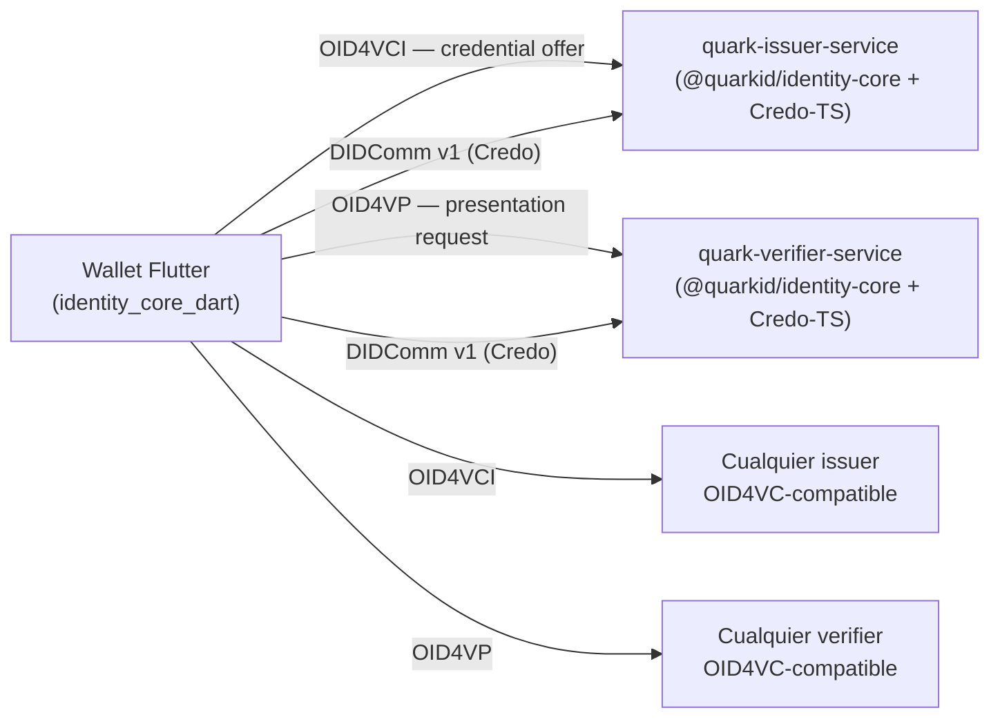

# Visión general del SDK

## ¿Qué es identity_core_dart?

`identity_core_dart` es un SDK holder SSI (el rol que recibe, guarda y presenta credenciales) (Self-Sovereign Identity) implementado íntegramente en Dart. Corre en aplicaciones Flutter sin depender de ninguna librería externa de agente SSI: **no usa Credo-TS ni ningún wrapper nativo**; todos los protocolos están implementados en Dart puro.

El SDK permite a una wallet Flutter actuar como **holder**: recibir credenciales verificables de un issuer, presentarlas a un verifier, gestionar las claves criptográficas y persistir los datos en almacenamiento local con cifrado por campo en valores sensibles (ver [Limitaciones](07-limitations.md)).

### Capacidades actuales

| Área | Detalle |
|------|---------|
| **OID4VCI** | Recepción de credenciales: flujo pre-authorized con y sin `tx_code`, authorization code con PKCE (`prepareAuthCodeFlow`), credenciales diferidas; compatible con issuers EUDI (`haip-vci://`, `issuer.eudiw.dev`) |
| **OID4VP** | Presentación de credenciales: matching por PEX y DCQL, selective disclosure SD-JWT, holder binding, respuesta JARM (`direct_post.jwt`) para verifiers EUDI |
| **DIDComm** | Interop con Quark Credo: OOB + DID Exchange, `DidCommFlowSession` (WS), Envelope V1 Authcrypt, issue-credential / present-proof (W3C JSON-LD); **BBS+ selective disclosure** en present-proof (`DartBbsLdSuite` + `libbbs` en mobile; bridge MATTR en desktop/CI) — ver [DIDComm](04-flows/04-didcomm.md) |
| **DIDs locales** | Creación de `did:key`, `did:jwk`, `did:peer`; resolución de `did:web` |
| **Almacenamiento** | Isar embebido; cifrado AES-256-GCM por campo (`enc:v1:`) en claves y credenciales; validación de PIN por hash Argon2id; archivo `.isar` completo sin cifrar — ver [Limitaciones](07-limitations.md) |
| **KMS software** | Generación, almacenamiento y uso de claves Ed25519, P-256, X25519 |
| **KMS hardware** | Interfaz disponible vía MethodChannel (Android Keystore / iOS Secure Enclave), soporte limitado a P-256 — ver [limitaciones](07-limitations.md) |
| **Framework de confianza** | Evaluación de issuers y verifiers por DID, cadena X.509 y EUDI Relying Party |

> El SDK interopera con cualquier issuer o verifier compatible con OID4VC. No requiere infraestructura Quark.

Antes de continuar, conviene familiarizarse con los roles SSI y los formatos de credencial.

---

## Conceptos clave

**Holder / Issuer / Verifier**
En el modelo de confianza SSI hay tres roles. El **issuer** emite credenciales verificables firmadas digitalmente. El **holder** las recibe, las almacena y decide cuándo presentarlas. El **verifier** solicita la presentación y valida que sean auténticas.

**Verifiable Credential (VC)**
Documento digital firmado que expresa atributos sobre un sujeto (por ejemplo, nombre, fecha de nacimiento, titulación). La firma criptográfica permite verificar que el issuer la emitió y que no fue alterada.

**SD-JWT VC vs W3C VC**
`SD-JWT VC` es el formato principal soportado: permite al holder revelar solo un subconjunto de claims (selective disclosure) sin exponer los demás. `W3C VC` en formato JSON-LD está soportado para compatibilidad; no admite selective disclosure nativo. El soporte de mDoc (ISO 18013-5 / CBOR) está pendiente — ver [limitaciones](07-limitations.md).

**Credential offer**
Mensaje emitido por un issuer que invita al holder a iniciar el flujo de emisión OID4VCI. Puede llegar como URL en un QR, deep link o portapapeles.

**Presentation request**
Mensaje enviado por un verifier que especifica qué credenciales o claims necesita para autenticar al holder. Llega típicamente como URL que el SDK procesa con `Oid4VpService`.

**Selective disclosure**
Mecanismo criptográfico que permite al holder presentar solo los claims que elige revelar de una credencial SD-JWT, sin exponer los demás atributos ni invalidar la firma del issuer.

**DID (Decentralized Identifier)**
Identificador persistente y auto-soberano que no depende de ninguna autoridad central. Incluye un documento DID que describe las claves públicas del sujeto. El SDK crea DIDs localmente (`did:key`, `did:jwk`, `did:peer`) y resuelve `did:web` para validar entidades externas.

---

## Arquitectura en capas

### Tabla de módulos

| Módulo | Responsabilidad | Path en `lib/src/` |
|--------|-----------------|--------------------|
| `WalletService` | Creación de wallet, gestión del PIN, apertura y cierre de sesión | `wallet/` |
| `WalletSession` | Punto de acceso autenticado a todos los servicios y stores | `wallet/` |
| `Oid4VciService` | Flujo OID4VCI end-to-end: resolución de offer, token, credenciales y diferidas | `protocol/openid4vc/oid4vci/` |
| `Oid4VpService` | Resolución de presentation request, matching PEX/DCQL, construcción de VP y envío | `protocol/openid4vc/oid4vp/` |
| `DidCommService` | Conexiones OOB, Envelope V1, `DidCommFlowSession`, issue-credential y present-proof | `protocol/didcomm/` |
| `InvitationResolver` | Detección del tipo de URL (OID4VCI, OID4VP, DIDComm) y delegación al servicio correspondiente | `invitation/` |
| `DidService` | Creación de `did:key`, `did:jwk`, `did:peer`; resolución de `did:web` | `did/` |
| `KmsService` | Generación de pares de claves, firma digital, selección de backend (software / hardware) | `kms/` |
| `CredentialRecordStore` | CRUD de credenciales verificables (SD-JWT VC, W3C, mDoc) | `record/` |
| `DeferredCredentialRecordStore` | Tracking de credenciales diferidas pendientes de retiro | `record/` |
| `ActivityRecordStore` | Historial de emisiones y presentaciones | `record/` |
| `ConnectionRecordStore` | Conexiones DIDComm establecidas | `record/` |
| `SdJwtParser` / `SdJwtSelector` | Parsing de SD-JWT y selección de disclosures para presentación | `sd_jwt/` |
| `TrustDetector` / `TrustConfig` | Evaluación de confianza de issuers y verifiers | `trust/` |

---

## Contexto del ecosistema Quark

Los servicios backend de Quark (`quark-issuer-service`, `quark-verifier-service`) están construidos sobre `@quarkid/identity-core`, una librería TypeScript que configura Credo-TS como agente SSI del lado servidor. El SDK Dart y esa librería TypeScript **no comparten código**; su interoperabilidad se basa en protocolos abiertos:

- **OID4VCI** para la recepción de credenciales SD-JWT
- **OID4VP** para la presentación SD-JWT / DCQL
- **DIDComm v1** (mismo envelope Authcrypt que Credo) para emisión/verificación JSON-LD con Quark

Dado que OID4VC es estándar, el SDK también funciona contra issuers/verifiers externos compatibles, independientemente de su tecnología interna.

---

## Siguiente paso

Continuar con [Instalación](02-installation.md) para agregar la dependencia git al `pubspec.yaml`, configurar los requisitos nativos de Android e iOS, y registrar los deep link schemes que el SDK usa para interceptar credential offers y presentation requests.

---

## Ver también

- [Instalación y configuración](02-installation.md) — git dependency, requisitos nativos Android/iOS y deep links
- [Ciclo de vida del wallet](03-wallet-lifecycle.md) — creación, apertura, bloqueo y destrucción de la wallet
- [Limitaciones conocidas](07-limitations.md) — restricciones de seguridad, funcionalidad y distribución
