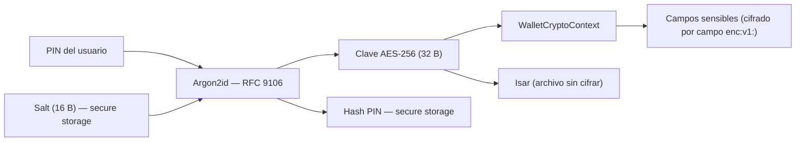

# Ciclo de vida del wallet

Este documento describe cómo crear, desbloquear, bloquear y resetear una wallet usando `WalletService`, y cómo trabajar con la sesión activa que devuelve.

---

## 1. Modelo de seguridad

La wallet no almacena el PIN en ningún momento. En cambio, lo usa como material de entrada para derivar una clave AES-256 mediante Argon2id, siguiendo **RFC 9106** (sección "Parameter Choice"):

- **Algoritmo:** Argon2id
- **Paralelismo:** 4 hilos
- **Memoria:** 64 MB
- **Iteraciones:** 8
- **Longitud de clave derivada:** 32 bytes (= clave AES-256)
- **Salt:** 16 bytes generados con `Random.secure()`, persistidos en secure storage con la clave `wallet_salt_<walletId>`
- **Hash de verificación del PIN:** derivado con Argon2id (dominio `pin-verify:`), persistido como `wallet_pin_hash_<walletId>` — usado en `unlock()` para lanzar `WrongPinError` si el PIN no coincide



La separación entre PIN y salt garantiza que dos wallets con el mismo PIN generen claves distintas, y que el salt (y el hash de PIN) puedan borrarse en un reset sin exponer el PIN.

> ⚠️ **Limitación actual:** Isar 3.1.0 no cifra el archivo `.isar` completo. Los valores sensibles se protegen con cifrado AES-256-GCM por campo (`enc:v1:`) vía `session.cryptoContext` cuando la sesión se abre con `WalletService`. Metadatos (ids, DIDs, fechas, `vct`) pueden quedar en claro. Ver [Limitaciones #1](07-limitations.md).

---

## 2. Crear una wallet

Usa `WalletService.create(...)` la primera vez que el usuario configura su wallet. Lanza `WalletAlreadyExistsError` si ya existe un salt registrado para ese `walletId`.

```dart
import 'package:identity_core_dart/identity_core.dart';
import 'package:path_provider/path_provider.dart';

// path_provider es provisto por la app; no es dependencia del SDK.
final dir = await getApplicationDocumentsDirectory();
// WalletService acepta opcionalmente un FlutterSecureStorage propio (útil para tests):
//   WalletService(secureStorage: miStorage)
final walletService = WalletService();

final session = await walletService.create(
  walletId: 'bax-wallet',
  pin: pinIngresadoPorElUsuario,
  directory: dir.path,
);
```

### Hardware KMS (`preferHardwareKms`)

El parámetro `preferHardwareKms: true` activa el backend de hardware del KMS, que se apoya en un `MethodChannel` real:

- **Android:** Android Keystore
- **iOS:** Secure Enclave

Cuando está activo, las operaciones criptográficas para curvas **P-256** se ejecutan dentro del enclave seguro del dispositivo y la clave privada nunca sale de él.

```dart
final session = await walletService.create(
  walletId: 'bax-wallet',
  pin: pin,
  directory: dir.path,
  preferHardwareKms: true, // claves P-256 en Android Keystore / iOS Secure Enclave
);
```

El mismo parámetro existe en `unlock(...)`.

> **Limitación:** el hardware KMS solo soporta P-256. Si necesitás otras curvas (Ed25519, P-384, etc.) el SDK cae automáticamente al software KMS. Consultá [07-limitations.md](07-limitations.md) para el detalle completo.

---

## 3. Desbloquear una wallet existente

Usa `WalletService.unlock(...)` cuando la wallet ya fue creada y el usuario ingresa su PIN para volver a acceder.

```dart
try {
  final session = await walletService.unlock(
    walletId: 'bax-wallet',
    pin: pinIngresadoPorElUsuario,
    directory: dir.path,
  );
  // session está lista para usar
} on WalletNotFoundError catch (e) {
  // No existe salt para ese walletId: la wallet nunca fue creada.
  print(e.walletId);
} on WrongPinError {
  // PIN incorrecto.
}
```

### Tabla de errores de `unlock`

| Excepción | Cuándo se lanza | Acción recomendada |
|---|---|---|
| `WalletNotFoundError` | No hay salt en secure storage para `walletId` | Redirigir al flujo de onboarding |
| `WrongPinError` | El PIN ingresado no coincide con el hash guardado en secure storage (verificación Argon2id antes de abrir Isar). | Informar al usuario e invitar a reintentar |

`WrongPinError` no expone intentos ni bloquea la wallet automáticamente; la lógica de reintentos y bloqueo temporal es responsabilidad de la app.

### Wallets creadas antes de la validación por hash

Solo las wallets creadas con esta versión (o posteriores) persisten `wallet_pin_hash_<walletId>`. Si el hash **no existe** en secure storage, `unlock()` deriva la clave y abre Isar **sin comparar el PIN** (comportamiento legacy). Para exigir validación de PIN, el usuario debe hacer `reset()` y volver a crear la wallet.

---

## 4. Bloquear la wallet

Llamar a `WalletService.lock()` cierra la base de datos subyacente y marca la sesión como bloqueada. A partir de ese momento, cualquier acceso a los getters de la sesión previa lanza `WalletLockedError`.

```dart
await walletService.lock();

// Cualquier acceso posterior a la sesión anterior lanza WalletLockedError:
// session.credentialStore  →  lanza WalletLockedError
// session.openid4vci       →  lanza WalletLockedError
```

**Patrón recomendado:**

- Nunca guardes una referencia directa a los stores (`credentialStore`, `keyStore`, etc.) en variables locales o en el estado de la UI.
- Siempre accedé a los stores a través de `session`, y chequeá `session.isLocked` antes de usarlos si existe posibilidad de que la sesión ya esté bloqueada.

---

## 5. Resetear la wallet

`WalletService.reset(...)` elimina todos los datos del wallet: borra los archivos Isar del disco (`<walletId>.isar` y `<walletId>.isar.lock`) y borra el salt y el hash de PIN de secure storage (`wallet_salt_<walletId>`, `wallet_pin_hash_<walletId>`). Si hay una sesión activa, la bloquea antes de borrar.

```dart
await walletService.reset(
  walletId: 'bax-wallet',
  directory: dir.path,
);
```

> **Advertencia:** esta operación es **irreversible**. No existe ningún mecanismo de backup ni de recuperación de datos. Una vez ejecutada, todas las credenciales, DIDs y claves almacenados se pierden de forma permanente. Consultá [07-limitations.md](07-limitations.md) para el contexto completo sobre ausencia de backup.

---

## 6. La sesión (`WalletSession`)

`create(...)` y `unlock(...)` devuelven un objeto `WalletSession` que agrupa los stores de persistencia y los servicios de alto nivel. Todos los getters lanzan `WalletLockedError` si la sesión fue bloqueada.

### Getters disponibles

| Getter | Tipo | Qué expone |
|---|---|---|
| `isLocked` | `bool` | `true` si la sesión fue bloqueada; no lanza excepción |
| `cryptoContext` | `WalletCryptoContext?` | Clave AES y [FieldCipher](../../lib/src/crypto/field_cipher.dart) activos mientras la sesión está desbloqueada; `null` si se abrió sin contexto criptográfico. Los stores sensibles cifran y descifran campos con este contexto al persistir en Isar. |
| `credentialStore` | `CredentialRecordStore` | CRUD de credenciales verificables (SD-JWT VC, W3C VC, mDoc) — ver [05-reference/01-stores.md](05-reference/01-stores.md) |
| `didStore` | `DidRecordStore` | CRUD de DIDs controlados por la wallet |
| `keyStore` | `KeyRecordStore` | CRUD de pares de claves criptográficas |
| `activityStore` | `ActivityRecordStore` | Historial de emisión y presentación |
| `deferredStore` | `DeferredCredentialRecordStore` | Credenciales diferidas pendientes de retiro |
| `connectionStore` | `ConnectionRecordStore` | Conexiones DIDComm establecidas |
| `kms` | `KmsService` | Key Management Service activo (software o hardware-backed) |
| `dids` | `DidService` | Creación, resolución y lookup de DIDs locales |
| `openid4vci` | `Oid4VciService` | Flujo completo de issuance de credenciales OID4VCI — ver [04-flows/02-oid4vci.md](04-flows/02-oid4vci.md) |
| `openid4vp` | `Oid4VpService` | Flujo completo de presentación de credenciales OID4VP |
| `invitation` | `InvitationResolver` | Router universal de invitaciones via QR, deeplink o clipboard |
| `didcomm` | `DidCommService` | Conexiones, intercambio de credenciales y pruebas DIDComm |

> Todos los stores (`credentialStore`, `didStore`, `keyStore`, `activityStore`, `deferredStore`, `connectionStore`) se detallan en [05-reference/01-stores.md](05-reference/01-stores.md).

### `WalletSession.fromRecordStore(...)`

Este factory es una **vía avanzada** destinada a casos donde necesitás inyectar una `TrustConfig` personalizada (por ejemplo, para definir listas de confianza de issuers o verificadores en OID4VP). No es necesario para el uso típico de la wallet.

```dart
final session = WalletSession.fromRecordStore(
  recordStore,
  trustConfig: miTrustConfig,
  kms: miKmsService, // opcional; si se omite se usa SoftwareKms por defecto
);
```

Para la configuración de confianza avanzada, consultá [05-reference/05-trust.md](05-reference/05-trust.md).

---

## 7. Patrón de integración recomendado

El siguiente esqueleto muestra cómo encapsular el ciclo de vida en una clase propia de la app, sin depender de ningún paquete de gestión de estado. Cada método maneja las excepciones relevantes y expone el estado mínimo necesario para la UI.

```dart
import 'package:identity_core_dart/identity_core.dart';
import 'package:path_provider/path_provider.dart';

class WalletController {
  final _service = WalletService();
  WalletSession? _session;

  bool get isUnlocked => _session != null && !(_session!.isLocked);

  WalletSession get session {
    final s = _session;
    if (s == null) {
      // La wallet nunca fue creada ni desbloqueada en esta instancia.
      throw StateError('La wallet no fue creada ni desbloqueada todavía.');
    }
    if (s.isLocked) {
      throw const WalletLockedError();
    }
    return s;
  }

  Future<String> _directory() async {
    final dir = await getApplicationDocumentsDirectory();
    return dir.path;
  }

  Future<void> create(String walletId, String pin) async {
    final dir = await _directory();
    _session = await _service.create(
      walletId: walletId,
      pin: pin,
      directory: dir,
    );
    // Lanza WalletAlreadyExistsError si ya existe.
  }

  /// Lanza [WalletNotFoundError] o [WrongPinError]; la capa de UI las captura
  /// para mostrar el mensaje apropiado al usuario.
  Future<void> unlock(String walletId, String pin) async {
    final dir = await _directory();
    _session = await _service.unlock(
      walletId: walletId,
      pin: pin,
      directory: dir,
    );
  }

  Future<void> lock() async {
    await _service.lock();
    _session = null;
  }

  Future<void> reset(String walletId) async {
    final dir = await _directory();
    await _service.reset(walletId: walletId, directory: dir);
    _session = null;
  }
}
```

Este patrón es agnóstico al framework de UI: puede usarse como base de cualquier capa de estado (ChangeNotifier, BLoC, etc.).

---

## Ver también

- [02-installation.md](02-installation.md) — configuración de dependencias y permisos de plataforma
- [05-reference/01-stores.md](05-reference/01-stores.md) — referencia completa de los stores de persistencia
- [04-flows/02-oid4vci.md](04-flows/02-oid4vci.md) — flujo de issuance de credenciales verificables
- [05-reference/05-trust.md](05-reference/05-trust.md) — configuración avanzada de confianza (TrustConfig)
- [05-reference/06-errors.md](05-reference/06-errors.md) — catálogo completo de excepciones del SDK
- [07-limitations.md](07-limitations.md) — limitaciones conocidas: cifrado en reposo, hardware KMS, backup
