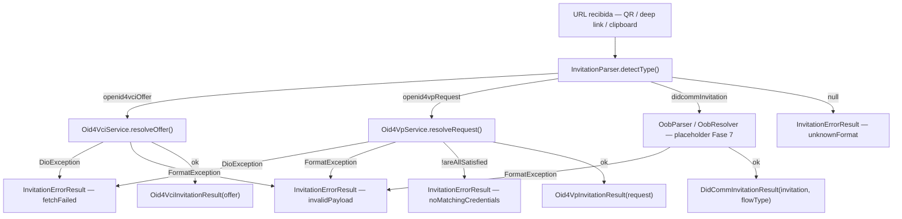

# Flujo de invitaciones

## Cuándo se usa

El flujo de invitaciones es el **punto de entrada universal** de la wallet: cubre todo escenario en el que el usuario recibe una URL externa — QR escaneado con cámara, deep link recibido del SO, o texto pegado desde el portapapeles.

`InvitationResolver.resolve()` actúa como único punto de entrada: detecta el tipo de protocolo encerrado en la URL, delega al servicio correspondiente (OID4VCI, OID4VP o DIDComm) y devuelve un resultado tipado listo para consumir en la capa de navegación. La app nunca necesita inspeccionar la URL por su cuenta.

---

## Diagrama



---

## Código mínimo

`InvitationResult` es una `sealed class`; Dart exige un `switch` exhaustivo. Los subtipos son `final class`, por lo que soportan destructuring con la sintaxis `:final campo`.

```dart
import 'package:identity_core_dart/identity_core.dart';

Future<void> procesarInvitacion(
  InvitationResolver resolver,
  String url,
) async {
  final result = await resolver.resolve(url);

  switch (result) {
    case Oid4VciInvitationResult(:final offer):
      // offer es ResolvedCredentialOffer — navegar a la pantalla de emisión
      navegarAEmision(offer);

    case Oid4VpInvitationResult(:final request):
      // request es CredentialsForRequest — navegar a la pantalla de presentación
      navegarAPresentacion(request);

    case DidCommInvitationResult(:final invitation, :final flowType):
      // invitation es Map<String,dynamic>, flowType es DidCommFlowType
      // Procesamiento completo disponible en Fase 7 — ver limitaciones
      navegarADidComm(invitation, flowType);

    case InvitationErrorResult(:final type, :final message):
      mostrarError(type, message);
  }
}
```

> **Nota sobre destructuring** — la sintaxis `:final campo` requiere Dart 3.0 o superior (pattern matching sobre sealed classes). Si el proyecto usa una versión anterior, accedé a los campos directamente: `(result as Oid4VciInvitationResult).offer`.

---

## Garantía: `resolve()` nunca lanza

`InvitationResolver.resolve()` captura todas las excepciones internas (`DioException`, `FormatException`, cualquier otra) y las convierte en `InvitationErrorResult`. **No uses try/catch alrededor del llamado al resolver** — si aparece una excepción en ese nivel, proviene de un error de programación en la app, no del SDK. Los errores inesperados internos también se devuelven como `InvitationErrorResult` con `type: invalidPayload` (no existe un tipo `unknown`); para diagnosticar fallos raros, inspeccioná el campo `message`.

### Tabla de `InvitationErrorType`

| Valor | Significado | Acción sugerida en UI |
|---|---|---|
| `unknownFormat` | El esquema y los query params de la URL no coinciden con ningún protocolo soportado | Mostrar mensaje "QR no reconocido" y ofrecer reintentar |
| `fetchFailed` | Falló la descarga de `credential_offer_uri` o `request_uri` (error de red / servidor) | Mostrar mensaje de error de red con opción de reintentar |
| `invalidPayload` | El payload descargado no es parseable (JSON malformado, campos requeridos ausentes) | Mostrar "Invitación inválida" e invitar al usuario a contactar al emisor |
| `noMatchingCredentials` | La solicitud OID4VP requiere credenciales que la wallet no posee | Informar que no hay credenciales que satisfagan la solicitud (solo se dispone del `message` de texto proveniente de `InvitationErrorResult`); si la app necesita mostrar el detalle de lo requerido, debe resolver el request por su cuenta vía `session.openid4vp.resolveRequest(...)` y leer `submission` (ver [OID4VP](03-oid4vp.md)) |

---

## Esquemas de URL soportados

La siguiente tabla reproduce exactamente lo que `InvitationParser.detectType()` reconoce. La detección es local — no realiza ninguna operación de red.

### Esquemas exclusivos (por prefijo)

| Esquema | Tipo detectado |
|---|---|
| `openid-credential-offer://` | `InvitationType.openid4vciOffer` |
| `openid-initiate-issuance://` | `InvitationType.openid4vciOffer` |
| `haip-vci://` | `InvitationType.openid4vciOffer` |
| `openid4vp://` | `InvitationType.openid4vpRequest` |
| `eudi-openid4vp://` | `InvitationType.openid4vpRequest` |
| `mdoc-openid4vp://` | `InvitationType.openid4vpRequest` |
| `haip://` | `InvitationType.openid4vpRequest` |
| `didcomm://` | `InvitationType.didcommInvitation` |

### URLs `https://` — detección por query param

Para URLs con esquema `https`, el parser inspecciona los query parameters:

| Query param presente | Tipo detectado |
|---|---|
| `credential_offer` | `InvitationType.openid4vciOffer` |
| `credential_offer_uri` | `InvitationType.openid4vciOffer` |
| `request_uri` | `InvitationType.openid4vpRequest` |
| `request` | `InvitationType.openid4vpRequest` |
| `presentation_definition` | `InvitationType.openid4vpRequest` |
| `oob` | `InvitationType.didcommInvitation` |
| `c_i` | `InvitationType.didcommInvitation` |
| `_oobid` | `InvitationType.didcommInvitation` |

> El registro de estos esquemas en `AndroidManifest.xml` e `Info.plist` es responsabilidad de la app consumidora. Ver [Instalación y configuración — Sección 7](../02-installation.md#7-deep-links--app-links) para el XML completo — no se repite aquí.

### Normalización de URLs

Antes de detectar el tipo, `InvitationParser` y `resolveOffer` aplican
`normalizeInvitationUrl()` para corregir variantes frecuentes en QRs copiados:

- Sufijos basura (`>`, `)`, `]`) al final del string.
- Esquemas OID4VCI con una sola barra (`openid-credential-offer:/...` → `openid-credential-offer://...`).
- Lo mismo para `openid-initiate-issuance:` y `haip-vci:`.

La app puede pasar la URL cruda del escáner; no hace falta preprocesarla manualmente.

---

## Conectar deep links con el resolver

El patrón recomendado es escuchar el stream de links entrantes del SO (usando el paquete `app_links` o equivalente) y pasar cada URL directamente a `resolver.resolve()`. El resultado tipado determina a qué pantalla navegar.

```dart
import 'dart:async';
import 'package:app_links/app_links.dart';

class DeepLinkHandler {
  DeepLinkHandler({
    required this.resolver,
    required this.onVci,
    required this.onVp,
    required this.onDidComm,
    required this.onError,
  });

  final InvitationResolver resolver;
  final void Function(Oid4VciInvitationResult) onVci;
  final void Function(Oid4VpInvitationResult) onVp;
  final void Function(DidCommInvitationResult) onDidComm;
  final void Function(InvitationErrorResult) onError;

  final _appLinks = AppLinks();
  StreamSubscription<Uri>? _sub;

  Future<void> start() async {
    // link inicial si la app fue abierta desde un enlace
    final initial = await _appLinks.getInitialLink();
    if (initial != null) await _handle(initial);

    _sub = _appLinks.uriLinkStream.listen(_handle);
  }

  Future<void> dispose() async => _sub?.cancel();

  Future<void> _handle(Uri uri) async {
    final result = await resolver.resolve(uri.toString());
    // No se usan campos individuales, por eso se omite el destructuring (:final campo)
    switch (result) {
      case Oid4VciInvitationResult r:  onVci(r);
      case Oid4VpInvitationResult r:   onVp(r);
      case DidCommInvitationResult r:  onDidComm(r);
      case InvitationErrorResult r:    onError(r);
    }
  }
}
```

> **Riverpod / BLoC** — el snippet omite gestión de estado a propósito. La wallet de referencia usa Riverpod; adaptá el patrón al sistema de estado que use bax.

---

## Soporte DIDComm — estado actual

El parser detecta y clasifica URLs DIDComm correctamente. Sin embargo, el procesamiento del payload (decodificación OOB, establecimiento de conexión, handshake de credencial) es un **placeholder de Fase 7** — el SDK devuelve `DidCommInvitationResult` con el `invitation` decodificado y el `flowType` inferido del goal code, pero no ejecuta el protocolo completo.

Ver [Limitaciones conocidas](../07-limitations.md) para el detalle del alcance actual de DIDComm.

---

## Ver también

- [Emisión de credenciales (OID4VCI)](02-oid4vci.md) — cómo continuar desde `Oid4VciInvitationResult`
- [Presentación de credenciales (OID4VP)](03-oid4vp.md) — cómo continuar desde `Oid4VpInvitationResult`
- [Mensajería DIDComm](04-didcomm.md) — estado y roadmap del flujo DIDComm
- [Referencia de errores](../05-reference/06-errors.md) — catálogo completo de errores del SDK
