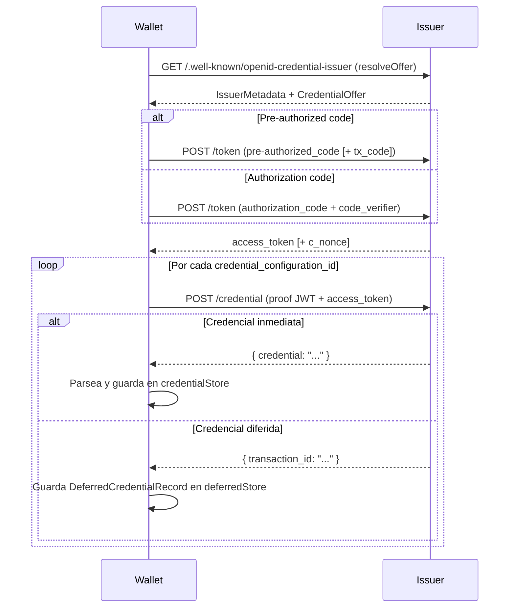

# Emisión de credenciales (OID4VCI)

## Cuándo se usa

Este flujo aplica cuando el usuario recibe una **credential offer** de un issuer — típicamente
escaneando un código QR o abriendo un deep link del tipo
`openid-credential-offer://?credential_offer=...`, `haip-vci://?credential_offer_uri=...` u
otros esquemas listados en [Invitaciones](01-invitations.md). La wallet resuelve el offer,
negocia un access token con el issuer y solicita las credenciales firmando un proof JWT con la
clave del holder. Las credenciales recibidas quedan persistidas automáticamente en los stores
del SDK.

---

## Diagrama



---

## Caso común: pre-authorized code sin PIN

```dart
// 1. Resolver la URL del offer (GET metadatos del issuer incluido)
final offer = await session.openid4vci.resolveOffer(offerUri);

// 2. Adquirir las credenciales (POST /token + POST /credential)
final result = await session.openid4vci.acquireCredentials(
  resolvedOffer: offer,
);

// result.credentials          — List<CredentialRecord> disponibles de inmediato
// result.deferredCredentials  — List<DeferredCredentialRecord> aún pendientes en el issuer
```

`acquireCredentials` guarda cada `CredentialRecord` en `credentialStore` y cada
`DeferredCredentialRecord` en `deferredStore` **de forma automática**, antes de retornar.
No es necesario persistir nada manualmente.

---

## Variantes

### Pre-authorized code con txCode (PIN de transacción)

Algunos issuers incluyen un código de transacción de un solo uso (por ejemplo un PIN de
4 dígitos enviado por SMS). Para detectarlo, verificar el campo `flow` del offer resuelto:

```dart
final offer = await session.openid4vci.resolveOffer(offerUri);

if (offer.flow == Oid4VciFlow.preAuthWithTxCode) {
  // Pedir el código al usuario antes de continuar
  final pin = await ui.promptForTxCode();

  final result = await session.openid4vci.acquireCredentials(
    resolvedOffer: offer,
    txCode: pin,
  );
}
```

Valores del enum `Oid4VciFlow`:

| Valor | Descripción |
|---|---|
| `Oid4VciFlow.preAuth` | Pre-authorized code, sin código de transacción. |
| `Oid4VciFlow.preAuthWithTxCode` | Pre-authorized code con código de transacción requerido. |
| `Oid4VciFlow.authCode` | Authorization code (requiere PKCE y redirect de browser). |

### Authorization code (con PKCE)

Este flujo requiere que la app abra un browser, gestione el redirect y proporcione los
parámetros PKCE. El SDK expone `prepareAuthCodeFlow` para generar PKCE, `state` y la URI del
authorization endpoint; la app abre el browser y luego llama a `acquireCredentialsWithAuthCode`.

```dart
final offer = await session.openid4vci.resolveOffer(offerUri);

if (offer.flow != Oid4VciFlow.authCode) {
  return;
}

const redirectUri = 'quark-wallet://callback'; // registrado en el issuer

// 1. Preparar URI de autorización (PKCE + authorization_details)
final prepared = await session.openid4vci.prepareAuthCodeFlow(
  resolvedOffer: offer,
  redirectUri: redirectUri,
);

// 2. Abrir prepared.authorizationUri en browser (in-app o externo)
//    Conservar prepared.codeVerifier y prepared.state para el callback

// 3. Tras el redirect, intercambiar code por credenciales
final result = await session.openid4vci.acquireCredentialsWithAuthCode(
  resolvedOffer: prepared.resolvedOffer,
  authorizationCode: authorizationCode, // parámetro "code" del redirect
  codeVerifier: prepared.codeVerifier,
  redirectUri: redirectUri,
  clientId: 'mi-client-id', // opcional
);
```

`prepareAuthCodeFlow` resuelve el authorization server OAuth del issuer, construye
`authorization_details` por cada `credential_configuration_id` y añade `scope` con `openid` más
los IDs de configuración.

Origen de cada parámetro en `acquireCredentialsWithAuthCode`:

- `authorizationCode` — valor del parámetro `code` en la URL de redirect del browser.
- `codeVerifier` — el mismo `prepared.codeVerifier` del paso 1 (PKCE S256).
- `redirectUri` — idéntico al usado en `prepareAuthCodeFlow`.
- `clientId` — opcional según el issuer.

> **Issuers EUDI** (`issuer.eudiw.dev`) usan authorization code con `haip-vci://` en el QR.
> Ver [Invitaciones](01-invitations.md) para esquemas y normalización de URLs.

### Credenciales diferidas

Cuando el issuer no puede emitir la credencial de inmediato, responde con un `transaction_id`.
El SDK persiste el `DeferredCredentialRecord` en `deferredStore` automáticamente.

Para reintentar más tarde:

```dart
// Obtener todos los registros diferidos pendientes
final pending = await session.deferredStore.getAll();

for (final deferred in pending) {
  await session.openid4vci.retryDeferred(deferred);
}
```

**Comportamiento real de `retryDeferred`:**

| Situación | Qué hace el método | Retorna |
|---|---|---|
| El record no tiene `credential_endpoint` o `transaction_id` | Retorna de inmediato sin tocar `deferredStore`. | `null` |
| El issuer responde sin `credential` (aún pendiente) | No modifica el record en `deferredStore`. | `null` |
| El issuer responde con `credential` | Actualiza el `DeferredCredentialRecord` en `deferredStore` con la respuesta cruda. | `null` |

En todos los casos el método retorna `null`. Cuando el issuer ya devuelve la credencial, el caller
es responsable de leer el registro actualizado desde `deferredStore`, parsear el JWT e insertarlo
en `credentialStore`.

Esta limitación es conocida. Consultar [../07-limitations.md](../07-limitations.md) para el
estado actual y la hoja de ruta.

---

## Errores posibles

| Excepción | Causa |
|---|---|
| `StateError` | El offer no contiene un grant `pre_authorized_code` y se llamó a `acquireCredentials`. |
| `StateError` | Se llamó a `prepareAuthCodeFlow` con un offer cuyo `flow` no es `Oid4VciFlow.authCode`. |
| `DioException` | Error de red, timeout, o respuesta HTTP de error del token endpoint o credential endpoint. |
| `FormatException` | La `offerUri` no contiene ni `credential_offer` ni `credential_offer_uri`. |

Para un tratamiento exhaustivo de errores, consultar
[../05-reference/06-errors.md](../05-reference/06-errors.md).

---

## Probar contra issuers reales

El SDK funciona contra cualquier issuer OID4VCI-compatible. Para pruebas de interoperabilidad
EUDI, usar `issuer.eudiw.dev` con un QR `haip-vci://` o `openid-credential-offer://`.

Para probar contra el issuer de Quark, pedir al equipo una URL de offer generada por el issuer
service. No se requiere configuración especial en el SDK: basta con pasar la URL recibida a
`resolveOffer`.

---

## Ver también

- [01-invitations.md](01-invitations.md) — cómo la wallet detecta y despacha un offer recibido como invitación.
- [../05-reference/01-stores.md](../05-reference/01-stores.md) — API de `credentialStore` y `deferredStore`.
- [../05-reference/02-credentials.md](../05-reference/02-credentials.md) — modelos `CredentialRecord`, `SdJwtVcRecord`, `W3cCredentialRecord`.
- [../05-reference/06-errors.md](../05-reference/06-errors.md) — catálogo de errores y estrategias de manejo.
