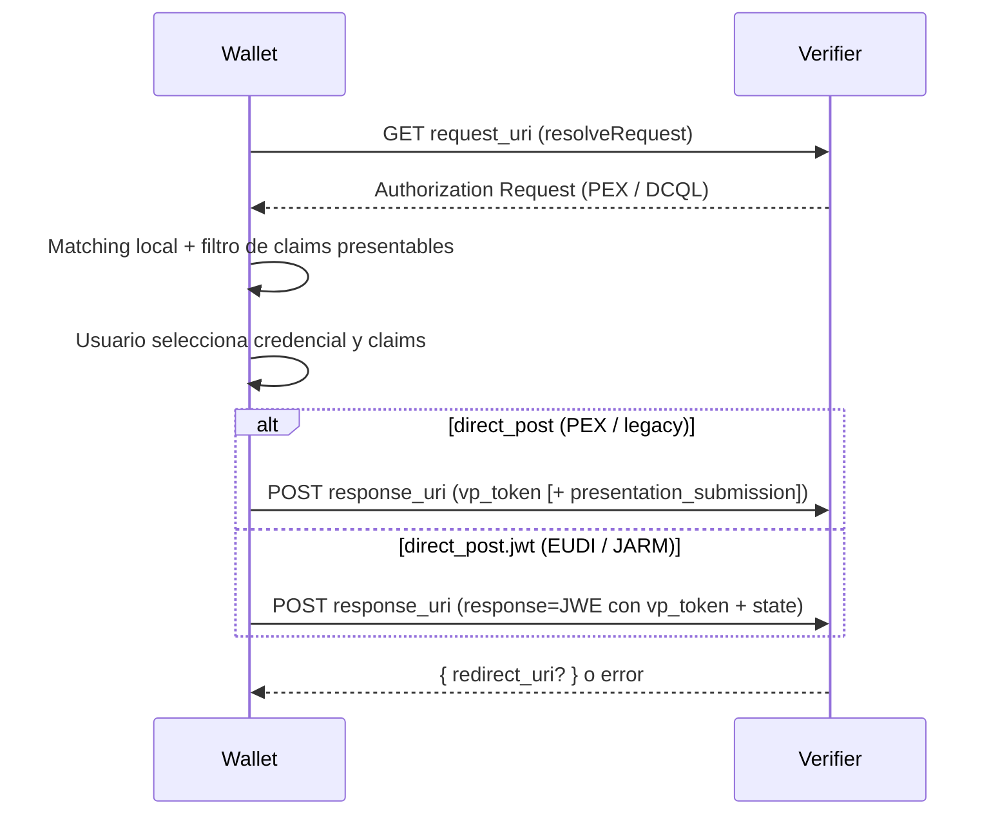

# Presentación de credenciales (OID4VP)

## Cuándo se usa

Este flujo aplica cuando un verifier solicita que la wallet demuestre que el usuario posee
ciertas credenciales — típicamente escaneando un código QR o abriendo un deep link del tipo
`openid4vp://?request_uri=...`, `eudi-openid4vp://?...` u `haip://?...`. La wallet resuelve
el authorization request, realiza el matching local de credenciales con PEX o DCQL, el usuario
elige qué credencial y qué claims compartir, y la wallet envía la respuesta al `response_uri`
del verifier (`vp_token` en texto plano o JWE cifrado según `response_mode`).

---

## Diagrama



---

## Código mínimo

```dart
// 1. Resolver el authorization request y obtener las credenciales candidatas
final request = await session.openid4vp.resolveRequest(uri);

// 2. Verificar que haya credenciales disponibles para todos los descriptores
if (!request.submission.areAllSatisfied) {
  // El usuario no tiene las credenciales requeridas por el verifier
  return;
}

// 3. Compartir credenciales con el verifier
final result = await session.openid4vp.shareCredentials(
  resolvedRequest: request,
  selectedCredentials: {'descriptorId': 'credentialId'},
  selectedDisclosures: {'descriptorId': ['given_name', 'family_name']},
);

if (result.success) {
  // Presentación aceptada; result.redirectUri puede tener un URI de redirect opcional
} else {
  // result.error contiene el mensaje devuelto por el verifier
}
```

### Semántica de los dos mapas

**`selectedCredentials`** — `Map<String, String>`

Asocia cada `inputDescriptorId` con el `id` de la `CredentialRecord` elegida para satisfacer
ese descriptor. Debe tener una entrada por cada descriptor presente en
`request.submission.entries` cuyo `isSatisfied` sea `true`.

```dart
// Ejemplo: el descriptor "id_card" se satisface con la credencial "cred-abc"
selectedCredentials: {
  'id_card': 'cred-abc',
}
```

**`selectedDisclosures`** — `Map<String, List<String>>`

Asocia cada `inputDescriptorId` con los paths de claims que se revelarán al verifier.
**Si el mapa está vacío para un descriptor, o si el descriptor no aparece en el mapa,
se revelan todos los claims de esa credencial.**

```dart
// Revelar solo nombre y apellido para el descriptor "id_card"
selectedDisclosures: {
  'id_card': ['given_name', 'family_name'],
}

// Revelar todos los claims de "id_card" (disclosure total)
selectedDisclosures: {}
// — o bien —
selectedDisclosures: {'id_card': []}
```

> Nota: el comportamiento de selective disclosure solo aplica a credenciales **SD-JWT VC**.
> Para credenciales **W3C JSON-LD** se presenta siempre la credencial completa,
> independientemente del contenido de `selectedDisclosures`.
> Ver [Selective disclosure](#selective-disclosure) más abajo.

---

## Cómo construir la UI de selección

`resolveRequest` retorna un `CredentialsForRequest` cuyo campo `submission` es una
`FormattedSubmission`. La estructura real es la siguiente:

```
FormattedSubmission
  ├── name            String?          — nombre de la solicitud (del PEX name o metadata del verifier)
  ├── purpose         String?          — propósito declarado por el verifier
  ├── areAllSatisfied bool             — true si todos los descriptores tienen credenciales disponibles
  └── entries         List<FormattedSubmissionEntry>
        ├── inputDescriptorId   String           — ID del descriptor (clave para los dos mapas)
        ├── isSatisfied         bool             — true si hay al menos una credencial candidata
        ├── name                String?          — nombre descriptivo del tipo de credencial requerida
        ├── purpose             String?          — propósito específico de este descriptor
        ├── matchingCredentials List<CredentialRecord>? — credenciales que satisfacen el descriptor
        └── requestedClaimPaths List<String>?   — paths de claims solicitados **y presentables** (ver abajo)
```

Campos adicionales en `CredentialsForRequest` (útiles para el envío, no para la UI):

| Campo | Descripción |
|---|---|
| `responseMode` | Modo de respuesta del authorization request. `direct_post` (por defecto) o `direct_post.jwt` (JARM, verifiers EUDI). |
| `clientMetadata` | Metadatos del verifier; incluye `jwks` necesario para cifrar la respuesta JARM. |
| `authorizationEncryptedResponseEnc` | Algoritmo de cifrado de contenido JWE (típicamente `A128GCM`). |

Snippet que construye los mapas iniciales para la UI (equivalente al patrón del provider
interno de la wallet):

```dart
// Selección por defecto: primera credencial que satisface cada descriptor
final Map<String, String> selectedCredentials = {
  for (final entry in request.submission.entries)
    if (entry.isSatisfied && (entry.matchingCredentials?.isNotEmpty ?? false))
      entry.inputDescriptorId: entry.matchingCredentials!.first.id,
};

// Disclosures por defecto: los claims solicitados por el verifier
final Map<String, List<String>> selectedDisclosures = {
  for (final entry in request.submission.entries)
    if (entry.requestedClaimPaths != null)
      entry.inputDescriptorId: entry.requestedClaimPaths!,
};
```

Para armar la lista de ítems de la UI:

```dart
for (final entry in request.submission.entries) {
  // Título del requisito
  final title = entry.name ?? entry.inputDescriptorId;

  // Credenciales candidatas (puede ser null si !entry.isSatisfied)
  final candidates = entry.matchingCredentials ?? [];

  // Claims que el verifier solicita y que la credencial puede revelar
  final claims = entry.requestedClaimPaths ?? [];

  // Si entry.isSatisfied == false, el usuario no posee una credencial para este descriptor.
  // Mostrar un mensaje de advertencia con entry.name / entry.purpose y deshabilitar el botón de envío.
}
```

---

## Perfil EUDI (DCQL + JARM)

Los verifiers del ecosistema EUDI Wallet (p. ej. `verifier.eudiw.dev`) suelen combinar:

1. **DCQL** en lugar de PEX para describir la credencial y los claims requeridos.
2. **`response_mode: direct_post.jwt`** — la wallet no envía `vp_token` en claro sino un
   parámetro `response` con un JWE (JARM, OID4VP §8.3).
3. **`client_metadata.jwks`** — clave P-256 del verifier para ECDH-ES + `A128GCM`.

### Formato `vp_token` con DCQL

Con `queryType == QueryType.dcql`, el SDK construye `vp_token` como **objeto JSON**:

```json
{
  "credential_query_id": ["<sd-jwt-presentado-con-kb-jwt>"]
}
```

Cada clave es el `id` de la entrada en `dcql_query.credentials`; el valor es un **array**
con una presentación (OID4VP §8.1). Con PEX, `vp_token` sigue siendo un `String` o `List<String>`.

### Envío con JARM (`direct_post.jwt`)

Si `request.responseMode == 'direct_post.jwt'`, `submitPresentation` cifra un payload JSON:

```json
{ "state": "...", "vp_token": { ... } }
```

y envía `response=<JWE compacto>` como `application/x-www-form-urlencoded`. El SDK selecciona
la primera JWK de cifrado en `client_metadata.jwks` con `alg: ECDH-ES` y `crv: P-256`.

Soporte actual de JARM: `ECDH-ES` + `A128GCM` + curva P-256. Otros algoritmos lanzan
`UnsupportedError` al cifrar.

### Paths DCQL con arrays

DCQL puede expresar contenedores de array con `null` en el path, p. ej.
`["nationalities", null]`. El SDK lo convierte a la notación con puntos `nationalities` y
selecciona los disclosures de los elementos del array en el SD-JWT.

---

## Selective disclosure

La selective disclosure solo aplica a credenciales **SD-JWT VC**. Al llamar a
`shareCredentials`, el SDK incluye únicamente los claims listados en `selectedDisclosures`
para ese descriptor, **filtrados a los que la credencial puede revelar realmente**.

Para credenciales **W3C JSON-LD**, el SDK siempre presenta la credencial completa. El
contenido de `selectedDisclosures` se ignora para ese formato.

### Filtrado de claims presentables

En el matching DCQL (`matchDcql`) y al construir la presentación (`buildPresentation`), el SDK
filtra los paths solicitados por el verifier:

- Omite claims que **no existen** en la credencial (p. ej. `picture` si el issuer no lo emitió).
- Omite claims que **no son revelables** con selective disclosure (sin disclosure asociado).
- Soporta rutas anidadas (`address.locality`) y contenedores de array (`nationalities`).

Por eso `entry.requestedClaimPaths` en la UI ya refleja solo lo que se puede compartir. Si el
verifier pide diez campos y la credencial solo soporta siete, la lista mostrada al usuario
tendrá siete — no fallará al pulsar "Compartir" por intentar revelar claims inexistentes.

### Holder binding y `cnf.jwk`

Si la credencial SD-JWT incluye `cnf.jwk` en el payload, el kb-JWT se firma con la clave
privada del wallet que coincide con esa JWK (típico en credenciales EUDI PID). Si no hay
coincidencia, se usa la clave de firma P-256 por defecto del holder DID.

Reglas de `selectedDisclosures`:

| Valor para un descriptor | Comportamiento |
|---|---|
| Lista de paths (p. ej. `['given_name']`) | Se revelan solo esos claims (SD-JWT VC). |
| Lista vacía `[]` | Se revelan todos los claims disponibles. |
| Descriptor ausente del mapa | Se revelan todos los claims disponibles. |

---

## Trust

Si al inicializar el SDK se configuró un `TrustConfig`, el método `resolveRequest` valida
automáticamente la confianza del verifier antes de retornar. La validación puede incluir
certificados X.509 o el registro EUDI RP Trust Anchor según la configuración.

El resultado de la validación queda en `request.trustedEntity` (`TrustedEntity?`):
- `null` — no se pudo determinar la confianza (o no hay `TrustConfig` configurado).
- Valor presente — el verifier fue reconocido; los campos del `TrustedEntity` permiten
  mostrar al usuario el nombre y el nivel de confianza del verifier.

Consultar [../05-reference/05-trust.md](../05-reference/05-trust.md) para la configuración
completa de `TrustConfig` y los modelos de confianza soportados.

---

## Errores posibles

| Excepción | Causa |
|---|---|
| `StateError` | `resolvedRequest.submission.areAllSatisfied` es `false` al llamar a `shareCredentials`. |
| `StateError` | El authorization request no tiene `response_uri`. |
| `StateError` | Una `credentialId` del mapa `selectedCredentials` no existe en `credentialStore`. |
| `result.success == false` | Error de red, timeout o rechazo HTTP del verifier. El detalle está en `result.error`. |
| `result.success == false` | `response_mode: direct_post.jwt` pero `client_metadata` no incluye `jwks` utilizables. |
| `result.success == false` | Fallo al cifrar la respuesta JARM (algoritmo no soportado, JWK inválida). |

**No es necesario un `try/catch`** para la fase de envío — el SDK captura errores de red y
de cifrado internamente y los comunica vía `SubmitPresentationResult`.

Cuando `shareCredentials` completa con éxito, el SDK guarda automáticamente una
`PresentationActivity` en `activityStore` con el `verifierClientId` y los IDs de las
credenciales presentadas. No es necesario registrar la actividad manualmente.

Para un tratamiento exhaustivo de errores consultar
[../05-reference/06-errors.md](../05-reference/06-errors.md).

---

## Ver también

- [01-invitations.md](01-invitations.md) — cómo la wallet detecta y despacha un authorization request recibido como invitación.
- [02-oid4vci.md](02-oid4vci.md) — flujo complementario de emisión de credenciales.
- [../05-reference/01-stores.md](../05-reference/01-stores.md) — API de `credentialStore` y `activityStore`.
- [../05-reference/05-trust.md](../05-reference/05-trust.md) — configuración de `TrustConfig` y modelos de confianza.
- [../05-reference/06-errors.md](../05-reference/06-errors.md) — catálogo de errores y estrategias de manejo.
