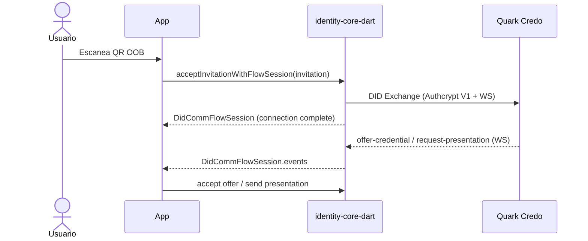

# Mensajería DIDComm

## Cuándo se usa

DIDComm cubre la mensajería punto a punto entre la wallet y un agente remoto (emisor, verificador o intermediario) cuando el protocolo de transporte es DIDComm en lugar de OID4VCI/OID4VP.

Los casos típicos son:

- **Establecer una conexión persistente** con un agente que envió una invitación OOB (RFC 0434).
- **Recibir una oferta de credencial** a través de la conexión (RFC 0036 issue-credential 2.0).
- **Responder a una solicitud de presentación** sobre la conexión (RFC 0037 present-proof 2.0).

### Versión y protocolos implementados

El SDK alinea mensajería con agentes Credo (backend Quark):

- Decoradores Aries / DIDComm v1 (`@type`, `@id`, `~thread`, `credentials~attach`).
- Message types `https://didcomm.org/...` (didexchange, issue-credential, present-proof).
- Empaquetado **DIDComm v1 Authcrypt/Anoncrypt** vía `DidCommEnvelopeV1` (libsodium sealed box / box, compatible Credo + Askar).

El flujo principal de wallet usa `DidCommFlowSession` (WebSocket abierto) para recibir `offer-credential` y `request-presentation` tras el handshake.

---

## Estado de implementación

| Capacidad | Estado | Notas |
|---|---|---|
| Parseo de invitación OOB (URL `?oob=`, `?c_i=`, `didcomm://`) | Funcional | `OobParser` / `InvitationParser` |
| Detección de flujo por `goal_code` | Funcional | `issue-vc` / `request-proof` / connect |
| DID Exchange + `did:peer:2` | Funcional | Handshake hasta `complete` con WS |
| Envelope Credo V1 (Authcrypt/Anoncrypt) | Funcional | `DidCommEnvelopeV1` + `DidCommEncryptedSend` |
| `DidCommFlowSession` (inbound WS) | Funcional | Offer / request-presentation / ack |
| RFC 0036 issue-credential | Funcional | Offer → request → issue vía sesión |
| RFC 0037 present-proof | Funcional | Request → VP LDP firmada → presentation; si la VC es BBS+, deriveProof selectivo (PEX) antes de embeber |
| `handleIncomingMessage()` | Funcional | Ad-hoc; preferir `DidCommFlowSession` |
| Interop con backend Quark (Credo) | En uso | Mismo envelope v1 que issuer/verifier |

Para el contexto completo del roadmap, ver [Limitaciones conocidas](../07-limitations.md).

---

## Diagrama

Flujo principal con sesión WS (wallet ↔ Credo):



---

## Código

### Aceptar una invitación OOB

El punto de entrada para DIDComm desde el flujo de invitaciones es `session.didcomm.acceptInvitation()`. Recibe el `Map<String, dynamic>` que devuelve `OobParser.parse()` o `InvitationResolver.resolve()`.

```dart
import 'package:identity_core_dart/identity_core.dart';

// Preferir sesión de flujo (WS abierto) para emisión/verificación:
final DidCommFlowSession flow =
    await session.didcomm.acceptInvitationWithFlowSession(invitation);

// O solo conexión (cierra WS al terminar el handshake):
final ConnectionRecord connection =
    await session.didcomm.acceptInvitation(invitation);
```

**Firmas:**

```dart
Future<ConnectionRecord> acceptInvitation(Map<String, dynamic> invitation)
Future<DidCommFlowSession> acceptInvitationWithFlowSession(
  Map<String, dynamic> invitation,
)
```

### Listar conexiones existentes

```dart
final List<ConnectionRecord> conexiones =
    await session.didcomm.getConnections();
```

**Firma exacta:**

```dart
Future<List<ConnectionRecord>> getConnections()
```

### Stream reactivo de conexiones

Para actualizar la UI ante cambios en el store de conexiones:

```dart
StreamBuilder<List<ConnectionRecord>>(
  stream: session.didcomm.connections,
  builder: (context, snapshot) {
    final lista = snapshot.data ?? [];
    // ...
  },
)
```

**Firma exacta:**

```dart
Stream<List<ConnectionRecord>> get connections
```

### Sesión de flujo (recomendado) y desencriptado ad-hoc

Para emisión/verificación con Quark, preferí `acceptInvitationWithFlowSession` y
escuchar `DidCommFlowSession.events` (el SDK clasifica offer / request / ack).

`handleIncomingMessage` desencripta un envelope Credo V1 con las claves
**Ed25519** del store (prueba cada una hasta coincidir el `kid`). Sirve para
canales ad-hoc (push, polling); el routing por `@type` queda a cargo del caller
si no usás la sesión.

```dart
final Map<String, dynamic> mensaje =
    await session.didcomm.handleIncomingMessage(encryptedJson);

final tipo = mensaje['@type'] as String? ?? mensaje['type'] as String?;
// Rutear a credentialExchange / proofExchange según el tipo
```

**Firma:**

```dart
Future<Map<String, dynamic>> handleIncomingMessage(String encryptedJson)
```

### Intercambio de credenciales (RFC 0036) — uso directo

Si la app tiene acceso al mensaje desencriptado y al `ConnectionRecord`, puede invocar los métodos del `CredentialExchangeService` directamente:

```dart
// Recibir oferta y enviar request automaticamente
final CredentialExchangeRecord exRecord =
    await session.didcomm.credentialExchange.handleOfferCredential(
  message: mensajeOffer,
  connection: connection,
);
// exRecord.state == CredentialExchangeState.requestSent

// Cuando llega el issue-credential:
final CredentialExchangeRecord completado =
    await session.didcomm.credentialExchange.handleIssueCredential(
  message: mensajeIssue,
  exchangeRecord: exRecord,
);
// completado.credentialAttach contiene el attachment de la credencial
// La app es responsable de extraer y persistir la credencial
```

**Advertencia:** los `CredentialExchangeRecord` y `ProofExchangeRecord` no se persisten en ningún store. La app debe mantenerlos en memoria o persistirlos por su cuenta.

### Intercambio de prueba (RFC 0037) — uso directo

```dart
final ProofExchangeRecord proofRecord =
    await session.didcomm.proofExchange.handleRequestPresentation(
  message: mensajeRequest,
  connection: connection,
);

final ProofExchangeRecord enviado =
    await session.didcomm.proofExchange.sendPresentation(
  exchangeRecord: proofRecord,
  vpToken: miVpToken,
  connection: connection,
);
// enviado.state == ProofExchangeState.presentationSent
```

---

## Interoperabilidad con el backend Quark

Issuer y verifier Quark usan Credo-TS con Askar (`CryptoBox.seal` / `crypto_box`). El SDK Dart usa el mismo wire format vía `DidCommEnvelopeV1`.

Flujo wallet típico:

1. `acceptInvitationWithFlowSession` — handshake + WS abierto.
2. Escucha `DidCommFlowSession.events` (`credentialOffer`, `presentationRequest`, …).
3. Responde con `DidCommEncryptedSend` (mismo envelope).

`handleIncomingMessage` desencripta con Envelope V1 (claves Ed25519 del store) para canales ad-hoc; no usar el stack JWE XC20P legacy (eliminado).

---

## Errores

| Error | Tipo | Causa |
|---|---|---|
| `StateError: No se encontró clave Ed25519...` | `StateError` | `handleIncomingMessage` sin claves Ed25519 con `privateJwk` en el store |
| `StateError: No se pudo desencriptar...` | `StateError` | Ninguna clave del store coincide con el `kid` del envelope |
| `UnsupportedError: alg no soportado` | `UnsupportedError` | Envelope con `alg` distinto de `Anoncrypt` / `Authcrypt` |
| `DioException` al enviar | `DioException` | Fallo de red o rechazo HTTP del agente remoto |

Los errores de parseo de invitación (URL mal formada, base64 inválido) no lanzan — `OobParser.parse()` devuelve `null`. `InvitationResolver.resolve()` convierte esos `null` en `InvitationErrorResult` (ver [Flujo de invitaciones](01-invitations.md)).

---

## Ver también

- [Flujo de invitaciones](01-invitations.md) — punto de entrada y parseo de URLs DIDComm
- [Referencia de stores](../05-reference/01-stores.md) — `ConnectionRecordStore` y persistencia
- [Limitaciones conocidas](../07-limitations.md) — estado de interop DIDComm v1/v2, roadmap Fase 7
