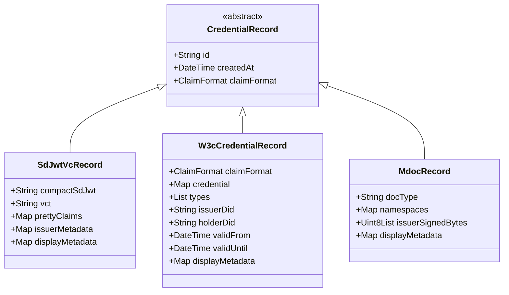

# Referencia de modelos de credencial

Este documento describe los modelos de dominio que representan las credenciales verificables almacenadas en la wallet. Cubrimos la jerarquía de clases, los campos de cada formato, los helpers de visualización para UI y el patrón de pattern matching recomendado.

---

## 1. Jerarquía de modelos



### Campos comunes del contrato base

`CredentialRecord` es una clase `abstract` (no `sealed`). Los tres subtipos la implementan mediante `freezed`.

| Campo | Tipo | Descripción |
|---|---|---|
| `id` | `String` | Identificador único dentro del wallet. Formato: `'{formato}-{uuid}'` (p. ej. `'sd-jwt-vc-abc123'`). |
| `createdAt` | `DateTime` | Fecha y hora en que la credencial fue almacenada. |
| `claimFormat` | `ClaimFormat` | Enum que discrimina el formato: `sdJwtVc`, `w3cJwt`, `w3cLdp`, `mdoc`. |

El enum `ClaimFormat` refleja los formatos del ecosistema EUDI:

```dart
enum ClaimFormat {
  sdJwtVc,   // dc+sd-jwt — formato principal EUDI
  w3cJwt,    // jwt_vc_json
  w3cLdp,    // ldp_vc (JSON-LD)
  mdoc,      // ISO 18013-5 (CBOR)
}
```

---

## 2. Modelos por formato

### 2.1 `SdJwtVcRecord` — SD-JWT VC (`dc+sd-jwt`)

Es el formato principal del ecosistema EUDI. Al recibirlo, el SDK decodifica todas las disclosures y guarda los claims resueltos en `prettyClaims`, de modo que la UI puede renderizarlos sin re-parsear el token en cada operación.

| Campo | Tipo | Descripción |
|---|---|---|
| `id` | `String` | `'sd-jwt-vc-{uuid}'` |
| `createdAt` | `DateTime` | Fecha de almacenamiento. |
| `compactSdJwt` | `String` | Token SD-JWT compacto completo: `{issuer-jwt}~{disc1}~{disc2}~...~` |
| `vct` | `String` | Tipo de credencial declarado por el issuer en el claim `vct`. Ej.: `'eu.europa.ec.eudi.pid_vc_sd_jwt'` |
| `prettyClaims` | `Map<String, dynamic>` | Claims decodificados con todas las disclosures aplicadas, listos para UI. |
| `issuerMetadata` | `Map<String, dynamic>?` | Metadata del issuer del endpoint `/.well-known/openid-credential-issuer`. |
| `displayMetadata` | `Map<String, dynamic>?` | Nombre, colores y logo extraídos de `issuerMetadata`. |

#### Acceso a los claims

Para mostrar claims en pantalla, usar `prettyClaims` directamente:

```dart
final record = credential as SdJwtVcRecord;
final givenName = record.prettyClaims['given_name'] as String?;
final familyName = record.prettyClaims['family_name'] as String?;
```

Para operaciones avanzadas (selective disclosure en OID4VP), se trabaja con el token compacto y `SdJwtParser` / `SdJwtSelector`:

```dart
// Parsear el token (operación async)
final token = await SdJwtParser.parse(record.compactSdJwt);

// Seleccionar disclosures para varios paths (OID4VP / DCQL)
final selected = SdJwtSelector.selectDisclosuresForPaths(
  token,
  ['given_name', 'nationalities', 'address.locality'],
);

// Construir el SD-JWT presentado (sin kb-JWT)
final presented = SdJwtSelector.buildPresented(token, selected);
```

Para filtrar paths solicitados por un verifier a los realmente presentables:

```dart
final presentable = SdJwtSelector.filterPresentableClaimPaths(
  token: token,
  requestedPaths: ['given_name', 'picture', 'age_over_18'],
);
// → solo incluye paths que la presentación parcial puede revelar
```

Ver [OID4VP](../04-flows/03-oid4vp.md) para el flujo completo de presentación.

---

### 2.2 `W3cCredentialRecord` — W3C Verifiable Credential

Soporta JWT (`w3cJwt`) y JSON-LD (`w3cLdp`). El campo `claimFormat` distingue ambos casos dentro del mismo tipo.

| Campo | Tipo | Descripción |
|---|---|---|
| `id` | `String` | `'w3c-credential-{uuid}'` |
| `createdAt` | `DateTime` | Fecha de almacenamiento. |
| `claimFormat` | `ClaimFormat` | `w3cJwt` o `w3cLdp`. |
| `credential` | `Map<String, dynamic>` | JSON completo de la W3C Verifiable Credential. |
| `types` | `List<String>` | Tipos del campo `type`. Ej.: `['VerifiableCredential', 'UniversityDegreeCredential']` |
| `issuerDid` | `String?` | DID del issuer. |
| `holderDid` | `String?` | DID del holder (de `credentialSubject.id`). |
| `validFrom` | `DateTime?` | Inicio de validez (`validFrom` o `issuanceDate`). |
| `validUntil` | `DateTime?` | Fin de validez (`validUntil` o `expirationDate`). |
| `displayMetadata` | `Map<String, dynamic>?` | Metadata de visualización extraída de la credencial. |

#### Acceso a los claims

Los claims del holder se encuentran en `credentialSubject` dentro del JSON de la credencial:

```dart
final record = credential as W3cCredentialRecord;
final subject = record.credential['credentialSubject'] as Map<String, dynamic>?;
final degree = subject?['degree'] as Map<String, dynamic>?;
final degreeName = degree?['name'] as String?;
```

Para distinguir JWT de JSON-LD:

```dart
if (record.claimFormat == ClaimFormat.w3cJwt) {
  // credencial JWT: el JSON ya está decodificado del payload
} else {
  // credencial JSON-LD: el campo @context está presente
  final context = record.credential['@context'];
}
```

---

### 2.3 `MdocRecord` — mDoc (ISO 18013-5)

> **Estado actual (Fase 3):** `MdocRecord` almacena el documento CBOR firmado (`issuerSignedBytes`) y los atributos pre-decodificados agrupados por namespace (`namespaces`). El parsing CBOR completo mediante `MdocParser` está planificado para **Fase 4** y aún no está implementado. Las operaciones que requieran verificar la firma CBOR del issuer o construir una `DeviceResponse` para presentación offline **no están disponibles todavía**. Ver [Limitaciones](../07-limitations.md).

| Campo | Tipo | Descripción |
|---|---|---|
| `id` | `String` | `'mdoc-{uuid}'` |
| `createdAt` | `DateTime` | Fecha de almacenamiento. |
| `docType` | `String` | Tipo de documento mDoc. Ej.: `'eu.europa.ec.eudi.pid_mdoc'` |
| `namespaces` | `Map<String, Map<String, dynamic>>` | Atributos agrupados por namespace. Estructura: `{ namespace: { claimName: claimValue } }` |
| `issuerSignedBytes` | `Uint8List` | Bytes CBOR del `IssuerSigned` firmado, necesarios para presentación offline. |
| `displayMetadata` | `Map<String, dynamic>?` | Metadata de visualización extraída del credential endpoint. |

#### Acceso a los claims

Los claims están pre-decodificados en `namespaces` y se acceden directamente por namespace y nombre de claim:

```dart
final record = credential as MdocRecord;

// Namespace del PID europeo
const ns = 'eu.europa.ec.eudi.pid.1';
final claims = record.namespaces[ns];

final familyName = claims?['family_name'] as String?;
final birthDate = claims?['birth_date'];
```

Para iterar todos los atributos de todos los namespaces:

```dart
for (final entry in record.namespaces.entries) {
  final namespace = entry.key;
  final attributes = entry.value;
  for (final attr in attributes.entries) {
    print('$namespace / ${attr.key}: ${attr.value}');
  }
}
```

---

## 3. Display para UI

El SDK expone un conjunto de tipos de dato para construir la representación visual de una credencial de forma agnóstica al formato subyacente.

### `CredentialForDisplay`

Modelo normalizado que la wallet construye a partir de un `CredentialRecord`. Agrupa la información visual y los atributos formateados en una sola estructura:

| Campo | Tipo | Descripción |
|---|---|---|
| `id` | `String` | Coincide con `CredentialRecord.id`. |
| `createdAt` | `DateTime` | Fecha de almacenamiento. |
| `claimFormat` | `ClaimFormat` | Formato subyacente. |
| `display` | `CredentialDisplay` | Nombre, colores, logo de la credencial. |
| `attributes` | `List<FormattedAttribute>` | Atributos tipados y listos para renderizar. |
| `rawAttributes` | `Map<String, dynamic>` | Claims crudos para operaciones programáticas. |
| `record` | `CredentialRecord` | Record original, necesario para firmar y presentar. |

### `CredentialDisplay` e `IssuerDisplay`

`CredentialDisplay` contiene la metadata visual de la credencial:

| Campo | Tipo | Descripción |
|---|---|---|
| `name` | `String?` | Nombre descriptivo (ej. `'Documento de identidad'`). |
| `description` | `String?` | Descripción breve del propósito. |
| `textColor` | `String?` | Color del texto en hex (ej. `'#FFFFFF'`). |
| `backgroundColor` | `String?` | Color de fondo en hex (ej. `'#003399'`). |
| `backgroundImageUrl` | `String?` | URL de la imagen de fondo de la tarjeta. |
| `issuer` | `IssuerDisplay` | Información del emisor (nombre, dominio, logo). |

`IssuerDisplay` incluye `name`, `domain` y `logoUrl`, todos opcionales.

### `FormattedAttribute` (jerarquía sellada)

Los atributos listos para UI se representan con la jerarquía sellada `FormattedAttribute`. Cada subtipo encapsula el tipo de dato del claim:

| Subtipo | Campo de valor | Tipo de valor |
|---|---|---|
| `FormattedAttributeString` | `value` | `String` |
| `FormattedAttributeNumber` | `value` | `num` |
| `FormattedAttributeDate` | `value` | `DateTime` |
| `FormattedAttributeBool` | `value` | `bool` |
| `FormattedAttributeArray` | `items` | `List<FormattedAttribute>` |
| `FormattedAttributeObject` | `children` | `List<FormattedAttribute>` |

Todos los subtipos exponen `key` (ruta del claim) y `label` (etiqueta localizada del issuer, nullable).

### Ejemplo de uso

El integrador construye el `CredentialForDisplay` a partir del `CredentialRecord` recuperado del store, mapeando los campos según el formato. A continuación, un ejemplo que muestra el nombre de la credencial y lista sus atributos en un widget Flutter:

```dart
// Suponer que 'displayData' es un CredentialForDisplay ya construido
// a partir del CredentialRecord y la metadata del issuer.
Widget buildCredentialCard(CredentialForDisplay displayData) {
  return Column(
    crossAxisAlignment: CrossAxisAlignment.start,
    children: [
      // Nombre de la credencial
      Text(
        displayData.display.name ?? displayData.id,
        style: TextStyle(
          color: Color(
            int.parse(
              (displayData.display.textColor ?? '#000000')
                  .replaceFirst('#', '0xFF'),
            ),
          ),
        ),
      ),

      // Emisor
      if (displayData.display.issuer.name != null)
        Text('Emisor: ${displayData.display.issuer.name}'),

      const SizedBox(height: 8),

      // Lista de atributos formateados
      ...displayData.attributes.map((attr) => _buildAttribute(attr)),
    ],
  );
}

Widget _buildAttribute(FormattedAttribute attr) {
  final label = attr.label ?? attr.key;

  return switch (attr) {
    FormattedAttributeString(:final value) =>
      Text('$label: $value'),
    FormattedAttributeNumber(:final value) =>
      Text('$label: $value'),
    FormattedAttributeDate(:final value) =>
      Text('$label: ${value.toLocal()}'),
    FormattedAttributeBool(:final value) =>
      Text('$label: ${value ? 'Sí' : 'No'}'),
    FormattedAttributeArray(:final items) =>
      Column(
        crossAxisAlignment: CrossAxisAlignment.start,
        children: [
          Text('$label:'),
          ...items.map(_buildAttribute),
        ],
      ),
    FormattedAttributeObject(:final children) =>
      Column(
        crossAxisAlignment: CrossAxisAlignment.start,
        children: [
          Text('$label:'),
          ...children.map(_buildAttribute),
        ],
      ),
  };
}
```

El switch sobre `FormattedAttribute` es **exhaustivo** porque `FormattedAttribute` es `sealed`.

### `ClaimDisplayResolver` y `LabeledClaim`

Para listar claims con etiquetas legibles del metadata OID4VCI/EUDI (p. ej. `credential_metadata.claims`
con `display.name` localizado), usar `ClaimDisplayResolver`:

```dart
final record = await session.credentialStore.getById(credentialId);
if (record == null) return;

final labeled = ClaimDisplayResolver.resolve(
  record,
  locale: 'es', // opcional; BCP47 corto
);

for (final claim in labeled) {
  // claim.label — texto para UI ("Nombre", "Fecha de nacimiento")
  // claim.key   — clave técnica ("given_name")
  // claim.value — valor en la credencial
}
```

`LabeledClaim` es un DTO simple (`label`, `key`, `value`). El resolver:

1. Prioriza definiciones en `credential_metadata.claims` (array con `path` + `display`).
2. Hace fallback a `claims` legacy del issuer metadata.
3. Agrega claims presentes en la credencial pero sin metadata, con etiqueta humanizada (`given_name` → "Given Name").

Útil en pantallas de detalle de credencial y en OID4VP cuando se quieren mostrar nombres
amigables en lugar del último segmento del path técnico.

---

## 4. Pattern matching sobre `CredentialRecord`

`CredentialRecord` es una clase `abstract` (no `sealed`), por lo que el switch **no es exhaustivo** en tiempo de compilación y requiere un caso `default` o `_` para cubrir subtipos desconocidos.

### Switch con tipo explícito

```dart
void processCredential(CredentialRecord record) {
  switch (record) {
    case SdJwtVcRecord(:final vct, :final prettyClaims):
      print('SD-JWT VC — vct: $vct');
      print('Claims: $prettyClaims');

    case W3cCredentialRecord(:final types, :final issuerDid):
      print('W3C VC — tipos: $types');
      print('Issuer: $issuerDid');

    case MdocRecord(:final docType, :final namespaces):
      print('mDoc — docType: $docType');
      // CBOR completo pendiente (Fase 4)
      print('Namespaces: ${namespaces.keys.toList()}');

    default:
      // CredentialRecord no es sealed: default obligatorio para cubrir subtipos desconocidos
      print('Formato no reconocido: ${record.claimFormat}');
  }
}
```

### Discriminar por `claimFormat`

Si ya se tiene el `ClaimFormat` (por ejemplo, al filtrar una lista), puede ser más directo:

```dart
final sdJwtCredentials = credentials
    .where((r) => r.claimFormat == ClaimFormat.sdJwtVc)
    .cast<SdJwtVcRecord>()
    .toList();
```

### Renderizar el formato en la UI

```dart
String formatLabel(ClaimFormat format) => switch (format) {
  ClaimFormat.sdJwtVc => 'SD-JWT VC',
  ClaimFormat.w3cJwt  => 'W3C JWT',
  ClaimFormat.w3cLdp  => 'W3C JSON-LD',
  ClaimFormat.mdoc    => 'mDoc (ISO 18013-5)',
};
```

Este switch sí es exhaustivo porque `ClaimFormat` es un `enum`.

---

## Ver también

- [Stores](01-stores.md) — cómo persistir y recuperar `CredentialRecord` con `CredentialRecordStore`
- [OID4VCI](../04-flows/02-oid4vci.md) — flujo de emisión de credenciales
- [OID4VP](../04-flows/03-oid4vp.md) — flujo de presentación y selective disclosure
- [Limitaciones](../07-limitations.md) — estado del parsing CBOR de mDoc y cifrado en reposo
