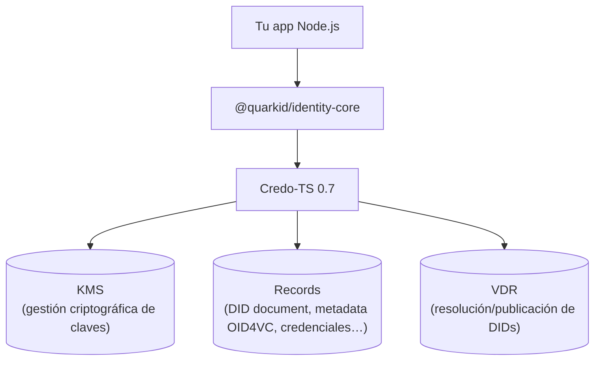

# Overview

## Qué es

`@quarkid/identity-core` es una librería TypeScript que envuelve [Credo-TS](https://credo.js.org/) 0.7 para habilitar agentes SSI (Self-Sovereign Identity) en el ecosistema QuarkID 2.0. La librería expone funciones de alto nivel para crear e inicializar agentes en los tres roles del flujo de credenciales verificables:

- **Issuer** (emisor): emite credenciales hacia un holder.
- **Holder** (titular): recibe, almacena y presenta credenciales.
- **Verifier** (verificador): solicita y valida presentaciones del holder.

Sobre Credo, la librería configura los protocolos de mensajería e intercambio que usa QuarkID:

- **DIDComm v1** — mensajería cifrada agente a agente (connections, credentials, proofs).
- **OID4VCI** (OpenID for Verifiable Credential Issuance) — emisión de credenciales vía OpenID.
- **OID4VP** (OpenID for Verifiable Presentations) — verificación de presentaciones vía OpenID.

Además provee soporte **multi-tenant**, donde un solo agente root coordina múltiples wallets aisladas.

> **Audiencia**: integradores que consumen el paquete npm `@quarkid/identity-core` desde una aplicación Node.js y necesitan levantar agentes issuer, holder o verifier.

## Conceptos clave

| Concepto | Descripción |
| --- | --- |
| **Agente** (agent) | Instancia de Credo-TS creada por una de las funciones de la librería (`createIssuerAgent`, `createRootIssuerAgent`, `createHolderAgent`, `createVerifierAgent`, etc.). Encapsula KMS, DIDs, storage y los módulos de protocolo del rol correspondiente. |
| **Tenant** | Wallet aislada dentro de un agente root multi-tenant. Cada tenant es una wallet Credo identificada por su `contextCorrelationId`; los datos (claves, DIDs, records) quedan separados por contexto. En modo single-wallet hay un único contexto implícito. |
| **DID** | Identificador descentralizado del agente. El issuer y el verifier crean un `did:web` (vía `ensureWebDid`); el holder crea un `did:key` con clave Ed25519 (vía `ensureKeyDid`). |
| **KMS** (Key Management System) | Gestión de claves del agente. Nest inyecta `KeyManagementService`: `postgres` (tabla `keys` en texto plano; **solo dev/CI**) o `vault` (HashiCorp Vault Transit; producción y compose local). Ver [KMS](./06-reference/02-kms.md). |
| **Record** | Estado persistente del agente distinto del KMS. Incluye DIDs, credenciales, conexiones y sesiones OID4VC. Se inyecta como `recordStorage` (`RecordStorage`) al crear el agente; el servicio Nest provee el adapter (p. ej. `PostgresRecordStorage`). Ver [Records](./06-reference/03-records.md). |

## Arquitectura

`@quarkid/identity-core` se ubica como una capa de abstracción entre tu aplicación Node.js y Credo-TS. Credo usa el `KeyManagementService` inyectado, persiste el estado del agente en records (`recordStorage`) y publica/resuelve DIDs según el método y el protocolo. En el flujo **OID4VC** actual, cada issuer o verifier actúa como su propio punto de publicación: la contraparte consulta **a ese ente** (endpoints OID4VC y/o `did.json` en su dominio), no un VDR global compartido.

- **Tu app Node.js** importa la librería y llama a las funciones de creación de agentes.
- **`@quarkid/identity-core`** arma los módulos de Credo (KMS, dids, DIDComm, OID4VCI/VP, SD-JWT VC, W3C) según el rol.
- **Credo-TS 0.7** ejecuta los protocolos y gestiona el ciclo de vida del agente.
- **KMS**: el integrador inyecta `KeyManagementService` (y opcionales en `additionalKeyManagementServices`) en `createRoot*Agent`. Los servicios Quark usan Askar + sidecar BLS. Ver [KMS](./06-reference/02-kms.md) y [Limitaciones](./08-limitations.md).
- **Records**: el integrador inyecta `RecordStorage` (`AskarRecordStorage` o `PostgresRecordStorage`). Persisten DIDs, credenciales, conexiones y sesiones OID4VC. Ver [Records](./06-reference/03-records.md).
- **VDR**: en OID4VC la wallet o el verifier resuelven DIDs y claves públicas **consultando al mismo issuer/verifier** con el que interactúan (HTTP del ente), no un registro centralizado. Cada agente publica su propio material de confianza — un VDR **por ente**. Para `did:web` eso incluye `/.well-known/did.json` en su dominio; para `did:key` / `did:jwk` la resolución es local/algorítmica. Ver [DIDs](./06-reference/01-dids.md).

## Ecosistema

El flujo SSI involucra tres roles. El holder recibe credenciales del issuer y luego las presenta al verifier. Cada interacción puede ir por OID4VCI/OID4VP (OpenID) o por DIDComm.

- El **issuer** emite una credencial; el **holder** la recibe y la guarda como record.
- El **verifier** solicita una presentación; el **holder** responde presentando las credenciales que posee.

## Modos de uso

La librería ofrece dos modos de levantar agentes. Ver el detalle en [Agent bootstrap](./03-agent-bootstrap.md).

- **Single-wallet (legacy)**: `createIssuerAgent` / `createHolderAgent` / `createVerifierAgent` crean un agente con **una sola wallet** propia (el issuer y el verifier crean además su `did:web`; el holder su `did:key`).
- **Multi-tenant (recomendado)**: `createRootIssuerAgent` / `createRootHolderAgent` / `createRootVerifierAgent` crean un **agente root** sin wallet de negocio propia, que coordina **múltiples wallets como tenants** (cada una creada con `ensureTenant` y operada con `withTenant`).

## Ver también

- [Installation](./02-installation.md) — instalación del paquete npm y dependencias.
- [Agent bootstrap](./03-agent-bootstrap.md) — creación de agentes single-wallet y multi-tenant.
- [Flujo de emisión OID4VCI](./05-flows/01-issuance-oid4vci.md) — emisión de credenciales paso a paso.
