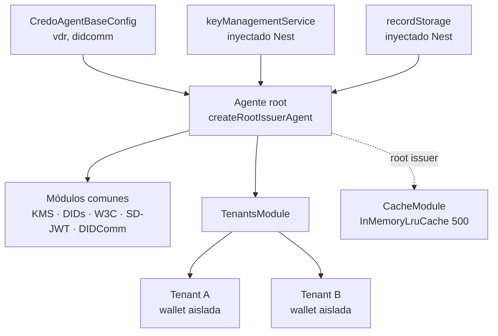
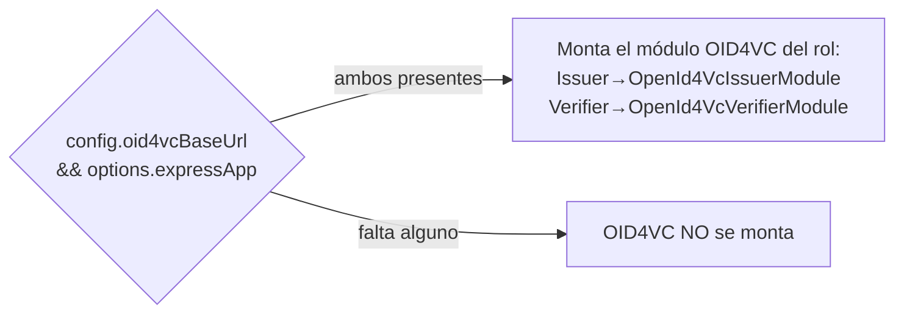

# Bootstrap del agente

Este documento describe cómo se construye e inicializa un **agente Credo** en
`@quarkid/identity-core`. Un agente es la instancia de [Credo-TS](https://credo.js.org)
que gestiona claves (KMS), DIDs, almacenamiento de records y los protocolos de
emisión/presentación (DIDComm, SD-JWT VC, OID4VC).

La librería expone **seis funciones de creación** organizadas por rol (issuer,
holder, verifier) y por modo de operación (single-wallet legacy y multi-tenant).
Todas reciben la misma configuración base, `CredoAgentBaseConfig`, y devuelven un
`Agent` de Credo ya inicializado.

:::warning Advertencia de seguridad — HTTP plano habilitado en todo el stack
Las **seis** funciones de creación invocan
`setGlobalConfig({ allowInsecureUrls: true })` de `@openid4vc/oauth2` de forma
**incondicional** (no detrás de ningún flag de configuración), y todas inicializan
el `Agent` con `ROOT_AGENT_INIT_CONFIG`, que incluye `allowInsecureHttpUrls: true`.

El efecto combinado es que **se permite HTTP plano (sin TLS) en todo el flujo
OID4VC** y en la resolución de URLs internas. Esto es cómodo para desarrollo local
y entornos Docker sin certificados, pero **no debe usarse tal cual en producción**.

Referencias en código:
- `agent/issuer.agent.ts:47` y `:152`
- `agent/holder.agent.ts:49` y `:143`
- `agent/verifier.agent.ts:47` y `:150`
- `agent/credo-init-config.ts:4` (`allowInsecureHttpUrls: true`)

Ver [Limitaciones](./08-limitations.md).
:::

---

## `CredoAgentBaseConfig` campo por campo

Definida en `types/config.types.ts`. Es el primer argumento de las seis funciones
de creación.

| Campo              | Tipo                  | Obligatorio | Descripción |
| ------------------ | --------------------- | ----------- | ----------- |
| `vdrServiceUrl`    | `string`              | Sí          | URL del vdr-service usado por el resolver/registrar de `did:custom` (método propio de QuarkID). |
| `didcommEndpoint`  | `string`              | Sí          | Endpoint público DIDComm del agente. Se usa para el `DidCommModuleConfig`, para construir el dominio del `did:web` (issuer/verifier) y como service endpoint. |
| `didcommPort`      | `number`              | No          | Puerto del transport WebSocket inbound cuando **no** se pasa `options.wsServer`. Default según rol: **3001** (issuer), **9205** (holder), **9204** (verifier). |
| `useHttpForWebDid` | `boolean`             | No          | Si es `true`, resuelve `did:web` por HTTP en lugar de HTTPS. Útil en dev local sin TLS. |
| `oid4vcBaseUrl`    | `string`              | No          | URL base pública de los endpoints OID4VC (p. ej. `https://issuer.example.com/openid4vc-flow`). Si se omite, OID4VCI/OID4VP **no** se montan. Ver [Activación de OID4VC](#activación-de-oid4vc). |

El KMS **no** forma parte de `CredoAgentBaseConfig`. El integrador inyecta la instancia (Askar, Postgres u otro).

### Record storage y KMS (inyección)

El almacenamiento de records y el KMS **no** se configuran en `CredoAgentBaseConfig`. El integrador crea los adapters y los pasa en las opciones del agente:

| Campo en `RootAgentOptions` | Tipo | Descripción |
| --- | --- | --- |
| `recordStorage` | `RecordStorage` | **Obligatorio.** `AskarRecordStorage` o `PostgresRecordStorage`. |
| `keyManagementService` | `KeyManagementService` | **Obligatorio.** Primario (`defaultBackend`). |
| `additionalKeyManagementServices` | `KeyManagementService[]` | Opcional. BBS, domain-key, futuros. |
| `askarStore` | `QuarkAskarStoreOptions` | Opcional. Store Askar si usás adapters Askar. |

Wiring en `agent/record.module.ts` (`registerRecordConfig`) y `agent/kms.module.ts` / `agent/askar.module.ts`.

Los servicios Quark (issuer/verifier/holder) fijan Askar + sidecar BLS sin variables de driver. Ver [KMS](./06-reference/02-kms.md).

---

## Dos modos de operación

Cada rol (issuer, holder, verifier) ofrece dos funciones de creación: una
single-wallet (legacy) y una root multi-tenant (recomendada).

### Single-wallet (legacy)

El agente gestiona **una sola wallet de negocio**, identificada por
`options.wallet = { id, key }`. El DID de negocio se crea durante el bootstrap:

- **Issuer / Verifier**: crean un `did:web` derivado de `didcommEndpoint` +
  `wallet.id` (vía `ensureWebDid`).
- **Holder**: crea un `did:key` Ed25519 (vía `ensureKeyDid`).

```ts
createIssuerAgent(config: CredoAgentBaseConfig, options: CreateIssuerAgentOptions): Promise<Agent>
createHolderAgent(config: CredoAgentBaseConfig, options: CreateHolderAgentOptions): Promise<Agent>
createVerifierAgent(config: CredoAgentBaseConfig, options: CreateVerifierAgentOptions): Promise<Agent>
```

:::note Modo legacy
Este modo se mantiene por compatibilidad. Para nuevos despliegues se recomienda el
modo multi-tenant, que permite aislar múltiples wallets dentro de un único proceso.
:::

### Multi-tenant (recomendado)

El agente **root** no tiene wallet de negocio propia: solo coordina **tenants**.
Cada tenant es una wallet aislada que se crea con `ensureTenant` y se opera con
`withTenant`. Los listeners DIDComm (y OID4VC) se registran **una sola vez** en el
root y atienden eventos de todos los tenants.

```ts
createRootIssuerAgent(config: CredoAgentBaseConfig, options: CreateRootIssuerAgentOptions): Promise<Agent>
createRootHolderAgent(config: CredoAgentBaseConfig, options?: CreateRootHolderAgentOptions): Promise<Agent>
createRootVerifierAgent(config: CredoAgentBaseConfig, options?: CreateRootVerifierAgentOptions): Promise<Agent>
```

El **root issuer** y el **root holder/verifier** registran adicionalmente el módulo
`TenantsModule`. Además, el **root issuer** incluye un `CacheModule`
(`InMemoryLruCache`, límite 500 entradas) — `agent/issuer.agent.ts:175`.

La gestión concreta de tenants (creación, contexto, operación) se documenta en
[Tenants](./04-tenants.md).



---

## `CreateAgentOptions` comunes

Definidas en `agent/create-agent-options.types.ts`. Todas las funciones de creación
heredan estas opciones base.

| Opción                  | Tipo            | Default | Descripción |
| ----------------------- | --------------- | ------- | ----------- |
| `wsServer`              | `object`        | —       | Servidor WebSocket externo a reutilizar como transport inbound. Si se omite, el agente abre su propio servidor en `config.didcommPort`. |
| `transportCloseDelayMs` | `number`        | `10000` | Delay (ms) antes de cerrar el transport WebSocket de salida. |
| `logger`                | `CredoLogger`   | `console` | Logger para los listeners (p. ej. el `Logger` de NestJS). Si se omite, usa `console`. |
| `fetchOverride`         | `typeof fetch`  | —       | Función `fetch` personalizada que reemplaza la de `@credo-ts/node`. Ver detalle abajo. |

### `fetchOverride` en detalle

`fetchOverride` reemplaza el `agentDependencies.fetch` por defecto en **todas** las
peticiones HTTP del agente, incluyendo las URLs que `@openid4vc` construye
internamente y la verificación de tokens en el issuer.

Su uso principal es **reescribir URLs en entornos Docker sin TLS**: cuando la
librería genera URLs `https://` que internamente deben resolverse contra servicios
que solo escuchan en `http://`, `fetchOverride` permite interceptar y reescribir
`https://` → `http://` antes de la petición. Dado que afecta **todo** el tráfico del
agente, debe usarse con cuidado.

Ver [Troubleshooting](./07-troubleshooting.md) para ejemplos concretos de
reescritura.

### Opciones adicionales por modo / rol

| Interfaz                       | Hereda de                      | Campos adicionales |
| ------------------------------ | ------------------------------ | ------------------ |
| `RootAgentOptions`             | `CreateAgentOptions`           | `listenerLabel?: string` (etiqueta en logs de listeners). |
| `CreateRootIssuerAgentOptions` | `RootAgentOptions`             | `expressApp?: Express` (requerido para OID4VCI). |
| `CreateIssuerAgentOptions`     | `CreateRootIssuerAgentOptions` | `wallet: { id; key }`, `oid4vcOptions?: IssuerOid4vcOptions`. |
| `CreateRootHolderAgentOptions` | `RootAgentOptions`             | (ninguno) |
| `CreateHolderAgentOptions`     | `CreateRootHolderAgentOptions` | `wallet: { id; key }`. |
| `CreateRootVerifierAgentOptions` | `RootAgentOptions`           | `expressApp?: Express`. |
| `CreateVerifierAgentOptions`   | `CreateRootVerifierAgentOptions` | `wallet: { id; key }`, `verifierOptions?: VerifierOid4vcOptions`. |

---

## Activación de OID4VC

Los módulos OID4VC se montan de forma **condicional**.

### Issuer (OID4VCI)

El módulo `OpenId4VcIssuerModule` se monta **solo si están presentes ambos**:

```ts
config.oid4vcBaseUrl && options.expressApp
```

(`agent/issuer.agent.ts:80` para single-wallet, `:185` para root). Si falta
cualquiera de los dos, **OID4VCI no se monta**. La inicialización del issuer OID4VC
(`initializeIssuerOid4vc`) requiere además `options.oid4vcOptions` (`:127`).

### Verifier (OID4VP)

El módulo `OpenId4VcVerifierModule` se monta **solo si están presentes ambos**:

```ts
config.oid4vcBaseUrl && options.expressApp
```

(`agent/verifier.agent.ts:80` para single-wallet, `:179` para root). La
inicialización OID4VP (`initializeVerifierOid4vc`) ocurre cuando hay
`config.oid4vcBaseUrl && options.verifierOptions` (`:126`).

### Holder (OID4VCI / OID4VP)

A diferencia de issuer y verifier, el holder monta `OpenId4VcHolderModule`
**siempre** (sin condición), tanto en single-wallet (`agent/holder.agent.ts:83`)
como en root (`:172`). El holder es cliente OID4VC, no expone endpoints, por lo que
no necesita `expressApp` ni `oid4vcBaseUrl`.



Los detalles de los flujos OID4VC se documentan en la
[emisión OID4VCI](./05-flows/01-issuance-oid4vci.md) (issuer) y la
[verificación OID4VP](./05-flows/02-verification-oid4vp.md) (verifier).

---

## Ejemplo completo — issuer multi-tenant

Configuración base + creación de un agente **root issuer** con OID4VCI activado.

```ts
import express from 'express'
import { Logger } from '@nestjs/common'
import {
  createRootIssuerAgent,
  PostgresRecordStorage,
  PostgresKeyManagementService,
  ROOT_STORAGE_SCOPE,
} from '@quarkid/identity-core'
import type { CredoAgentBaseConfig, RecordStorage, KeyManagementService } from '@quarkid/identity-core'
import { Pool } from 'pg'

// 1. App Express que recibirá los endpoints OID4VCI registrados por Credo.
const expressApp = express()

// 2. Records + KMS (típicamente desde Nest RecordStorageModule / KeyManagementModule).
const pool = new Pool({ connectionString: process.env.DATABASE_URL })
const recordStorage: RecordStorage = new PostgresRecordStorage(pool, ROOT_STORAGE_SCOPE)
const keyManagementService: KeyManagementService = new PostgresKeyManagementService(
  pool,
  ROOT_STORAGE_SCOPE,
)
// Con Vault: new VaultKeyManagementService(VAULT_ADDR, VAULT_TOKEN, mount?)

// 3. Configuración base del agente (sin KMS ni records).
const config: CredoAgentBaseConfig = {
  vdrServiceUrl: 'https://vdr.example.com',
  didcommEndpoint: 'https://issuer.example.com:3001',
  didcommPort: 3001,
  useHttpForWebDid: false,
  oid4vcBaseUrl: 'https://issuer.example.com/openid4vc-flow',
}

// 4. Creación del agente root.
const agent = await createRootIssuerAgent(config, {
  expressApp,
  recordStorage,
  keyManagementService,
  logger: new Logger('IssuerAgent'),
})
```

:::tip Activar OID4VCI
En el ejemplo, OID4VCI se monta porque están presentes **tanto** `oid4vcBaseUrl`
en `config` **como** `expressApp` en `options`. Quitar cualquiera de los dos deja
el agente operando solo con DIDComm + SD-JWT VC.
:::

---

## Ver también

- [Tenants](./04-tenants.md) — creación y operación de tenants en modo multi-tenant.
- [Referencia: KMS](./06-reference/02-kms.md) — adapters Postgres / Vault e inyección Nest.
- [Emisión OID4VCI](./05-flows/01-issuance-oid4vci.md) — flujo del issuer.
- [Verificación OID4VP](./05-flows/02-verification-oid4vp.md) — flujo del verifier.
- [Troubleshooting](./07-troubleshooting.md) — uso de `fetchOverride` y entornos sin TLS.
- [Limitaciones](./08-limitations.md) — claves en claro en Postgres, HTTP plano, etc.
