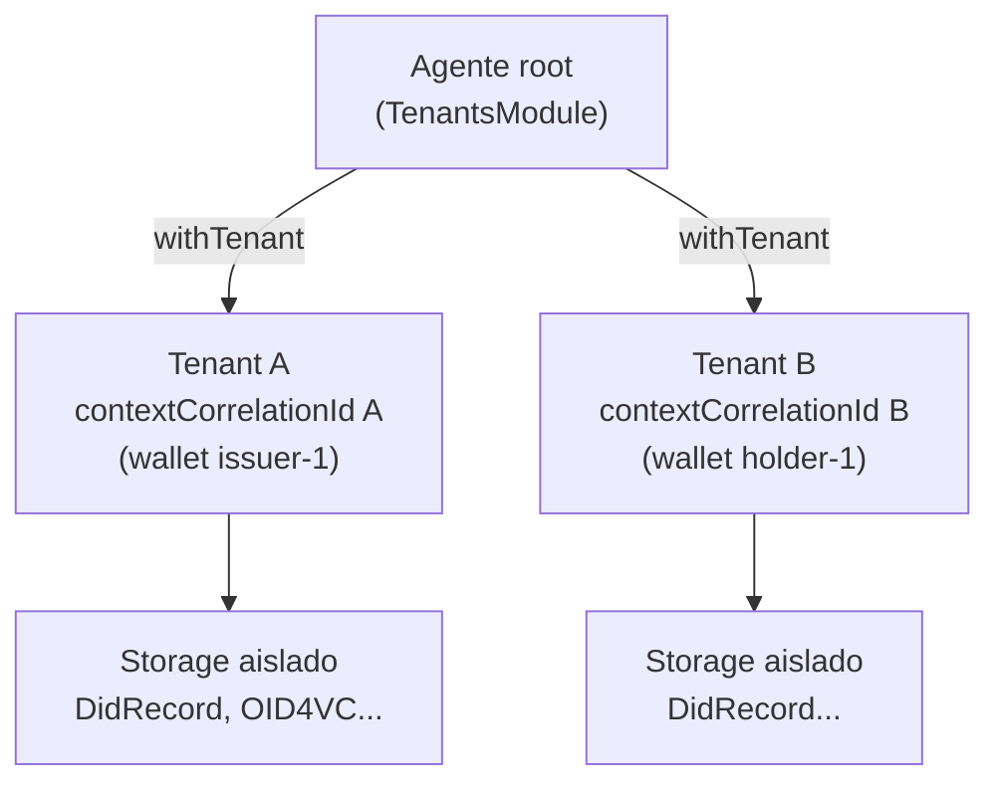

# Tenants y wallets

## Concepto

`@quarkid/identity-core` opera en modo **multi-tenant** sobre Credo-TS. En este
modelo cada **wallet equivale a un tenant** de Credo: un contexto de storage y
de claves completamente aislado, identificado internamente por un
`contextCorrelationId`.

El **agente root** (creado con `createRootIssuerAgent` /
`createRootVerifierAgent` / `createRootHolderAgent`, ver
[Bootstrap del agente](./03-agent-bootstrap.md)) no realiza operaciones de
negocio por sí mismo: actúa como **coordinador**. Tiene activo el
`TenantsModule` de Credo y a través de él crea, recupera y enruta hacia los
distintos tenants.

Toda operación de negocio (emitir o verificar credenciales, resolver DIDs,
firmar, etc.) se ejecuta **dentro del contexto de un tenant**, mediante
`withTenant`. Nunca se opera directamente sobre el agente root.

:::info Excepción: handlers de eventos DIDComm
Los listeners de eventos (`issuer.listener.ts`, `holder.listener.ts`,
`verifier.listener.ts`) reciben el **root agent** por defecto — Credo no
entrega el `tenantAgent` en los eventos. Para operar dentro del tenant
correcto, los handlers usan `findTenantIdForRecord` para resolver el
`tenantId` del record asociado y luego llaman a
`api.withTenantAgent({ tenantId }, callback)` directamente. Ver
[DIDComm](./05-flows/04-didcomm.md#compartidos-sharedlistenerts) para el
detalle de `findTenantIdForRecord`.
:::



Cada wallet se identifica con un **`walletId` lógico** (string elegido por la
aplicación). Internamente Credo le asigna un **`tenantId`** (UUID,
`TenantRecord.id`). El `walletId` se persiste como `label` del tenant, y es la
clave que permite recuperar el `tenantId` más adelante.

## API de tenants

Definida en `packages/identity-core/src/agent/tenant.ts`. Las tres funciones
resuelven el `TenantsApi` desde el `dependencyManager` del agente root.

### `ensureTenant`

```ts
ensureTenant(rootAgent: Agent, walletId: string, _walletKey: string): Promise<string>
```

Crea un nuevo tenant o **recupera el existente** cuyo `label` (o
`walletConfig.id` legacy) coincide con `walletId`. Es idempotente: llamarla dos
veces con el mismo `walletId` devuelve siempre el mismo `tenantId`.

- Si ya existe un tenant con ese `walletId`, devuelve su `id`.
- Si no existe, ejecuta `api.createTenant({ config: { label: walletId } })` y
  devuelve `record.id`.

:::warning El tercer parámetro `_walletKey` se ignora
El parámetro `_walletKey` se recibe en la firma pero **no se persiste ni se
usa**. El nombre con guion bajo lo deja explícito en el código: `createTenant`
solo recibe `{ config: { label: walletId } }` (`tenant.ts:29`), sin rastro de la
clave. Está reservado para mantener compatibilidad con la firma de las funciones
de creación de wallets, pero no tiene efecto alguno sobre el aislamiento ni
sobre el cifrado. Ver [Limitaciones](./08-limitations.md).
:::

### `withTenant`

```ts
withTenant<T>(
  rootAgent: Agent,
  tenantId: string,
  callback: (tenantAgent: Agent) => Promise<T>,
): Promise<T>
```

Ejecuta `callback` dentro del contexto **aislado** del tenant indicado. Es la
única forma soportada de operar sobre una wallet. Internamente delega en
`api.withTenantAgent({ tenantId }, callback)`.

El `tenantAgent` recibido en el callback es un `Agent` de Credo cuyo storage y
claves apuntan exclusivamente a ese tenant. El valor que retorna el `callback`
se propaga como resultado de la promesa.

```ts
const did = await withTenant(rootAgent, tenantId, async (agent) => {
  return getTenantWebDid(agent)
})
```

### `loadTenantMap`

```ts
loadTenantMap(rootAgent: Agent): Promise<Map<string, string>>
```

Carga todos los tenants registrados y devuelve un mapa **`walletId → tenantId`**.
Útil al arrancar el servicio para reconstruir la tabla de routing sin volver a
crear tenants.

```ts
const map = await loadTenantMap(rootAgent)
const tenantId = map.get('issuer-1')
```

## Creación de wallets

Definidas en `packages/identity-core/src/agent/wallet.ts`. Cada función llama
internamente a `ensureTenant` (por lo que también es idempotente) y luego abre
un `withTenant` para materializar los records del tenant. Todas devuelven el
**`tenantId`** de Credo.

### Records que materializa cada wallet

| Función | DID que crea | Records OID4VC | Resto |
|---|---|---|---|
| `createIssuerWallet` | `did:web` + clave DIDComm (`DidRecord`) | `OpenId4VcIssuerRecord` (solo si se pasan `oid4vcOptions`; `issuerId` = `walletId`) | `StorageVersionRecord` (seed) |
| `createVerifierWallet` | `did:web` + clave DIDComm (`DidRecord`) | `OpenId4VcVerifierRecord` (solo si se pasan `oid4vpOptions`; `verifierId` = `walletId`) | `StorageVersionRecord` (seed) |
| `createHolderWallet` | `did:key` Ed25519 (`DidRecord`) | Ninguno (el holder no publica metadata OID4VC) | `StorageVersionRecord` (seed) |

### Firmas

```ts
createIssuerWallet(
  rootAgent: Agent,
  walletId: string,
  walletKey: string,
  opts: { didcommEndpoint: string; oid4vcOptions?: IssuerOid4vcOptions },
): Promise<string>   // devuelve tenantId

createVerifierWallet(
  rootAgent: Agent,
  walletId: string,
  walletKey: string,
  opts: { didcommEndpoint: string; oid4vpOptions?: VerifierOid4vcOptions },
): Promise<string>   // devuelve tenantId

createHolderWallet(
  rootAgent: Agent,
  walletId: string,
  walletKey: string,
): Promise<string>   // devuelve tenantId
```

- **`createIssuerWallet`** — crea el `did:web` (con `addDidCommKey: true`) cuyo
  dominio se deriva de `didcommEndpoint` y `walletId`, y si recibe
  `oid4vcOptions` inicializa OID4VCI (`OpenId4VcIssuerRecord` con
  `issuerId = walletId`). Ver [Emisión OID4VCI](./05-flows/01-issuance-oid4vci.md).
- **`createVerifierWallet`** — crea el `did:web` y, si recibe `oid4vpOptions`,
  inicializa OID4VP (`OpenId4VcVerifierRecord` con `verifierId = walletId`).
- **`createHolderWallet`** — crea únicamente un `did:key` Ed25519. **No** publica
  metadata OID4VC.

:::warning `walletKey` en las funciones de creación
Igual que `_walletKey` en `ensureTenant`, el parámetro `walletKey` de estas tres
funciones está documentado en el código como *"Reservado; no persistido con KMS
interno"*. Se reenvía a `ensureTenant`, donde tampoco se usa. No protege ni
cifra nada. Ver la advertencia al final de este documento.
:::

### Lectura de DIDs del tenant

Dos helpers para recuperar el DID creado dentro de un tenant (se usan **dentro**
de un `withTenant`):

```ts
getTenantWebDid(agent: Agent): Promise<string | null>  // primer did:web, o null
getTenantKeyDid(agent: Agent): Promise<string | null>  // primer did:key, o null
```

Ambos consultan `agent.dids.getCreatedDids({ method })` y devuelven el `did` del
primer record, o `null` si no hay ninguno. Ver
[DIDs](./06-reference/01-dids.md).

## Ejemplo completo

Crear un agente root issuer, materializar una wallet de issuer y operar dentro
de su tenant:

```ts
import {
  createRootIssuerAgent,
  createIssuerWallet,
  withTenant,
  getTenantWebDid,
} from '@quarkid/identity-core'

// 1. Agente root (ver ./03-agent-bootstrap.md para la configuración completa)
const rootAgent = await createRootIssuerAgent(/* ...config... */)

// 2. Crear (o recuperar) la wallet del issuer => devuelve el tenantId
const tenantId = await createIssuerWallet(
  rootAgent,
  'issuer-1',              // walletId lógico
  'walletKey-reservado',   // walletKey: reservado, NO cifra ni se persiste
  {
    didcommEndpoint: 'https://issuer.example.com',
    oid4vcOptions: {
      // ...opciones OID4VCI...
    },
  },
)

// 3. Operar SIEMPRE dentro del contexto aislado del tenant
const webDid = await withTenant(rootAgent, tenantId, async (agent) => {
  // `agent` es el agente del tenant: storage y claves aislados
  return getTenantWebDid(agent)
})

console.log('DID web del issuer:', webDid)
```

La firma de `withTenant` exige `(rootAgent, tenantId, callback)`; el `callback`
recibe el `tenantAgent` y lo que retorne se propaga como resultado.

## Advertencia de seguridad: `walletKey` no cifra nada

Tanto `_walletKey` (en `ensureTenant`) como `walletKey` (en las funciones de
creación de wallets) **dan una falsa sensación de protección**. En la
implementación actual:

- El valor no se persiste en ningún record.
- No se pasa a `createTenant` ni a ningún componente de cifrado.
- Con el adapter **Postgres** del KMS (`PostgresKeyManagementService`), las claves
  del tenant **no se cifran en reposo** con esa `walletKey` (ver limitación 1).
  Con Vault Transit las privadas no salen de Vault, pero `walletKey` sigue sin
  usarse como passphrase del tenant.

En otras palabras: pasar un `walletKey` no aporta confidencialidad. No debe
asumirse que las claves del tenant estén protegidas por ese valor. El detalle
completo y sus implicaciones de seguridad están en
[Limitaciones](./08-limitations.md).

## Ver también

- [Bootstrap del agente](./03-agent-bootstrap.md) — creación del agente root.
- [Emisión OID4VCI](./05-flows/01-issuance-oid4vci.md) — uso de la wallet issuer.
- [DIDs](./06-reference/01-dids.md) — `did:web` y `did:key` de los tenants.
- [Limitaciones](./08-limitations.md) — `walletKey` ignorado y cifrado en reposo.
