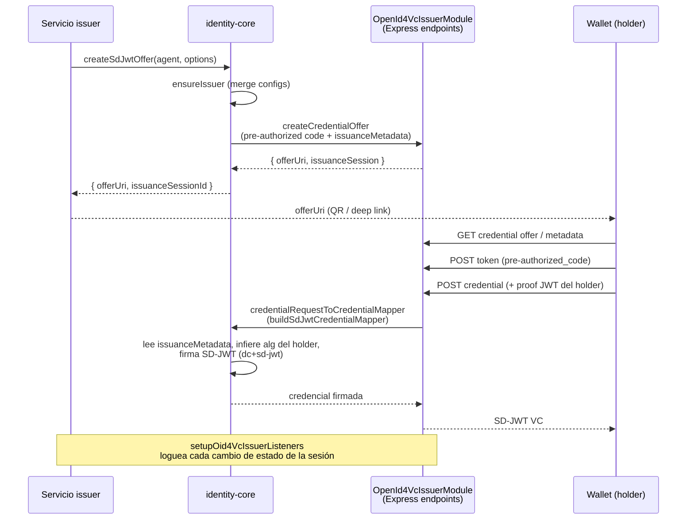

# Emisión OID4VCI (issuer)

Este documento describe el flujo de emisión de credenciales **OID4VCI** (OpenID for Verifiable Credential Issuance) implementado en `@quarkid/identity-core` sobre Credo-TS 0.7, usando el módulo `OpenId4VcIssuerModule`. El formato de credencial emitido es **IETF SD-JWT VC** (`dc+sd-jwt`), con flujo *pre-authorized code*.

Toda la API descrita vive en `src/protocol/openid4vc/issuer.oid4vc.ts` y `src/protocol/openid4vc/issuer.oid4vc.listener.ts`.

## Inicialización OID4VCI

El rol issuer OID4VCI solo se activa si el agente fue arrancado con `oid4vcBaseUrl` y una `expressApp` (ver [Bootstrap del agente](../03-agent-bootstrap.md)). El `OpenId4VcIssuerModule` registra automáticamente sus endpoints HTTP (metadata, credential offer, token, credential) bajo esa `expressApp`; Credo los sirve sin código adicional del llamador.

Una vez arrancado el agente, se inicializa el registro del issuer **una sola vez** durante el bootstrap, después de crear el did:web (`ensureWebDid`):

```ts
import { initializeIssuerOid4vc } from '@quarkid/identity-core'

const issuerRecord = await initializeIssuerOid4vc(agent, {
  issuerId: 'tenant-acme',
  // credentialConfigurationsSupported, display, etc. (opcional aquí;
  // createSdJwtOffer también sincroniza configs más tarde)
})
```

`initializeIssuerOid4vc(agent, options)`:

1. Resuelve el primer DID Document `did:web` del wallet del agente (`DidsApi.getCreatedDids({ method: 'web' })`). Si no hay ninguno, lanza `Error('No did:web DID document found for metadataSigner')`.
2. Deriva el `metadataSigner` desde ese did:web usando la clave **ES256** (`getOid4VcSigningDidUrlForAlg(didDocument, 'ES256')`, que busca el verification method con fragment `#key-p256`). Con ese signer Credo firma la metadata del issuer y la sirve cuando una wallet la solicita con `Accept: application/jwt`.
3. Delega en `ensureIssuer(agent, { ...options, metadataSigner }, options.issuerId)`.

`ensureIssuer(agent, options, issuerId?)` crea o recupera el `OpenId4VcIssuerRecord`:

- Con `issuerId`: intenta `getIssuerByIssuerId(issuerId)`; si existe, hace merge de metadata (`updateIssuerMetadata`); si no existe, crea uno nuevo con ese `issuerId`.
- **Sin `issuerId`: usa el primer issuer que encuentre en la DB** (`getAllIssuers()[0]`), o crea uno si la DB está vacía. Ver [nota de honestidad](#notas-de-honestidad) — esto es peligroso en multi-tenant.

El merge de `credentialConfigurationsSupported` se hace por clave (`configurationId`) preservando el `display` visual existente salvo que el llamador envíe `display` explícito.

## Ciclo de emisión OID4VCI



Pasos:

1. **Crear la oferta** con `createSdJwtOffer` (helper de alto nivel, recomendado) o `createCredentialOffer` (más bajo nivel). Ambos devuelven un `offerUri` que la wallet recibe (típicamente como QR o deep link) y un id de sesión.
2. **El mapper firma la credencial**: `buildSdJwtCredentialMapper()` produce el `OpenId4VciCredentialRequestToCredentialMapper` que Credo invoca cuando llega la credential request de la wallet. Lee los metadatos guardados en `issuanceSession.issuanceMetadata`, resuelve el did:web del wallet, infiere el algoritmo del holder y firma una credencial en formato `dc+sd-jwt`. El mapper debe registrarse al construir el `OpenId4VcIssuerModule` durante el bootstrap.
3. **Endpoints** quedan registrados por Credo en la Express app provista al arrancar el agente.
4. **Listeners**: `setupOid4VcIssuerListeners(agent, { label?, logger? })` se suscribe a `OpenId4VcIssuerEvents.IssuanceSessionStateChanged` y **solo loguea** `session=<id> state=<estado>` (y `error=` si la sesión falló). No auto-responde ni interviene en el flujo.

### Mapper SD-JWT en detalle

`buildSdJwtCredentialMapper()` (en cada credential request):

- Resuelve el did:web del wallet vía el `agentContext` que pasa Credo; si no hay did:web lanza `Error('No did:web DID document found in issuer wallet')`.
- Infiere el algoritmo del holder con `extractProofAlg(holderBinding)`:
  - `method: 'jwk'` → `kty === 'OKP'` ⇒ `EdDSA`, en otro caso `ES256`.
  - `method: 'did'` → fragment que empieza con `z6Mk` ⇒ `EdDSA`, en otro caso `ES256`.
- Elige la clave de firma del issuer para ese alg (`getOid4VcSigningDidUrlForAlg`).
- Construye el payload SD-JWT: `vct` (con fallback `'QuarkCredential'`), `iss` (el did:web del issuer), `status` (si está), y los `claims`. Aplica `disclosureFrame` para selective disclosure.

## Opciones de oferta (`CreateSdJwtOfferOptions`)

`CreateSdJwtOfferOptions` extiende `SdJwtIssuanceMetadata`. Campos verificados en `issuer.oid4vc.ts`:

| Campo | Tipo | Descripción |
|-------|------|-------------|
| `vct` | `string` | **Requerido**. Verifiable Credential Type del SD-JWT. |
| `claims` | `Record<string, unknown>` (opcional) | Claims del subject que se incluyen en el payload de la credencial. |
| `disclosureFrame` | `{ _sd?: string[] }` (opcional) | Selective disclosure: qué claims se hacen *disclosable*. |
| `status` | `{ status_list: { idx: number; uri: string } }` (opcional) | Entrada de status list para revocación. Ver [Revocación](../06-reference/05-revocation.md). |
| `configurationId` | `string` | **Requerido**. Id de la `credentialConfigurationSupported` que se ofrece. |
| `preAuthorizedCode` | `string` (opcional) | Pre-authorized code del flujo. Si se omite, Credo genera uno. |
| `claimsDisplay` | `Record<string, { name: string; locale? }>` (opcional) | Labels legibles por claim para la wallet (locale por defecto `'es'`). |
| `issuerDisplay` | `Array<{ name: string; locale? }>` (opcional) | Display del issuer (nombre de organización visible en la wallet). |
| `issuerId` | `string` (opcional) | issuerId estable del registro OID4VCI. **Si se omite, se usa el primer issuer en DB.** |
| `supportedAlgorithms` | `string[]` (opcional) | Algoritmos del proof JWT del holder. La configuración SD-JWT usa `['ES256']` por defecto si se omite. |

> Nota de honestidad: el comentario de la interfaz dice "Por defecto `['EdDSA']`" para `supportedAlgorithms`, pero el código real (`buildSdJwtCredentialConfiguration`) usa `['ES256']` cuando se omite. Documentamos el comportamiento real (`['ES256']`).

`createSdJwtOffer` internamente:

1. Llama a `ensureIssuer` con una `credentialConfigurationSupported` construida a partir de `configurationId`, `vct`, `claimsDisplay` y `supportedAlgorithms`. El binding method ofrecido es `['did:jwk', 'jwk']` (dual, por compatibilidad de wallets).
2. Llama a `createCredentialOffer` con `preAuthorizedCodeFlowConfig` y guarda `vct`, `claims`, `disclosureFrame` y `status` en `issuanceMetadata` para que el mapper los recupere al firmar.

## Sesiones de emisión

Para consultar el estado de una sesión:

```ts
import { getIssuanceSession } from '@quarkid/identity-core'

const session = await getIssuanceSession(agent, issuanceSessionId)
console.log(session.state)        // estado OID4VCI de la sesión
console.log(session.errorMessage) // mensaje de error si falló
```

`getIssuanceSession(agent, issuanceSessionId)` delega en `OpenId4VcIssuerApi.getIssuanceSessionById`.

## Emisión vía DIDComm (alternativa)

Como alternativa a OID4VCI, `@quarkid/identity-core` también soporta emisión de credenciales **W3C JSON-LD** vía DIDComm (protocol version v2), sobre una conexión DIDComm existente. Vive en `src/protocol/didcomm/issuance.ts`.

```ts
import { offerCredential } from '@quarkid/identity-core'

const result = await offerCredential(agent, {
  connectionId,
  // ...CredentialParams (tipos, claims, proof, etc.)
  // issuerDid opcional; si se omite se resuelve el did:web del wallet
})
if ('error' in result) {
  // offerCredential devuelve { error } en vez de lanzar ante:
  //  - agent sin didcomm.credentials  → 'Agent not ready'
  //  - conexión no encontrada          → 'Connection <id> not found'
  //  - error del exchange (try/catch)  → message del error
} else {
  console.log(result.credentialExchangeId, result.state, result.credentialId)
}
```

- `offerCredential(agent, params)` — rol issuer. Ofrece una credencial JSON-LD sobre la conexión `connectionId`. El holder DID se toma de `conn.theirDid`.
- `proposeCredential(agent, params)` — rol holder. Propone/solicita una credencial JSON-LD; el holder DID se resuelve del primer `did:key` del wallet.

Ambas funciones devuelven `{ error: string }` en vez de lanzar en los casos descritos arriba: validá siempre `'error' in result`.

### Listeners DIDComm que auto-responden

A diferencia del listener OID4VCI (que solo loguea), el listener DIDComm del issuer (`setupDidCommIssuerListeners`, en `src/protocol/didcomm/issuer.listener.ts`) **sí auto-responde** al cambio de estado del credential exchange:

- `ProposalReceived` → `negotiateProposal` (si la propuesta trae credencial) o `acceptProposal`.
- `RequestReceived` → `acceptRequest` (emite la credencial).

Esto significa que, con los listeners DIDComm activos, las propuestas/requests entrantes se aceptan automáticamente sin intervención del servicio. Tenerlo en cuenta por sus implicaciones de seguridad. Ver [DIDComm](./04-didcomm.md).

## Ejemplo: emitir una credencial SD-JWT

```ts
import { createSdJwtOffer, getIssuanceSession } from '@quarkid/identity-core'

// agent = tenant issuer ya arrancado (oid4vcBaseUrl + expressApp),
// con initializeIssuerOid4vc llamado en el bootstrap.

const { offerUri, issuanceSessionId } = await createSdJwtOffer(agent, {
  issuerId: 'tenant-acme',            // explícito: evita el "primer issuer en DB"
  configurationId: 'university-degree',
  vct: 'https://acme.example/credentials/UniversityDegree',
  claims: {
    given_name: 'Ada',
    family_name: 'Lovelace',
    degree: 'BSc Mathematics',
  },
  disclosureFrame: { _sd: ['given_name', 'family_name', 'degree'] },
  claimsDisplay: {
    given_name: { name: 'Nombre', locale: 'es' },
    family_name: { name: 'Apellido', locale: 'es' },
    degree: { name: 'Título', locale: 'es' },
  },
  issuerDisplay: [{ name: 'Acme University', locale: 'es' }],
  supportedAlgorithms: ['ES256'],
})

// `offerUri` se entrega a la wallet (QR / deep link).
// La wallet canjea el pre-authorized code y pide la credencial;
// el mapper SD-JWT la firma automáticamente.

const session = await getIssuanceSession(agent, issuanceSessionId)
console.log('Estado de la sesión:', session.state)
```

## Notas de honestidad

Comportamientos verificados en el código que conviene tener presentes (ver también [Limitaciones](../08-limitations.md)):

- **`ensureIssuer` sin `issuerId` usa el "primer issuer en DB"** (`issuer.oid4vc.ts:105-121`). En un despliegue multi-tenant donde varios issuers comparten almacenamiento, esto puede emitir/actualizar contra el issuer equivocado de forma silenciosa. **Pasá siempre `issuerId` explícito** (vía `initializeIssuerOid4vc`, `createSdJwtOffer` o `createCredentialOffer`).
- **El mapper SD-JWT usa `vct ?? 'QuarkCredential'`** (`issuer.oid4vc.ts:358`). Si por alguna razón el `vct` no llegó a `issuanceMetadata`, se emite con un `vct` genérico sin error ni warning. Verificá que `vct` esté siempre presente.
- **Detección del algoritmo del holder por heurística de fragmento** (`extractProofAlg`, `issuer.oid4vc.ts:304-311`): para `method: 'did'` se asume `EdDSA` solo si el fragment empieza con `z6Mk`, y `ES256` en cualquier otro caso. Es una heurística frágil ante DIDs con fragmentos no canónicos.
- **El default real de `supportedAlgorithms` es `['ES256']`** (no `['EdDSA']` como dice el comentario de la interfaz).
- **Los listeners DIDComm auto-responden** a `ProposalReceived` y `RequestReceived` emitiendo credenciales sin validación adicional (`issuer.listener.ts`). El listener OID4VCI, en cambio, **solo loguea** y no interviene.
- **`offerCredential` / `proposeCredential` devuelven `{ error }`** en lugar de lanzar en varios casos (agente no listo, conexión inexistente, error del exchange). El llamador debe chequear `'error' in result`.

## Ver también

- [Bootstrap del agente](../03-agent-bootstrap.md) — cómo activar OID4VCI (`oid4vcBaseUrl` + `expressApp`) y el did:web del wallet.
- [Holder](./03-holder.md) — el lado wallet que canjea la oferta.
- [DIDComm](./04-didcomm.md) — emisión y listeners por DIDComm.
- [Revocación](../06-reference/05-revocation.md) — uso del campo `status` / status list.
- [Limitaciones](../08-limitations.md) — caveats conocidos.
