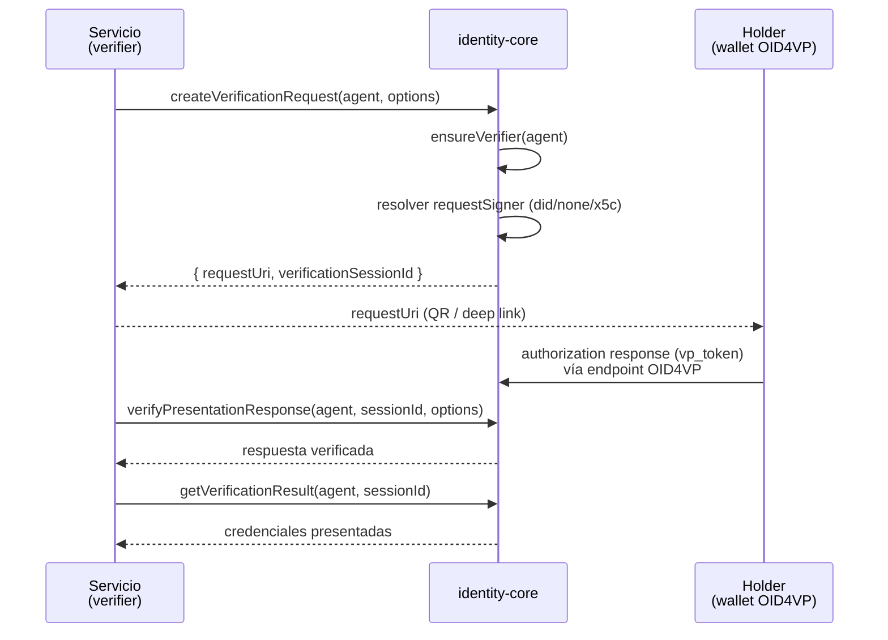

# Verificación OID4VP

El rol **verifier** OID4VP (OpenID for Verifiable Presentations) permite solicitar a un holder (EUDI Wallet u otra wallet OID4VP) que presente credenciales, y luego verificar la presentación recibida. Esta guía documenta el flujo tal como lo implementa `@quarkid/identity-core` sobre Credo-TS 0.7, usando las funciones de `protocol/openid4vc/verifier.oid4vc.ts`.

## Inicialización OID4VP

Igual que el rol issuer, el rol verifier OID4VP solo se activa si el agente fue arrancado con `oid4vcBaseUrl` y una `expressApp` (ver [Bootstrap del agente](../03-agent-bootstrap.md)). El `OpenId4VcVerifierModule` de Credo registra automáticamente sus endpoints HTTP (authorization request, authorization response) bajo esa `expressApp`.

Antes de crear authorization requests es necesario contar con un `OpenId4VcVerifierRecord`. Para eso se usa `initializeVerifierOid4vc`, que durante el arranque del agente crea o recupera el registro:

```ts
import { initializeVerifierOid4vc } from '@quarkid/identity-core'

// En multi-tenant, pasar verifierId para alinear con el ID lógico del tenant.
const verifierRecord = await initializeVerifierOid4vc(agent, {
  verifierId: 'tenant-acme',
  clientMetadata: {
    client_name: 'ACME Verifier',
    logo_uri: 'https://acme.example/logo.png',
  },
})
```

`initializeVerifierOid4vc(agent, options?)` es un wrapper delgado sobre `ensureVerifier`. La función `ensureVerifier` resuelve el `OpenId4VcVerifierApi` del agente y:

- Si se pasa `verifierId`: intenta recuperar el verifier por ese ID. Si existe y se proveyó `clientMetadata`, hace merge de la metadata y lo devuelve actualizado. Si no existe (lanza), lo crea con `createVerifier`.
- Si **no** se pasa `verifierId`: toma **el primer verifier registrado en DB** (`getAllVerifiers()[0]`), y solo lo crea si no hay ninguno. Ver [Notas de honestidad](#notas-de-honestidad).

## Ciclo de verificación



Pasos:

1. **Crear la solicitud de presentación** con `createVerificationRequest(agent, options)`. Devuelve `{ requestUri, verificationSessionId }`. El `requestUri` es lo que el holder escanea (QR) o abre por deep link; `verificationSessionId` es el ID de sesión que se usará en los pasos siguientes.
2. **El holder responde** enviando la authorization response (con el `vp_token`) al endpoint OID4VP que Credo sirve sobre la `expressApp`.
3. **Verificar la respuesta** con `verifyPresentationResponse(agent, verificationSessionId, options)`. Valida la firma del VP Token, la estructura de la presentación y que satisfaga el presentation definition / DCQL query original. Devuelve un `OpenId4VpVerifiedAuthorizationResponse`.
4. **Consultar el resultado** con `getVerificationResult(agent, verificationSessionId)` (devuelve el `OpenId4VpVerifiedAuthorizationResponse` ya procesado) o **consultar el estado** de la sesión con `getVerificationSession(agent, verificationSessionId)` (devuelve el `OpenId4VcVerificationSessionRecord` con su `state` actual).

> En muchos flujos `direct_post`, Credo verifica internamente la respuesta cuando el holder la postea al endpoint; en ese caso basta con consultar `getVerificationResult` / `getVerificationSession`. El llamado explícito a `verifyPresentationResponse` aplica cuando el servicio recibe la respuesta por fuera del endpoint gestionado.

### Funciones de bajo nivel

`createVerificationRequest` encapsula el armado del `requestSigner` y la selección de modo (PE vs DCQL). Por debajo hay dos funciones más directas, expuestas para casos avanzados:

- `createPresentationRequest(agent, verifierId, options)` — llama directamente a `createAuthorizationRequest` con las `OpenId4VpCreateAuthorizationRequestOptions` crudas de Credo. Devuelve `{ authorizationRequest, verificationSession }`.
- `ensureVerifier(agent, options?)` — crea/recupera el `OpenId4VcVerifierRecord` (descrito arriba).

## Opciones de `CreateVerificationRequestOptions`

`createVerificationRequest` recibe un objeto `CreateVerificationRequestOptions` con los siguientes campos (todos opcionales):

| Campo | Tipo | Descripción |
| --- | --- | --- |
| `presentationDefinition` | `Record<string, unknown>` | Presentation Exchange definition. Mutuamente exclusivo con `dcqlQuery`. |
| `dcqlQuery` | `Record<string, unknown>` | DCQL query (OID4VP v1). Mutuamente exclusivo con `presentationDefinition`. |
| `responseMode` | `OpenId4VpCreateAuthorizationRequestOptions['responseMode']` | Modo de respuesta del authorization request. Default `direct_post`. |
| `authorizationResponseRedirectUri` | `string` | URI a la que la wallet redirige al usuario tras completar la presentación. |
| `requestSignerMethod` | `'did' \| 'none' \| 'x5c'` | Método de firma del request object. Default `'did'`. |
| `x5cCertificatesBase64` | `string[]` | Cadena x5c en base64 (leaf primero). Requerido si `requestSignerMethod = 'x5c'`. |
| `x5cLeafCertificateKeyId` | `string` | KeyId del certificado leaf en KMS. Requerido si `requestSignerMethod = 'x5c'`. |
| `x5cClientIdPrefix` | `'x509_hash' \| 'x509_san_dns'` | Prefijo de `client_id` para requests firmados con x5c. |

Comportamiento interno verificado en `createVerificationRequest`:

- **Selección de versión OID4VP**: si se pasa `presentationDefinition`, la librería fija `version: 'v1.draft21'`; si se pasa `dcqlQuery`, fija `version: 'v1'`. Si no se pasa ninguno de los dos, no se setea ni `presentationExchange`, ni `dcql`, ni `version`.
- **`requestSignerMethod`** (default `'did'`):
  - `'did'`: resuelve internamente un `did:web` creado en el agente y arma `{ method: 'did', didUrl }`. El llamador **no** pasa el DID.
  - `'none'`: request sin firma (`{ method: 'none' }`).
  - `'x5c'`: arma la cadena X.509 desde `x5cCertificatesBase64` (asigna `x5cLeafCertificateKeyId` al certificado leaf) y usa `x5cClientIdPrefix`. Lanza error si falta `x5cCertificatesBase64` o `x5cLeafCertificateKeyId`.
- **`responseMode`**: si no se define explícitamente, usa `'direct_post'` (para compatibilidad amplia con wallets que aún no esperan respuesta JARM cifrada por defecto).
- `authorizationResponseRedirectUri` solo se agrega al request si se proveyó.

## Verificación vía DIDComm (alternativa)

Para conexiones DIDComm establecidas (no OID4VP), el verifier puede solicitar una prueba con `requestProof(agent, params)` de `protocol/didcomm/presentation.ts`:

```ts
import { requestProof } from '@quarkid/identity-core'

const result = await requestProof(agent, {
  connectionId: 'conn-123',
  presentationDefinition: {
    id: 'verify-generic-credential',
    input_descriptors: [
      {
        id: 'generic-credential',
        constraints: {
          fields: [
            {
              path: ['$.type'],
              filter: {
                type: 'array',
                contains: { const: 'GenericCredential' },
              },
            },
          ],
        },
      },
    ],
  },
  challenge: 'nonce-único',
  domain: 'verifier.example',
})
// result: { proofExchangeRecordId, state, mode, error? }
```

`requestProof` usa el protocolo de proofs Credo `v2` con formato `presentationExchange` y requiere una `presentationDefinition` DIF PEX explícita. Si el módulo de proofs no está disponible, devuelve `{ state: 'error', error: 'Agent or proofs module not ready' }` en lugar de lanzar. Ver [DIDComm](./04-didcomm.md).

## Ejemplo de código

Crear una solicitud de presentación y verificar la respuesta en un tenant verifier:

```ts
import {
  initializeVerifierOid4vc,
  createVerificationRequest,
  verifyPresentationResponse,
  getVerificationResult,
  getVerificationSession,
} from '@quarkid/identity-core'

// 1. Asegurar el verifier durante el arranque del tenant.
await initializeVerifierOid4vc(agent, {
  verifierId: 'tenant-acme',
  clientMetadata: { client_name: 'ACME Verifier' },
})

// 2. Crear la solicitud de presentación (Presentation Exchange).
const { requestUri, verificationSessionId } = await createVerificationRequest(agent, {
  presentationDefinition: {
    id: 'pd-edad',
    input_descriptors: [
      {
        id: 'mayor-de-edad',
        constraints: {
          fields: [{ path: ['$.credentialSubject.age_over_18'] }],
        },
      },
    ],
  },
  // requestSignerMethod default 'did' resuelve el did:web del agente.
  // responseMode default 'direct_post'.
})

// requestUri se entrega al holder como QR / deep link.
console.log(requestUri)

// 3. (Opcional) Verificar explícitamente una respuesta recibida fuera del endpoint OID4VP.
//    `receivedAuthorizationResponse` es el authorization response (vp_token) que el
//    holder envió y que capturaste por tu cuenta (no es necesario en el flujo direct_post).
await verifyPresentationResponse(agent, verificationSessionId, {
  authorizationResponse: receivedAuthorizationResponse,
})

// 4. Consultar estado y resultado.
const session = await getVerificationSession(agent, verificationSessionId)
if (session.state === 'ResponseVerified') {
  const verified = await getVerificationResult(agent, verificationSessionId)
  // `verified` contiene las credenciales presentadas.
}
```

Para usar DCQL en lugar de Presentation Exchange, reemplazar `presentationDefinition` por `dcqlQuery` (la librería fijará `version: 'v1'`).

## Notas de honestidad

Comportamientos verificados en el código que conviene tener presentes (ver también [Limitaciones](../08-limitations.md)):

- **`ensureVerifier` sin `verifierId` toma "el primer verifier en DB"** (`verifier.oid4vc.ts:50-52`): usa `getAllVerifiers()[0]`. En un proceso multi-tenant esto es peligroso, porque `createVerificationRequest` llama internamente a `ensureVerifier(agent)` **sin** `verifierId` (`verifier.oid4vc.ts:292`) y podría firmar con el verifier equivocado si el agente comparte DB entre tenants. Para multi-tenant, aislar el agente por tenant o usar `createPresentationRequest` con un `verifierId` explícito.
- **`ensureVerifier` solo actualiza metadata si cambian `client_name` o `logo_uri`** (`verifier.oid4vc.ts:58-61`): cualquier otro cambio en `clientMetadata` (por ejemplo otras claves) no dispara el `updateVerifierMetadata` cuando ya existe un verifier sin `verifierId`. (El branch con `verifierId` sí hace merge ante cualquier `clientMetadata` provisto.)
- **El JSDoc de `createVerificationRequest` menciona un parámetro `signingDidUrl` que no existe en la firma real** (`verifier.oid4vc.ts:284` vs `:288`): la firma real es `createVerificationRequest(agent, options)`. El DID de firma se resuelve internamente vía `resolveSigningDidUrl` (primer `did:web` creado en el agente), no se pasa por parámetro.
- **Discrepancia de versión PE en la documentación interna**: el JSDoc de `createVerificationRequest` dice `version: 'v1.draft24'` (`verifier.oid4vc.ts:280`), pero el código setea `'v1.draft21'` para Presentation Exchange (`verifier.oid4vc.ts:337`). La fuente de verdad es el código: **`v1.draft21`**.
- **El listener OID4VP solo loguea, no auto-responde** (`verifier.oid4vc.listener.ts`): `setupOid4VcVerifierListeners(agent, { label?, logger? })` se suscribe a `VerificationSessionStateChanged` y registra el `state` de la sesión; ante error, loguea un diagnóstico (headers de `vp_token`/`id_token`, claves del payload, etc.). No acepta ni rechaza presentaciones automáticamente: la lógica de verificación y decisión queda en manos del servicio.

## Ver también

- [Bootstrap del agente](../03-agent-bootstrap.md) — cómo activar OID4VP (`oid4vcBaseUrl` + `expressApp`).
- [Emisión OID4VCI](./01-issuance-oid4vci.md) — el flujo de emisión, lado issuer.
- [Holder](./03-holder.md) — el lado wallet que arma la presentación.
- [DIDComm](./04-didcomm.md) — verificación por DIDComm (`requestProof`) y listeners.
- [Limitaciones](../08-limitations.md) — caveats conocidos.
