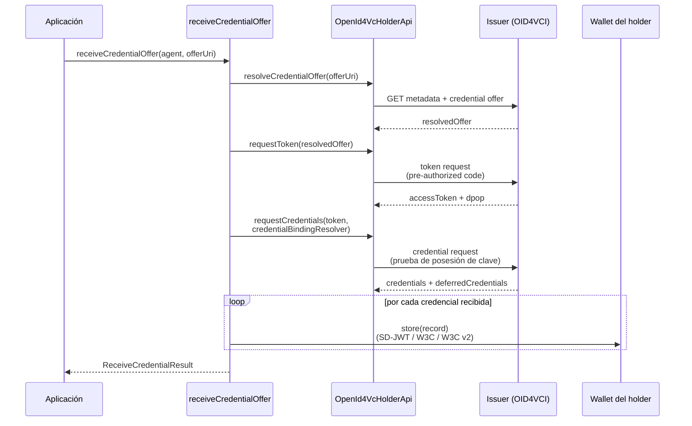
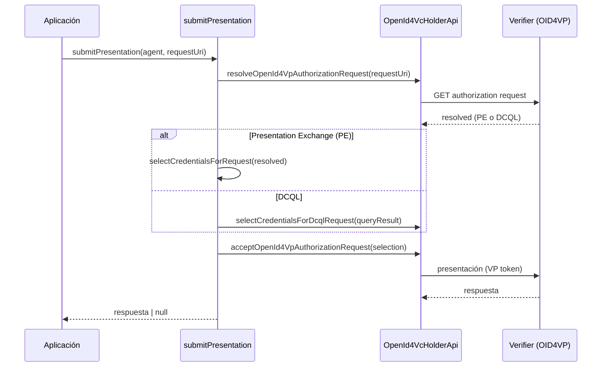

# Flujo holder

El **holder** es el actor que recibe credenciales verificables y las custodia, y que
luego las presenta ante un verifier cuando se las solicitan. En `@quarkid/identity-core`
el holder participa en dos protocolos OID4VC:

- **OID4VCI** (OpenID for Verifiable Credential Issuance) — recibe credenciales de un issuer.
- **OID4VP** (OpenID for Verifiable Presentations) — presenta credenciales a un verifier.

Adicionalmente, el holder puede operar sobre **DIDComm v1** para recibir y presentar
credenciales W3C JSON-LD vía mensajería cifrada.

## Rol del holder

El holder usa **`did:key` con clave Ed25519** como su identidad principal. El agente
del holder crea este DID durante su inicialización (ver
[`createHolderAgent`](../03-agent-bootstrap.md)):

```ts
// holder.agent.ts — tras agent.initialize()
const did = await ensureKeyDid(agent, { keyType: 'Ed25519' })
```

A diferencia del issuer y el verifier, **el holder es un cliente OID4VC: no expone
endpoints HTTP propios**. Inicia los flujos a partir de URIs (offer URIs, request URIs)
que recibe por canales externos (QR, deep link, mensaje). Por eso su agente monta
**siempre** el módulo `OpenId4VcHolderModule` sin necesidad de configurar un router de
endpoints:

```ts
modules: {
  // ...
  openId4VcHolder: new OpenId4VcHolderModule(),
}
```

Consultá [Bootstrap del agente](../03-agent-bootstrap.md) para los detalles de
inicialización y el modo multi-tenant (`createRootHolderAgent`).

## Recepción de credenciales (OID4VCI)

La función `receiveCredentialOffer(agent, offerUri)` ejecuta el flujo **pre-authorized
code** completo, desde el offer URI hasta la persistencia de cada credencial en la
wallet del holder.

```ts
function receiveCredentialOffer(
  agent: Agent,
  offerUri: string
): Promise<ReceiveCredentialResult>
```



### Pasos internos

1. **Resolver el offer** — `resolveCredentialOffer(offerUri)` obtiene la metadata del
   issuer y las configuraciones de credencial disponibles.
2. **Solicitar el access token** — `requestToken({ resolvedCredentialOffer })` ejecuta el
   pre-authorized code flow y devuelve `{ accessToken, dpop }`.
3. **Solicitar las credenciales** — `requestCredentials(...)` envía el credential request
   usando el `credentialBindingResolver` (ver [Holder binding](#holder-binding)).
4. **Persistir** — cada credencial recibida se almacena según su tipo de record:
   - `SdJwtVcRecord` → `sdJwtVcApi.store({ record })`
   - `W3cV2CredentialRecord` → `w3cV2CredentialsApi.store({ record })`
   - `W3cCredentialRecord` → `w3cCredentialsApi.store({ record })`

### Resultado: `ReceiveCredentialResult`

```ts
interface ReceiveCredentialResult {
  credentials: OpenId4VciCredentialResponse[]
  deferredCredentials: OpenId4VciDeferredCredentialResponse[]
}
```

- `credentials` — credenciales emitidas y ya almacenadas en la wallet.
- `deferredCredentials` — credenciales pendientes (deferred), que el issuer aún no
  entregó y deberán recuperarse más tarde. **Nota de honestidad:** `receiveCredentialOffer`
  solo persiste las credenciales de `credentials`; las `deferredCredentials` se devuelven
  pero **no se procesan ni recuperan automáticamente** por esta función.

## Holder binding

`buildCredentialBindingResolver(agent)` construye el callback que Credo-TS invoca durante
`requestCredentials()` para **probar la posesión de la clave del holder**. El resultado
queda embebido en el claim `cnf` de la credencial emitida, vinculándola criptográficamente
a la clave privada del holder.

```ts
function buildCredentialBindingResolver(agent: Agent): OpenId4VciCredentialBindingResolver
```

El resolver decide dos cosas:

**Key type** — según el primer algoritmo declarado por el issuer:

- `EdDSA` → `{ kty: 'OKP', crv: 'Ed25519' }`
- cualquier otro → `{ kty: 'EC', crv: 'P-256' }`

**Método de binding** — en orden de preferencia:

1. **`did:key`** — si el issuer declara soporte explícito (`supportedDidMethods` incluye
   `'did:key'`). Se crea un nuevo DID key y se devuelve el `id` de su verification method.
2. **`did:jwk`** — fallback universal cuando el issuer no soporta `did:key`. Siempre
   disponible, sin infraestructura externa. Se crea un `did:jwk` y se devuelve `${did}#0`.

Si la creación del `did:jwk` de fallback no produce un DID, el resolver lanza un error.

## Presentación de credenciales (OID4VP)

Para presentar una credencial el holder parte de una **request URI** del verifier. El
módulo expone tres funciones de bajo nivel y un atajo de alto nivel.

### Funciones de bajo nivel

```ts
// 1. Resolver el authorization request del verifier
function resolvePresentationRequest(
  agent: Agent,
  requestUri: string
): Promise<OpenId4VpResolvedAuthorizationRequest>

// 2. Seleccionar credenciales almacenadas que satisfacen la request
function selectCredentialsForRequest(resolved):
  | { presentationExchange: { credentials: Record<string, unknown[]> } }
  | { dcql: { credentials: unknown } }
  | null

// 3. Aceptar y enviar la respuesta al verifier
function acceptPresentationRequest(
  agent: Agent,
  options: OpenId4VpAcceptAuthorizationRequestOptions
)
```

- `resolvePresentationRequest` devuelve la request resuelta con las credenciales
  candidatas (en `presentationExchange` o `dcql`).
- `selectCredentialsForRequest` arma el objeto de credenciales seleccionadas (ver las
  [Notas de honestidad](#notas-de-honestidad) sobre su comportamiento y límites).
- `acceptPresentationRequest` envía la presentación. Las credenciales seleccionadas deben
  satisfacer los requisitos del `presentationExchange` o `dcql` de la request resuelta.

### Atajo: `submitPresentation`

```ts
function submitPresentation(
  agent: Agent,
  requestUri: string
): Promise<Awaited<ReturnType<typeof acceptPresentationRequest>> | null>
```

`submitPresentation` encapsula el flujo completo **resolve → auto-selección → accept**:



Devuelve `null` si ninguna credencial almacenada satisface la request (o, en DCQL, si
`queryResult.can_be_satisfied` es falso).

## Ejemplo de código

Recibir una oferta y, después, presentar una credencial:

```ts
import {
  receiveCredentialOffer,
  submitPresentation,
} from '@quarkid/identity-core'

// 1. Recepción de la credencial (OID4VCI)
const { credentials, deferredCredentials } = await receiveCredentialOffer(
  holderAgent,
  'openid-credential-offer://?credential_offer_uri=...'
)
console.log(`Recibidas ${credentials.length} credencial(es)`)
if (deferredCredentials.length > 0) {
  console.log(`${deferredCredentials.length} credencial(es) deferred pendientes`)
}

// 2. Presentación de la credencial (OID4VP)
const response = await submitPresentation(
  holderAgent,
  'openid4vp://?request_uri=...'
)
if (response === null) {
  console.warn('Ninguna credencial almacenada satisface la request')
} else {
  console.log('Presentación enviada al verifier')
}
```

Si necesitás control fino sobre qué credencial se presenta, usá las funciones de bajo
nivel en lugar de `submitPresentation`:

```ts
const resolved = await resolvePresentationRequest(holderAgent, requestUri)
const selection = selectCredentialsForRequest(resolved)
if (selection) {
  await acceptPresentationRequest(holderAgent, {
    authorizationRequestPayload: resolved.authorizationRequestPayload,
    ...selection,
  })
}
```

## Notas de honestidad

Esta sección documenta el comportamiento real del código que tiene implicancias de
funcionalidad y, sobre todo, de **privacidad**. Ver también
[Limitaciones](../08-limitations.md).

### DCQL no está implementado en `selectCredentialsForRequest`

`selectCredentialsForRequest` **siempre devuelve `null` para requests DCQL**
(`holder.oid4vc.ts:168-174`): la rama `dcql` no procesa el `queryResult`, solo retorna
`null`. La selección DCQL únicamente funciona a través de `submitPresentation`, que llama
internamente a `holderApi.selectCredentialsForDcqlRequest(queryResult)`. En la práctica,
**solo Presentation Exchange (PE) está soportado de extremo a extremo** por las funciones
de bajo nivel.

### PE selecciona la PRIMERA credencial por descriptor

En modo Presentation Exchange, `selectCredentialsForRequest` toma **únicamente la primera
credencial disponible** de cada input descriptor (`holder.oid4vc.ts:161`):

```ts
credentials[entry.inputDescriptorId] = [entry.verifiableCredentials[0]]
```

No hay selección configurable ni interacción con el usuario: si una credencial satisface
el descriptor, se elige sin más criterio que el orden de la lista. Esto significa que el
holder **no puede elegir** entre varias credenciales que matcheen el mismo requisito.

:::warning Privacidad: comportamiento automático de los listeners DIDComm

Cuando el holder opera vía DIDComm (`setupHolderListeners`, registrado automáticamente
por `createHolderAgent` / `createRootHolderAgent`), su comportamiento es **totalmente
automático y no consulta al usuario**:

- **Auto-acepta offers de credenciales** — al recibir un offer (`OfferReceived`), el
  listener llama a `acceptOffer` sin intervención (`holder.listener.ts:134-140`).
- **Auto-acepta credenciales** — al recibir la credencial (`CredentialReceived`), llama a
  `acceptCredential` automáticamente (`holder.listener.ts:141-146`).
- **Auto-presenta proofs** — al recibir un proof request (`RequestReceived`), selecciona
  credenciales y envía la presentación con `acceptRequest`, sin confirmación del usuario
  (`holder.listener.ts:163-178`).

**El punto más sensible — `expandPexSelection` (`holder.listener.ts:46-118`):** antes de
presentar, este helper inspecciona la presentation definition y, para los input
descriptors que la selección automática dejó **sin asignar**, busca en la wallet otras
credenciales W3C cuyos tipos matcheen los `requiredTypes` y las **añade a la presentación**
(`holder.listener.ts:106-114`). El resultado es que el holder puede terminar presentando
**más credenciales de las estrictamente solicitadas** que el matching automático no había
cubierto.

Esto rompe el principio de **minimización de divulgación** (data minimization): el holder
divulga información que el usuario no eligió compartir explícitamente y sin posibilidad de
revisar o vetar lo que se envía. Cualquier integración que use el flujo DIDComm debe tener
en cuenta este comportamiento y, de ser necesario, reemplazar los listeners por un flujo
con confirmación del usuario.

:::

## Ver también

- [Bootstrap del agente](../03-agent-bootstrap.md) — inicialización del agente holder y modo multi-tenant
- [Issuance OID4VCI](./01-issuance-oid4vci.md) — el flujo desde la perspectiva del issuer
- [Verification OID4VP](./02-verification-oid4vp.md) — el flujo desde la perspectiva del verifier
- [DIDComm](./04-didcomm.md) — mensajería cifrada y comportamiento de los listeners
- [Referencia: Credenciales](../06-reference/04-credentials.md) — formatos W3C y SD-JWT
- [Referencia: DIDs](../06-reference/01-dids.md) — `did:key` del holder y holder binding
- [Limitaciones](../08-limitations.md)
