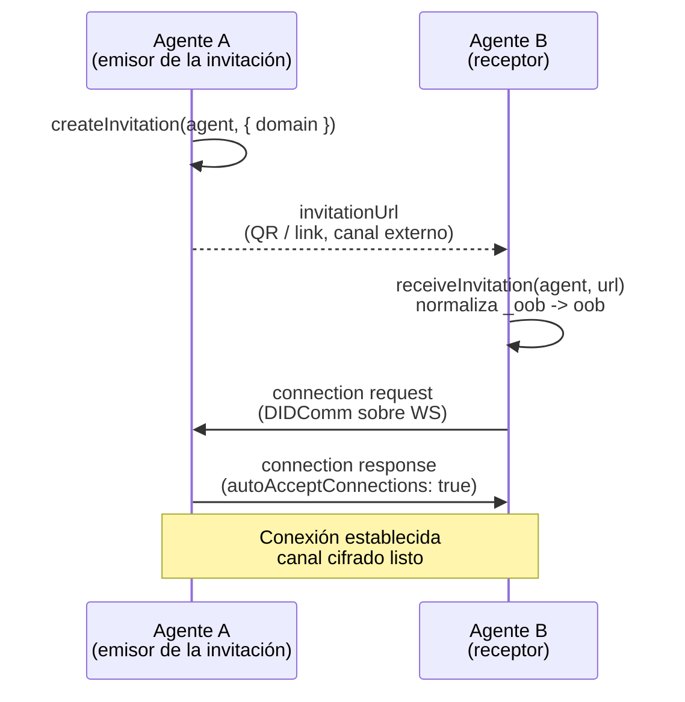

# DIDComm

## Concepto

DIDComm es el canal de mensajería cifrada punto a punto entre agentes. En
`@quarkid/identity-core` se usa **DIDComm v1 sobre WebSocket** (mediante Credo-TS
0.7) para el intercambio de credenciales W3C JSON-LD y de presentaciones.

Las piezas básicas son:

- **Conexión (connection):** relación bidireccional entre dos agentes, con su
  propio par de DIDs y claves. Una vez establecida, los mensajes viajan
  cifrados extremo a extremo.
- **Invitación out-of-band (OOB):** un agente genera una invitación (una URL) y
  la entrega por un canal externo (QR, link, etc.). El otro agente la recibe y,
  a partir de ahí, se negocia la conexión.

DIDComm v1 es la **capa de mensajería** (cifrado y transporte); sobre ese canal
corren los **protocolos de aplicación** de emisión (issue-credential v2) y de
prueba (present-proof v2), que se documentan en
[Emisión OID4VCI](./01-issuance-oid4vci.md),
[Verificación OID4VP](./02-verification-oid4vp.md) y
[Holder](./03-holder.md). Esta página cubre la capa de transporte y conexión.

## Invitaciones

El módulo `protocol/didcomm/invitation.ts` expone dos funciones helper sobre la
API OOB de Credo (`agent.didcomm.oob`).

### Crear una invitación

```typescript
import { createInvitation } from '@quarkid/identity-core'

const { invitationUrl, outOfBandId, invitationMessage } = await createInvitation(
  agent,
  {
    domain: 'https://issuer.example.com',
    goalCode: 'issue-vc', // o 'request-proof' en verifier
    goal: 'Emisión de credencial',
  },
)
```

`createInvitation(agent, options?)` devuelve:

| Campo | Uso |
|-------|-----|
| `invitationUrl` | URL OOB larga (`?oob=`) |
| `outOfBandId` | Enlaza pending offer/request al conectar |
| `invitationMessage` | JSON OOB para short URL RFC 0434 (`GET /oob/:id`) |
| `outOfBandRecord` | Record Credo serializado |

Opciones: `domain`, `goalCode` (`issue-vc` / `request-proof`), `goal`.

Los servicios Nest usan `onConnectionReady` (`ConnectionReadyPayload`) para
disparar `offerCredential` / `requestProof` cuando la conexión queda `completed`
o hay handshake-reuse.

> **Atención al dominio por defecto.** Si no pasás `options.domain`, el helper
> usa `'https://example.org'`. Especificá siempre el dominio público real.

### Recibir una invitación

```typescript
import { receiveInvitation } from '@quarkid/identity-core'

const outOfBandRecord = await receiveInvitation(agent, invitationUrl, {
  label: 'mi-holder',
})
```

`receiveInvitation(agent, invitationUrl, options?)`:

- **Normaliza la URL** antes de procesarla: si contiene el parámetro `_oob=`
  (variante que usan algunos sistemas) y no contiene `oob=`, lo reemplaza por
  `oob=` (`normalizeInvitationUrl`). Credo espera `oob=`.
- Resuelve el `label` desde `options.label`, o desde el label configurado del
  agente, o `'agent'` por defecto.
- Llama a `agent.didcomm.oob.receiveInvitationFromUrl(url, { label,
  reuseConnection: true })`. Con `reuseConnection: true`, si ya existe una
  conexión con ese par se reutiliza en lugar de crear una nueva.

### Handshake



## Transporte

La configuración del transporte DIDComm está en los agentes
(ver `issuer.agent.ts`, módulo `DidCommModule`):

- **Inbound:** `DidCommWsInboundTransport` (WebSocket). Usa un `wsServer`
  provisto o, si no, abre un puerto propio (`config.didcommPort ?? 3001`).
- **Outbound:** dos transportes registrados en orden:
  1. `DidCommHttpOutboundTransport` (HTTP, transporte estándar de Credo).
  2. `DidCommWsOutboundTransportDelayedClose` (WebSocket con cierre retrasado,
     ver abajo).

### `DidCommWsOutboundTransportDelayedClose`

Definido en `protocol/didcomm/transport.ts`, extiende
`DidCommWsOutboundTransport` de Credo y sobreescribe `sendMessage`.

El problema que resuelve: Credo, al enviar un mensaje saliente por un socket
**nuevo** que no espera respuesta, cierra el WebSocket inmediatamente después de
`send()`. Ese cierre prematuro puede cortar la conexión antes de que el receptor
llegue a recibir el mensaje completo (o antes de que su respuesta llegue de
vuelta). El wrapper retrasa ese cierre.

Detalle del override (`transport.ts:39`):

- Construye el `socketId` como `${endpoint}-${connectionId}` y resuelve el
  socket. Envía el payload serializado.
- **Sólo** programa el cierre cuando el socket es nuevo (`isNewSocket`) y el
  paquete **no** pide respuesta (`!outboundPackage.responseRequested`). Si el
  paquete espera respuesta o el socket ya estaba abierto, no se cierra.
- En ese caso, si `closeDelayMs > 0`, hace
  `setTimeout(() => socket.close(), closeDelayMs)`; si es `0`, cierra de
  inmediato (comportamiento base de Credo).

```typescript
// constructor(closeDelayMs = 10000)
new DidCommWsOutboundTransportDelayedClose(closeDelayMs)
```

Por defecto el delay es **10000 ms (10 segundos)**. En los agentes se toma de
`options.transportCloseDelayMs ?? 10000`. Poné `0` para restaurar el cierre
inmediato.

## Listeners por rol

Cada rol registra sus propios listeners de eventos DIDComm. Todos arrancan
llamando a los listeners compartidos.

### Compartidos (`shared.listener.ts`)

- `setupMessageListeners`: escucha `DidCommMessageReceived` y loguea el tipo de
  mensaje recibido (`[label] DidCommMessageReceived type=...`).
- `setupConnectionListeners`: escucha `DidCommConnectionStateChanged` y loguea el
  cambio de estado de cada conexión (`[label] Connection <id> state=<state>`).
- `findTenantIdForRecord(rootAgent, recordId, kind)`: devuelve el `tenantId`
  (`TenantRecord.id` de Credo) al que pertenece un record de tipo
  `credentials` o `proofs`. Recorre los tenants del root agent y devuelve
  aquel cuya wallet contiene el `recordId` buscado. Es **funcional**: se usa
  en los listeners por rol para ejecutar `api.withTenantAgent({ tenantId }, ...)`
  dentro del contexto correcto, ya que los handlers de eventos reciben el
  root agent por defecto y no operan dentro de un `withTenant`.

Los dos primeros son sólo observabilidad (logging/estado); no toman decisiones
de aceptación. El tercero es **infraestructura de scoping** indispensable
para los listeners multi-tenant.

### Holder (`holder.listener.ts`)

Auto-acepta ofertas de credencial y auto-presenta ante solicitudes de prueba:

- `OfferReceived` -> `acceptOffer`; `CredentialReceived` -> `acceptCredential`.
- `RequestReceived` (proof) -> selecciona credenciales, **expande la selección
  PEX** y `acceptRequest` (envía la presentación).

El detalle de cómo selecciona y expande las credenciales (y sus implicancias de
privacidad) está documentado en [Holder](./03-holder.md).

### Issuer (`issuer.listener.ts`)

Auto-responde al flujo de emisión:

- `ProposalReceived` -> arma el credential offer JSON-LD a partir de la
  propuesta y responde con `negotiateProposal` (o `acceptProposal` si la
  propuesta no trae credencial).
- `RequestReceived` -> `acceptRequest` (emite la credencial).
- `Done` -> loguea el cierre del intercambio.

### Verifier (`verifier.listener.ts`)

Auto-acepta presentaciones:

- `PresentationReceived` -> `acceptPresentation`. Loguea VERIFIED/NOT VERIFIED
  según el resultado.

## `autoAcceptConnections: true`

Los **tres roles** —issuer, holder y verifier, en sus variantes single-wallet y
multi-tenant— configuran el `DidCommModule` con `connections: { autoAcceptConnections: true }`:

- `issuer.agent.ts:96` (`createIssuerAgent`) y `:201` (`createRootIssuerAgent`)
- `holder.agent.ts:93` (`createHolderAgent`) y `:183` (`createRootHolderAgent`)
- `verifier.agent.ts:96` (`createVerifierAgent`) y `:195` (`createRootVerifierAgent`)

**Implicancia:** las solicitudes de conexión entrantes se aceptan
automáticamente, sin intervención del integrador. Cualquier agente que reciba o
genere una invitación válida queda conectado sin un paso de aprobación manual.

## Ejemplo de código

Crear una invitación en el agente A y recibirla en el agente B:

```typescript
import { createInvitation, receiveInvitation } from '@quarkid/identity-core'

const { invitationUrl, outOfBandId, invitationMessage } = await createInvitation(
  agentA,
  {
    domain: 'https://issuer.example.com',
    goalCode: 'issue-vc',
  },
)

const outOfBandRecord = await receiveInvitation(agentB, invitationUrl, {
  label: 'holder-app',
})
```

## Notas de honestidad

Estas son limitaciones reales del estado actual del código (ver también
[Limitaciones](../08-limitations.md)):

- **Dominio dummy por defecto.** `createInvitation` usa `'https://example.org'`
  cuando no se pasa `domain`. Pasá siempre el dominio público real.
- **Aceptación automática en cadena.** `autoAcceptConnections: true` junto con
  los listeners por rol auto-aceptan **todo** el flujo: conexiones, ofertas de
  credencial (holder), emisión (issuer) y presentaciones (verifier). El
  integrador **no** tiene un punto de control para aprobar o rechazar
  manualmente una conexión, una credencial entrante o una presentación. Si tu
  caso de uso necesita revisión humana o políticas de aceptación, hoy hay que
  modificar/reemplazar estos listeners y la config del módulo.
- **API HTTP de servicios.** Issuer/verifier exponen `POST .../didcomm/offer` y
  `POST .../didcomm/request` (OOB + pending + auto-protocol). Ya no hay
  `create-invitation` / `offer-credential` / `request-proof` / `connections`
  como endpoints HTTP separados en esos servicios.

## Ver también

- [Bootstrap del agente](../03-agent-bootstrap.md) — dónde se configura el
  `DidCommModule` y los transportes.
- [Emisión OID4VCI](./01-issuance-oid4vci.md)
- [Verificación OID4VP](./02-verification-oid4vp.md)
- [Holder](./03-holder.md) — detalle de selección/presentación de credenciales.
- [Limitaciones](../08-limitations.md)
