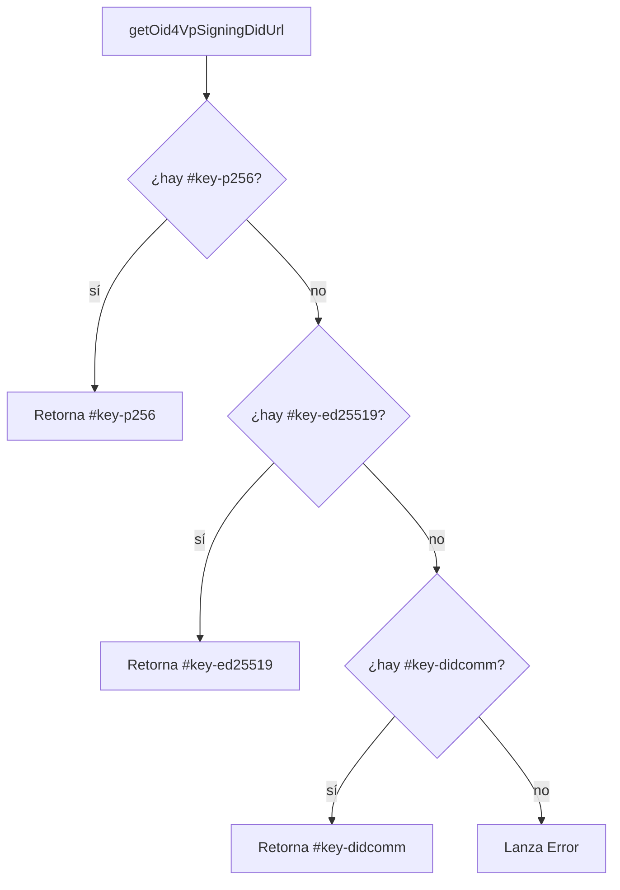
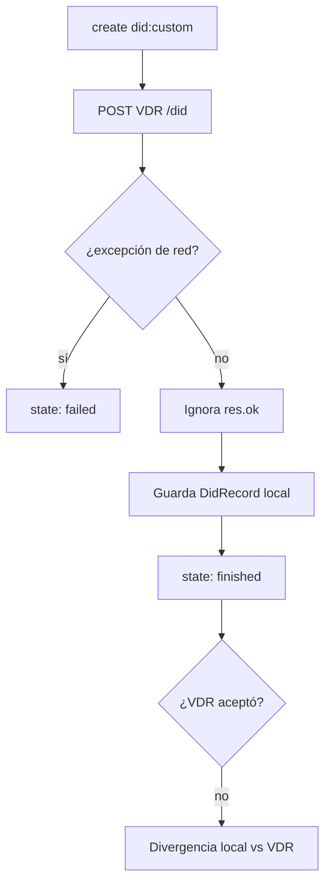

# DIDs

`@quarkid/identity-core` soporta tres métodos de DID, cada uno con un rol bien definido
dentro del ecosistema QuarkID. Esta referencia documenta los métodos soportados, los
helpers de creación, los fragmentos de clave en `did:web`, los registrars, los resolvers
y las notas de honestidad sobre el comportamiento real del código.

Todo lo descripto acá refleja el código en `packages/identity-core/src/did/`.

## Métodos de DID soportados

| Método | Rol típico | Registrar | Resolver | Almacenamiento del DID Document |
| --- | --- | --- | --- | --- |
| `did:web` | Issuer / Verifier | `WebDidRegistrar` (`'web'`) | `HttpWebDidResolver` / `WebDidResolver` (Credo-TS) | Servido por el consumidor en `/.well-known/did.json` |
| `did:key` | Holder | Registrar `key` nativo de Credo-TS | Resolver `key` nativo de Credo-TS | Derivado de la clave pública (sin almacenamiento externo) |
| `did:custom` | Método propio de QuarkID vía VDR | `QuarkDidRegistrar` (`'custom'`) | `QuarkDidResolver` (consulta el VDR) | Publicado en `vdr-service` (`POST /did`) |

Cuándo se usa cada uno:

- **`did:web`** — para agentes con dominio público estable (issuer, verifier). El DID
  Document se expone en `https://{domain}/.well-known/did.json`. Es el método recomendado
  para interoperabilidad EUDI/OID4VC porque la clave principal es P-256.
- **`did:key`** — para el holder (wallet). El DID se deriva directamente de la clave
  pública, no requiere dominio ni servicio externo. Ideal para identidades efímeras o sin
  infraestructura propia.
- **`did:custom`** — método propio de QuarkID. El DID (`did:custom:<uuid>`) se publica en
  el `vdr-service` y se resuelve consultando ese mismo servicio. Útil cuando se necesita un
  registro centralizado controlado por QuarkID en lugar de DNS (`did:web`).

## Helpers de creación

Los tres helpers siguen la misma semántica de "obtener o crear": si el DID ya existe y su
clave KMS sigue siendo válida, lo retornan tal cual; si la clave se perdió, lo recrean.
Ver las [notas de honestidad](#notas-de-honestidad) sobre el efecto destructivo de esta
lógica.

### `ensureWebDid(agent, options)`

Definido en `web-did.ts`. Obtiene o crea `did:web:{domain}` y retorna el DID Document
almacenado.

```ts
async function ensureWebDid(
  agent: Agent,
  options: EnsureWebDidOptions
): Promise<{ did: string; didDocument: DidDocument }>
```

`EnsureWebDidOptions`:

| Opción | Tipo | Default | Descripción |
| --- | --- | --- | --- |
| `domain` | `string` | — | Dominio público del agente (ej. `issuer.quarkid.com`). |
| `keyType?` | `{ kty:'EC'; crv:'P-256' }` \| `{ kty:'OKP'; crv:'Ed25519' }` | P-256 | Tipo de la clave primaria (`#key-p256`). |
| `didcommEndpoint?` | `string` | — | Endpoint DIDComm (`ws://` o `https://`) para el campo `service`. |
| `addEd25519Key?` | `boolean` | `false` | Agrega `#key-ed25519` (JsonWebKey2020) para fallback EdDSA. |
| `addDidCommKey?` | `boolean` | `false` | Agrega `#key-didcomm` (Ed25519VerificationKey2018) para firma JSON-LD en DIDComm. |

A diferencia de `ensureDid`, no usa reintentos: `did:web` no depende de servicios externos
en su creación.

### `ensureKeyDid(agent, options)`

Definido en `key-did.ts`. Obtiene o crea un `did:key`.

```ts
async function ensureKeyDid(
  agent: Agent,
  options: { keyType?: 'P-256' | 'Ed25519' } = {}
): Promise<string>
```

El default del helper es **P-256**. Sin embargo, el **holder usa `Ed25519`** explícitamente,
por lo que en el flujo de holder se invoca `ensureKeyDid(agent, { keyType: 'Ed25519' })`.
Ver [Flujo Holder](../05-flows/03-holder.md).

### `ensureDid(agent, options)`

Definido en `did.ts`. Obtiene o crea un `did:custom` con reintentos y backoff exponencial.

```ts
async function ensureDid(agent: Agent, options: EnsureDidOptions): Promise<string>
```

`EnsureDidOptions`:

| Opción | Tipo | Default | Descripción |
| --- | --- | --- | --- |
| `method` | `'custom'` | — | Único método soportado por este helper. |
| `vdrServiceUrl` | `string` | — | URL base del `vdr-service`. |
| `attempts?` | `number` | `10` | Número máximo de intentos. |
| `baseDelayMs?` | `number` | `5000` | Delay base entre reintentos (ms). |
| `maxDelayMs?` | `number` | `30000` | Delay máximo entre reintentos (ms). |

El reintento envuelve toda la operación con `withRetry`; cada intento puede crear el DID y
publicarlo en el VDR. Si el DID ya existe pero la clave KMS se perdió, además de borrar el
registro local hace `POST {vdrServiceUrl}/did/delete` para limpiar el VDR (con `.catch()`
silencioso).

## Fragmentos de clave en `did:web`

`WebDidRegistrar` genera un DID Document con hasta tres claves, identificadas por estos
fragmentos (constantes en `web.registrar.ts`):

| Fragmento | Constante | Tipo de clave | Formato | Uso |
| --- | --- | --- | --- | --- |
| `#key-p256` | `WEB_DID_KEY_P256_FRAGMENT` | P-256 | JsonWebKey2020 | Clave principal, OID4VC/OID4VP con ES256. Siempre presente. |
| `#key-ed25519` | `WEB_DID_KEY_ED25519_FRAGMENT` | Ed25519 | JsonWebKey2020 | Fallback EdDSA. Solo si `addEd25519Key: true`. |
| `#key-didcomm` | `WEB_DID_KEY_DIDCOMM_FRAGMENT` | Ed25519 | Ed25519VerificationKey2018 | Firma JSON-LD en DIDComm. Solo si `addDidCommKey: true`. |

La clave `#key-p256` se agrega a `authentication`, `assertionMethod` y `keyAgreement`.
`#key-ed25519` se agrega a `authentication` y `assertionMethod`. `#key-didcomm` se agrega
solo a `assertionMethod`.

### Selección del signing DID URL

Las funciones helper en `did.ts` recorren `assertionMethod` del DID Document y devuelven el
DID URL de la clave adecuada según el uso. Todas lanzan `Error` si la clave requerida no
existe.

| Función | Uso | Lógica de selección |
| --- | --- | --- |
| `getOid4VpSigningDidUrl(doc)` | Firma OID4VP (verifier) | Prioridad: `#key-p256` → `#key-ed25519` → `#key-didcomm`. |
| `getOid4VcSigningDidUrl(doc)` | Firma OID4VC EdDSA | Devuelve `#key-ed25519`. |
| `getOid4VcSigningDidUrlForAlg(doc, alg)` | Firma OID4VC por algoritmo | `'ES256'` → `#key-p256`; `'EdDSA'` → `#key-ed25519`. |
| `getDidCommSigningDidUrl(doc)` | Firma JSON-LD en DIDComm | Devuelve `#key-didcomm`. |



## Registrars

### `QuarkDidRegistrar`

`supportedMethods = ['custom']`. Flujo de `create`:

1. Crea o recupera un par de claves (Ed25519 por default, o P-256) vía KMS.
2. Deriva un DID Document a partir de `did:key` y reemplaza el identificador por
   `did:custom:<uuid>`.
3. Agrega un `DidCommV1Service` apuntando al `didcommEndpoint` configurado.
4. Publica el DID Document en el VDR vía `POST {vdrServiceUrl}/did`.
5. Persiste el `DidRecord` en el wallet de Credo-TS.

`update` y `deactivate` no están soportados y devuelven `state: 'failed'`
(`'notSupported'`). Cualquier error en `create` se captura y se devuelve como
`state: 'failed'` con el motivo (nunca lanza).

### `WebDidRegistrar`

`supportedMethods = ['web']`. Genera el DID Document con las claves descriptas arriba según
`addEd25519Key` / `addDidCommKey`. **No publica nada al VDR** — el servicio consumidor es
quien expone el DID Document en `/.well-known/did.json`.

`update` y `deactivate` también devuelven `state: 'failed'` (`'notSupported'`).

## Resolvers

| Resolver | Método | Mecanismo |
| --- | --- | --- |
| `HttpWebDidResolver` | `did:web` | Resuelve vía HTTP plano (dev local sin TLS). |
| `WebDidResolver` (Credo-TS) | `did:web` | Resuelve vía HTTPS (producción). |
| `QuarkDidResolver(baseUrl)` | `did:custom` | `GET {baseUrl}/did/:id` contra el VDR. |

### `buildWebDidResolver(useHttp?)`

Definido en `web.factory.ts`. Centraliza la decisión HTTP/HTTPS para `did:web`:

- `useHttp = true` → `HttpWebDidResolver` (HTTP plano).
- `useHttp = false | undefined` → `WebDidResolver` de Credo-TS (HTTPS).

### `didWebToHttpUrl(did)`

Definido en `web-http.resolver.ts`. Convierte un `did:web:...` a su URL HTTP de resolución.
El identificador se parte por `:` literal **antes** de decodificar percent-encoding, para
distinguir `%3A` (puerto) de `:` como separador de path:

- `did:web:host` → `http://host/.well-known/did.json`
- `did:web:host%3Aport` → `http://host:port/.well-known/did.json`
- `did:web:host:path:to` → `http://host/path/to/did.json`

`QuarkDidResolver` resuelve `did:custom` haciendo `GET {baseUrl}/did/{encodeURIComponent(did)}`.
Si la respuesta no es `ok`, devuelve `didDocument: null` con `error: 'notFound'`.

## Notas de honestidad

Ver también [Limitaciones conocidas](../08-limitations.md).

### El registrar `did:custom` no verifica la respuesta del VDR

En `quark.registrar.ts` (líneas ~150-157), `create` publica el DID Document con
`await fetch(\`${baseUrl}/did\`, ...)` pero **no verifica `res.ok`**. El código continúa
sin importar el resultado de esa petición: persiste el `DidRecord` local y devuelve
`state: 'finished'`.

Consecuencia: si el VDR rechaza la publicación (4xx/5xx), igual queda un DID local marcado
como creado y el flujo lo reporta como exitoso. Esto produce una **divergencia entre el
estado local y el VDR**: el agente cree tener un DID resoluble que el VDR no conoce. Solo
un error de red/excepción en el `fetch` (no un status de error HTTP) provoca el camino de
`failed`.



### `ensure*` es destructivo pese a su nombre

`ensureWebDid`, `ensureKeyDid` y `ensureDid` **borran y recrean el DID local** cuando la
clave KMS asociada se perdió (wallet efímero reiniciado, `KeyManagementKeyNotFoundError`).
`ensureWebDid` también borra y recrea si faltan las claves `#key-ed25519` / `#key-didcomm`
solicitadas. `ensureDid` va más allá: además de borrar el `DidRecord` local, hace
`POST {vdrServiceUrl}/did/delete` para **afectar el VDR**.

El nombre "ensure" sugiere una operación idempotente e inofensiva, pero en estos casos hay
borrado de estado local (y remoto, en `ensureDid`). Tenerlo en cuenta al reiniciar agentes
con almacenamiento efímero: un DID previamente publicado puede ser eliminado y reemplazado
por uno nuevo con distinto identificador o claves.

## Ver también

- [Bootstrap del agente](../03-agent-bootstrap.md)
- [Flujo Holder](../05-flows/03-holder.md)
- [Referencia: KMS](./02-kms.md)
- [Limitaciones conocidas](../08-limitations.md)
