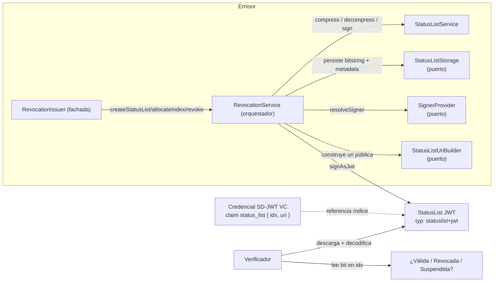

# Revocación (Token Status List)

Este módulo implementa la revocación y suspensión de credenciales SD-JWT VC mediante el mecanismo **Token Status List (TSL)** especificado por el IETF (draft `draft-ietf-oauth-status-list`). Vive en `src/revocation/` del paquete `@quarkid/identity-core`.

:::info Estado del módulo
El core provee la **lógica** (orquestador + bajo nivel), los **puertos** (storage, signers, uri builder, mensajería) y un **adapter de persistencia de referencia** (`PostgresStatusListStorage`). Los consumers solo deben implementar los puertos que el core no impone (cómo se obtiene el firmante y cómo se construye la URI pública).
:::

## Concepto

Token Status List es un mecanismo para revocar y suspender credenciales sin necesidad de contactar la credencial original. La idea central:

- El emisor mantiene una **bitstring comprimida** (DEFLATE/ZLIB) donde cada posición (índice) representa el estado de una credencial.
- Al emitir una credencial, se le asigna un **índice** dentro de la lista y se inyecta en la credencial un claim `status_list` con `{ idx, uri }` que apunta a esa posición.
- El emisor publica la bitstring firmada como un **JWT** (`typ: statuslist+jwt`) en la `uri` referenciada.
- Para conocer el estado de una credencial, un verificador descarga el JWT de la status list, lo decodifica, y lee el bit en el índice indicado.

De este modo, un único artefacto firmado (la lista) describe el estado de hasta decenas de miles de credenciales, y se puede actualizar revocando o suspendiendo sin tocar las credenciales ya emitidas.



> Decisión de librería: se usa `@sd-jwt/jwt-status-list` (`StatusList`) porque está más maduro en el ecosistema SD-JWT y solo se necesita soporte JWT (JOSE), no CWT/CBOR. Detalle en `src/revocation/README.md`.

## Estados

Las constantes de estado están definidas en `status-list.types.ts` (módulo `revocation/`, plano). El valor numérico es el que se almacena en cada índice de la bitstring (el tipo `StatusType` admite `0 | 1 | 2 | 15`):

| Constante | Valor | Significado |
|---|---|---|
| `STATUS_TYPE_VALID` | `0` | Credencial válida (estado por defecto al asignar un índice). |
| `STATUS_TYPE_INVALID` | `1` | Credencial **revocada** (estado que aplica `revoke`). |
| `STATUS_TYPE_SUSPENDED` | `2` | Credencial **suspendida** (definido en tipos; ver nota más abajo). |
| `STATUS_TYPE_UNRECOGNIZED` | `15` | Estado no reconocido / reservado. |

La cantidad de bits por entrada (`BitsPerStatus`) puede ser `1 | 2 | 4 | 8`. Con `bits = 1` solo se distingue válido (`0`) de inválido (`1`); para usar `SUSPENDED` (`2`) o `UNRECOGNIZED` (`15`) hace falta crear la lista con `bits >= 2` o `bits = 4` respectivamente.

:::note
`RevocationIssuer.revoke` aplica siempre `STATUS_TYPE_INVALID` (`1`). No hay un método de alto nivel para suspender (`SUSPENDED`); para ello se usa directamente `StatusListService.setStatus(list, index, STATUS_TYPE_SUSPENDED)` sobre una lista de `bits >= 2`. Ver [Notas de honestidad](#notas-de-honestidad).
:::

## API de alto nivel: `RevocationIssuer`

Para issuers, el caso de uso recomendado es la fachada `RevocationIssuer` (provista por `createRevocationIssuer(deps)`). El caller solo conoce `walletId` y `vct` — el core resuelve el firmante y arma la URI internamente.

### Construcción

```typescript
import { createRevocationIssuer } from '@quarkid/identity-core'

const revocationIssuer = createRevocationIssuer({
  storage,        // StatusListStorage (puerto) — ej: PostgresStatusListStorage
  signers,        // SignerProvider (puerto) — cómo obtener el firmante por tenant
  uriBuilder,     // StatusListUriBuilder (puerto) — cómo armar la URI pública
  messaging?,     // MessagingService (puerto, opcional) — para eventos
})
```

### Métodos

| Método | Firma | Qué hace |
|---|---|---|
| `createStatusList` | `(walletId, vct, options?: { bits?, capacity? }) => Promise<{ listId, uri }>` | Crea la status list para `(walletId, vct)`. **Idempotente**: si ya existe, devuelve la existente sin recrearla. Defaults `bits = 1`, `capacity = 16384`. |
| `allocateIndex` | `(walletId, vct, options?: { credentialId?, preferredIndex? }) => Promise<{ index, uri }>` | Asigna un índice a una credencial. Crea la lista si no existe. Soporta `preferredIndex`; si está ocupado, busca el siguiente libre. Marca el índice como `VALID` y persiste el cursor `nextIndex`. Si se pasa `credentialId`, guarda el vínculo vía `saveRevocation`. |
| `revoke` | `(walletId, vct, index, options?: { reason?, revokedBy? }) => Promise<{ revokedAt, status: 1 }>` | Marca el índice como `INVALID` (`1`), recomprime y persiste, incrementa el contador de revocados y registra `reason`/`revokedBy`. Devuelve `{ revokedAt, status: 1 }`. |
| `getStatus` | `(walletId, vct, index) => Promise<{ status, updatedAt? }>` | Descomprime la lista y devuelve el estado del índice. |
| `getStatusListJwt` | `(walletId, vct, options?: { ttl?, exp? }) => Promise<{ jwt, uri }>` | Genera el JWT firmado de la lista (`statuslist+jwt`), listo para publicar en la `uri`. |

### Ejemplo end-to-end

```typescript
import {
  createRevocationIssuer,
  PostgresStatusListStorage,
  type StatusListStorage,
  type SignerProvider,
  type StatusListUriBuilder,
  type SignerOptions,
} from '@quarkid/identity-core'
import { Pool } from 'pg'

// 1) Storage — el core provee PostgresStatusListStorage
const pool = new Pool({ connectionString: process.env.DATABASE_URL })
const storage: StatusListStorage = new PostgresStatusListStorage(pool)

// 2) Adapters que el consumer implementa según su dominio
const signers: SignerProvider = {
  async resolveSigner(walletId) {
    /* p. ej. resolver del agente Credo del tenant */
    return {} as SignerOptions
  },
}
const uriBuilder: StatusListUriBuilder = {
  build(walletId, vct, issuerDid) {
    return `${process.env.PUBLIC_BASE_URL}/v1/issuers/${walletId}/revocation/status-list/${vct}`
  },
}

// 3) Fachada
const issuer = createRevocationIssuer({ storage, signers, uriBuilder })

// Crear (o recuperar) la status list para un VCT
const { listId, uri } = await issuer.createStatusList('tenant-1', 'UniversityDegree')

// Asignar índice al emitir credencial
const { index } = await issuer.allocateIndex('tenant-1', 'UniversityDegree', {
  credentialId: 'credential-123',
})

// Revocar
const { revokedAt, status } = await issuer.revoke('tenant-1', 'UniversityDegree', index, {
  reason: 'Credencial vencida',
  revokedBy: 'admin-1',
})

// Publicar el JWT firmado de la status list
const { jwt } = await issuer.getStatusListJwt('tenant-1', 'UniversityDegree', { ttl: 43200 })
// Servir `jwt` con Content-Type application/statuslist+jwt en la `uri`.

// Consultar estado de un índice
const { status: estado } = await issuer.getStatus('tenant-1', 'UniversityDegree', index)
```

La asignación de índice típicamente se intercala dentro del [flujo de emisión OID4VCI](../05-flows/01-issuance-oid4vci.md): se hace `allocateIndex` y se inyecta el claim `status_list` resultante en la credencial antes de firmarla.

## API de bajo nivel: `RevocationService`

`RevocationService` es el orquestador de bajo nivel. **También recibe los puertos `SignerProvider` y `StatusListUriBuilder` por constructor**, por lo que su API pública tampoco exige `issuerDid`/`issuerKey`/`signer` por invocación — los resuelve internamente igual que la fachada. Se usa para casos donde el consumer quiere más control (admin, scripts batch, integraciones a medida).

**Constructor:**

```typescript
constructor(
  statusListService: StatusListService,
  repository: StatusListStorage,                  // puerto
  signers: SignerProvider,                       // puerto
  uriBuilder: StatusListUriBuilder,              // puerto
  messaging?: MessagingService,                  // opcional
)
```

### Métodos

| Método | Firma | Qué hace |
|---|---|---|
| `setLogger` | `(logger: CredoLogger) => void` | Inyecta un logger Credo-TS; lo propaga también al `StatusListService` interno. |
| `createStatusList` | `(params: { walletId, vct, bits?, capacity? }) => Promise<{ listId, uri }>` | Crea (o recupera, idempotente) la status list. Resuelve el signer y la URI internamente. |
| `allocateIndex` | `(params: { walletId, vct, credentialId?, preferredIndex? }) => Promise<{ index, uri }>` | Crea la lista si no existe y asigna un índice. Atómico vía `withTransaction`. |
| `revoke` | `(params: { walletId, vct, index, reason?, revokedBy? }) => Promise<{ revokedAt, status: 1 }>` | Marca el índice como inválido. Atómico (bitstring + counter + audit log). |
| `getStatus` | `(walletId, vct, index) => Promise<{ status, updatedAt? }>` | Estado actual de un índice. |
| `getStatusListJwt` | `(walletId, vct, options?: { ttl?, exp? }) => Promise<{ jwt, uri }>` | Genera el JWT firmado de la lista. |
| `getStatusListInfo` | `(walletId, vct) => Promise<StatusListInfo \| null>` | Metadata persistida sin descomprimir el bitstring. |

## `StatusListService` (bajo nivel)

Encapsula las operaciones puras sobre la bitstring (no toca persistencia ni mensajería). Es lo que `RevocationService` usa por debajo, pero también se puede usar directamente para casos avanzados (por ejemplo, suspender, decodificar un JWT externo, o extraer la referencia de una credencial).

| Método | Firma | Qué hace |
|---|---|---|
| `setLogger` | `(logger: CredoLogger) => void` | Inyecta un logger Credo-TS. |
| `createEmptyList` | `(bits: BitsPerStatus = 1, capacity: number = 16384) => StatusList` | Crea una `StatusList` vacía (todos los índices en `0`). |
| `setStatus` | `(list, index, value: StatusType) => void` | Escribe el estado de un índice. |
| `getStatus` | `(list, index) => StatusType` | Lee el estado de un índice. |
| `getBitsPerStatus` | `(list) => BitsPerStatus` | Devuelve los bits por entrada de la lista. |
| `compress` | `(list) => string` | Comprime la lista (devuelve string base64url). |
| `decompress` | `(compressed, bits) => StatusList` | Reconstruye la `StatusList` desde el string comprimido. |
| `getCapacity` | `(list) => number` | Cantidad de entradas de la lista. |
| `findFreeIndex` | `(list, fromIndex = 0) => number \| null` | Devuelve el primer índice con estado `0` desde `fromIndex`, o `null` si no hay libre. |
| `signAsJwt` | `(list, signer, { uri, ttl?, exp? }) => Promise<string>` | Firma la lista como `statuslist+jwt` (`alg` por defecto `ES256`). Delega la firma al `signer.kms`. |
| `decodeJwt` | `(jwt) => { list, payload }` | Decodifica un JWT de status list; lanza `InvalidStatusListJwtError` si falla. |
| `extractReference` | `(credentialJwt) => StatusListEntry` | Extrae `{ idx, uri }` desde el claim `status_list` de una credencial. |
| `buildStatusClaim` | `(idx, uri) => { status_list }` | Construye el claim `status_list` para inyectar en una credencial al emitir. |

:::warning Verificación criptográfica
`StatusListService` **no** integra verificación de firma del JWT. `decodeJwt` decodifica y parsea, pero la validación criptográfica de la firma (y de `exp`) queda a cargo del consumidor con su propio KMS/verificador. Por eso `StatusListExpiredError` y `StatusListSignatureError` están definidos pero no se lanzan internamente (ver [Errores](#errores)).
:::

## Puertos y fachada de alto nivel

El módulo expone **cuatro puertos** (interfaces) y sus **tokens de DI** (símbolos, mismo patrón que `MESSAGING_SERVICE`). Los consumers implementan los puertos que varían por dominio y los proveen al `RevocationService` (bajo nivel) o al `createRevocationIssuer` (alto nivel).

### `StatusListStorage` (puerto de persistencia)

```typescript
interface StatusListStorage {
  findByWalletAndVct(walletId, vct): Promise<StatusListInfo | null>
  findById(id): Promise<StatusListInfo | null>
  create({ walletId, vct, bits, capacity, compressedBitstring, nextIndex }): Promise<StatusListInfo>
  updateCompressedBitstring(id, compressed, nextIndex): Promise<void>
  incrementRevokedCount(id): Promise<void>
  saveRevocation({ statusListId, index, credentialId?, reason?, revokedBy? }): Promise<void>
  findRevocation(statusListId, index): Promise<{...} | null>
  updateRevocation({ statusListId, index, reason?, revokedBy? }): Promise<void>
  withTransaction<T>(fn: (tx: StatusListStorage) => Promise<T>): Promise<T>
}
```

**Adapter de referencia en el core:** `PostgresStatusListStorage` (`src/revocation/postgres-status-list.storage.ts`). Recibe un `pg.Pool`, crea las tablas con DDL idempotente y soporta transacciones reales.

```typescript
import { Pool } from 'pg'
import { PostgresStatusListStorage, type StatusListStorage } from '@quarkid/identity-core'

const pool = new Pool({ connectionString: process.env.DATABASE_URL })
const storage: StatusListStorage = new PostgresStatusListStorage(pool)
```

Si el consumer necesita otro backend (TypeORM, MongoDB, DynamoDB, in-memory para tests), implementa `StatusListStorage` y lo inyecta.

### `SignerProvider` (puerto de firmante)

```typescript
interface SignerProvider {
  resolveSigner(walletId: string): Promise<SignerOptions>
}
```

Encapsula *cómo* se obtiene el `SignerOptions` (DID, keyId, kid, alg, kms) para un tenant. El core lo invoca cuando necesita firmar; el consumidor decide si lo resuelve desde un agente Credo, un KMS externo o configuración estática.

El `kms` devuelto tiene que seguir siendo usable después de que `resolveSigner` retorne, porque el core firma más tarde dentro de la misma operación. Con agentes multi-tenant, el KMS de una sesión ya cerrada falla con `container has been disposed`: el adapter debe abrir una sesión nueva en cada firma.

Token Nest: `SIGNER_PROVIDER = Symbol('SignerProvider')`.

**Helper reusable del core** para consumers con un agente Credo: [`resolveSignerFromAgent`](#helpers-de-derivación-de-signer) deriva el `SignerMetadata` (DID, keyId, kid, alg) a partir del primer DID `did:web` del agente, con overrides opcionales para `alg` y `keyFragment`.

### `StatusListUriBuilder` (puerto de URI pública)

```typescript
interface StatusListUriBuilder {
  build(walletId: string, vct: string, issuerDid: string): string
}
```

Encapsula *cómo* se deriva la URI pública de la StatusList. El core no impone un esquema: el consumidor decide si la URI es DID-based, HTTP bajo su API pública, etc.

Token Nest: `STATUS_LIST_URI_BUILDER = Symbol('StatusListUriBuilder')`.

### `MessagingService` (puerto de eventos, opcional)

```typescript
interface MessagingService {
  publish(routingKey: string, payload: Record<string, unknown>): Promise<void>
}

export const MESSAGING_SERVICE = Symbol('MessagingService')
```

Si no se inyecta, los `publishEvent` son no-op. Ver [Eventos](#eventos).

### `createRevocationIssuer(deps)` (factory)

```typescript
interface RevocationIssuerDeps {
  storage: StatusListStorage
  signers: SignerProvider
  uriBuilder: StatusListUriBuilder
  messaging?: MessagingService
}

function createRevocationIssuer(deps: RevocationIssuerDeps): RevocationIssuer
```

Arma internamente `StatusListService` + `RevocationService` (con los puertos inyectados) + `RevocationIssuer`. Es la forma recomendada de instanciar la fachada.

## Helpers de derivación de signer

El core exporta utilidades para que cualquier consumer con un agente Credo pueda construir un `SignerProvider` sin reimplementar la lógica de derivación:

| Función | Firma | Propósito |
|---|---|---|
| `resolveSignerFromAgent` | `(agent: Agent, options?: SignerDerivationOptions) => Promise<SignerMetadata>` | Deriva DID, `keyId`, `kid` y `alg` desde un agente Credo. Estrategia por defecto: primer DID `did:web`, clave `#key-p256`, `alg` derivado del JWK público. No devuelve `kms`: lo completa el consumer. |
| `pickDidRecordKey` | `(keys: DidRecordKey[], fragment?: string) => DidRecordKey \| undefined` | Elige la clave del `DidRecord` que matchea `fragment` (con o sin `#`); fallback a la primera si no hay match exacto. |
| `deriveAlgFromKms` | `(agent: Agent, keyId: string) => Promise<string>` | Deriva el `alg` JWS del JWK público de una clave KMS (`P-256 → ES256`, `Ed25519 → EdDSA`, etc.). |

```typescript
interface SignerDerivationOptions {
  algOverride?: string         // fuerza el `alg` JWS
  kidOverride?: string         // fuerza el `kid` completo
  keyFragment?: string         // default: 'key-p256' (clave primaria de Credo en did:web)
  didMethod?: 'web' | 'key'    // default: 'web'
}

interface DidRecordKey {
  kmsKeyId: string
  didDocumentRelativeKeyId?: string
}
```

Ejemplo de un consumer que no es el issuer de QuarkID:

```typescript
import { resolveSignerFromAgent, type SignerProvider, type SignerOptions } from '@quarkid/identity-core'
import type { Agent } from '@credo-ts/core'

const signers: SignerProvider = {
  async resolveSigner(walletId): Promise<SignerOptions> {
    const metadata = await withWallet(walletId, (agent: Agent) =>
      resolveSignerFromAgent(agent, {
        // Opcional: si tu agente tiene un fragmento no estándar
        keyFragment: 'key-ed25519',
      })
    )

    // El KMS abre su propia sesión: la de derivación ya está cerrada.
    return {
      ...metadata,
      kms: {
        sign: (options) => withWallet(walletId, (agent: Agent) => agent.kms.sign(options)),
      },
    }
  },
}
```

`pickDidRecordKey` y `deriveAlgFromKms` están exportados para que el consumer pueda componer su propia lógica de selección sin reimplementar el matching de fragmento ni la tabla de algoritmos.

## `StatusListInfo` (metadata persistida)

Tipo de metadata que devuelve `StatusListStorage` (también el retorno de `getStatusListInfo`):

```typescript
interface StatusListInfo {
  id: string
  walletId: string
  vct: string
  bits: BitsPerStatus
  capacity: number
  compressedBitstring: string
  nextIndex: number
  revokedCount: number
  lastUpdatedAt: Date | null
  createdAt: Date
  updatedAt: Date
}
```

## Errores

Definidos en `revocation.errors.ts` (módulo `revocation/`, plano). Todos extienden `RevocationError`, que expone un `code` estable (`string`).

| Clase | `code` | Cuándo se lanza |
|---|---|---|
| `RevocationError` | (base) | Clase base; no se lanza directamente. Constructor `(message, code)`. |
| `StatusListNotFoundError` | `STATUS_LIST_NOT_FOUND` | `allocateIndex` / `revoke` / `getStatus` / `getStatusListJwt` cuando no existe lista para `(walletId, vct)`. |
| `NoFreeIndexError` | `NO_FREE_INDEX` | `allocateIndex` cuando la lista está al 100% de su capacidad. |
| `IndexOutOfBoundsError` | `INDEX_OUT_OF_BOUNDS` | `revoke` / `getStatus` con `index < 0` o `index >= capacity`. |
| `InvalidStatusListJwtError` | `INVALID_STATUS_LIST_JWT` | `StatusListService.decodeJwt` cuando falla el parseo del JWT. |
| `StatusListExpiredError` | `STATUS_LIST_EXPIRED` | Definido para el consumidor. **No se lanza internamente** (la verificación de `exp` no está integrada). |
| `StatusListSignatureError` | `STATUS_LIST_SIGNATURE_INVALID` | Definido para el consumidor. **No se lanza internamente** (la verificación de firma no está integrada). |
| `CredentialAlreadyRevokedError` | `CREDENTIAL_ALREADY_REVOKED` | `StatusListStorage.saveRevocation` cuando choca con la constraint UNIQUE (Postgres `23505`). |

## Eventos

`RevocationService` publica eventos a través del puerto `MessagingService` (inyectable via token `MESSAGING_SERVICE = Symbol('MessagingService')`). Si el puerto no se provee, los `publishEvent` son no-op. **El core no impone el transporte**: el consumidor decide si el adapter es RabbitMQ, Kafka, una cola in-memory, etc.

| Routing key | Cuándo |
|---|---|
| `revocation.status-list.created` | `createStatusList` crea una lista nueva (no al recuperar una existente). |
| `revocation.status-list.allocated` | `allocateIndex` asigna un índice. |
| `credential.revoked` | `revoke` completa la revocación. |

Si la publicación falla, el error se loguea y la operación de revocación no se aborta (fire-and-forget, ver `revocation.service.ts`).

## Notas de honestidad

- **El core sí incluye una implementación concreta de `StatusListStorage`:** `PostgresStatusListStorage` (sobre `pg.Pool`). Los consumers que necesiten otro backend implementan `StatusListStorage` y lo inyectan.
- **La mensajería es opcional y sin transporte incluido.** `MessagingService` es un puerto; el core no impone RabbitMQ/Kafka/etc. Si no se inyecta, no se publican eventos.
- **No hay verificación criptográfica integrada.** `StatusListService.decodeJwt` decodifica y parsea, pero no valida la firma ni la expiración. Por eso `StatusListSignatureError` y `StatusListExpiredError` están definidos pero nunca se lanzan internamente: están reservados para que el consumidor los use al implementar su propia verificación.
- **Solo revocación, no suspensión de alto nivel.** `RevocationIssuer.revoke` siempre escribe `STATUS_TYPE_INVALID` (`1`). Para suspender (`SUSPENDED = 2`) hay que operar directamente con `StatusListService.setStatus` sobre una lista de `bits >= 2` y persistir/firmar manualmente.
- **El `SignerOptions` no se construye a mano en código de issuer:** el adapter `SignerProvider` del consumer encapsula esa lógica. El core provee `resolveSignerFromAgent` como helper reusable para consumers con un agente Credo.

Estas limitaciones y su impacto en una integración productiva se detallan también en [Limitaciones](../08-limitations.md).

## Ver también

- [Credenciales](./04-credentials.md) — emisión y estructura de las credenciales SD-JWT VC que referencian la status list.
- [Flujo de emisión OID4VCI](../05-flows/01-issuance-oid4vci.md) — dónde se asigna el índice y se inyecta el claim `status_list`.
- [Flujo de verificación OID4VP](../05-flows/02-verification-oid4vp.md) — dónde el verificador consulta el estado de revocación.
- [Limitaciones](../08-limitations.md) — alcance del módulo y trabajo pendiente.
