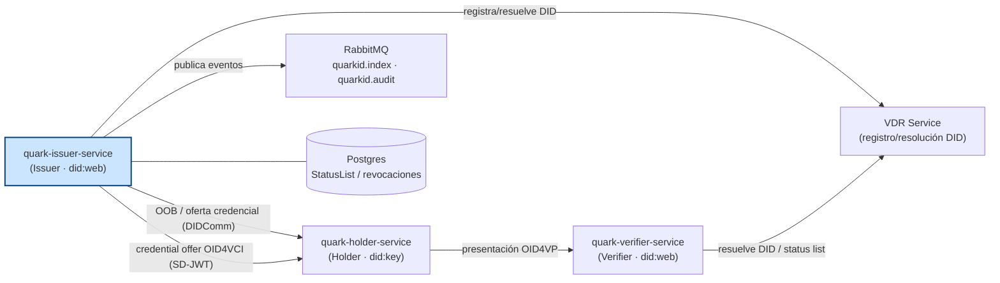
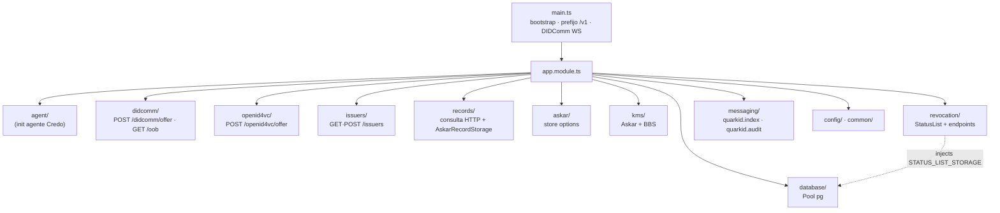
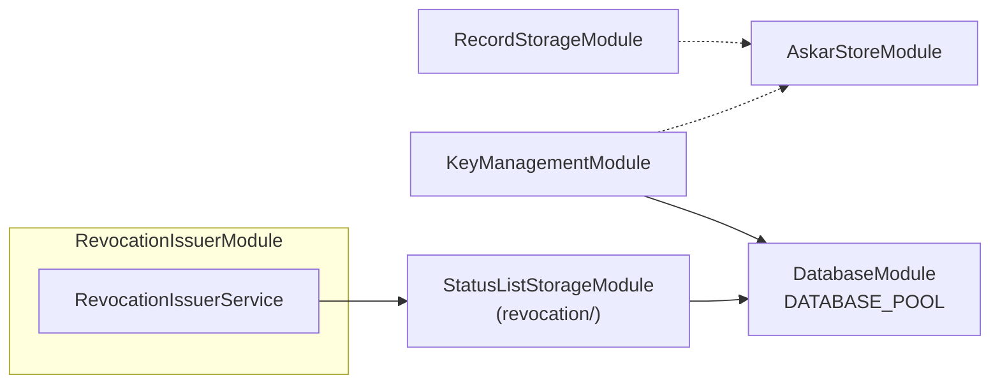

# quark-issuer-service

Servicio NestJS de prueba para el rol **Issuer** del stack QuarkID 2.0.

Consume `@quarkid/identity-core` para inicializar un agente Credo-TS con capacidades de emisión DIDComm y OID4VCI (SD-JWT), además de exponer endpoints de gestión de issuers, consulta de records Credo, metadata OID4VCI y StatusList (revocación).

> Este servicio es un entorno de prueba/integración para validar `@quarkid/identity-core`. No forma parte del stack productivo (Gateway, Auth, Web, Index, Resolver).

---

## Responsabilidades

- Inicializar agente Credo-TS como issuer (DID `did:web` + wallet + KMS + StatusList).
- **DIDComm**: invitaciones OOB, oferta de credenciales W3C JSON-LD, consulta de conexiones.
- **OID4VCI**: ofertas de credenciales SD-JWT (`dc+sd-jwt`) vía pre-authorized code flow (eIDAS 2.0).
- **Issuers**: alta y listado de issuers multi-tenant (`POST /issuers`, `GET /issuers`).
- **Records**: consulta y metadata OID4VCI por tenant (`/issuers/:walletId/records/*`).
- **Revocación**: gestión completa de StatusList (`/issuers/:walletId/revocation/*`).
- **Publicación de eventos**: a RabbitMQ (exchanges `quarkid.index` y `quarkid.audit`).

## Arquitectura

`quark-issuer-service` actúa como emisor (`did:web`) dentro del ecosistema QuarkID 2.0. Ofrece credenciales al holder por dos vías — DIDComm (OOB) y OID4VCI (SD-JWT pre-authorized) —, registra y resuelve DIDs contra el VDR Service, persiste StatusLists y revocaciones en Postgres, y publica eventos a RabbitMQ (`quarkid.index` y `quarkid.audit`).

### Diagrama 1 — Ecosistema (resaltando issuer)



### Diagrama 2 — Módulos internos



### Diagrama 3 — Persistencia / KMS Nest



> `StatusListStorageModule` vive en `revocation/`. El pool compartido está en `database/`; Askar store en `askar/`.

> `agent/`, `common/` y `config/` son directorios funcionales, no módulos NestJS.

## Stack

- NestJS 10 + TypeScript
- `@quarkid/identity-core` (wrapper Credo-TS)
- `@nestjs/config` para configuración tipada
- KMS: Askar + sidecar BBS
- Records Credo: `AskarRecordStorage` vía `RecordStorageModule`
- Revocación: `PostgresStatusListStorage` vía `StatusListStorageModule` (`DATABASE_POOL`)
- Transporte DIDComm: WebSocket + HTTP
- Mensajería: RabbitMQ (`amqplib`)

## Estructura

```
source/src/
├── agent/                  # Inicialización del agente Credo (DID gestionado internamente)
├── app.controller.ts       # /health, /health/ready, /:walletId/did.json
├── common/                 # logger, interceptors, exception filter, global-prefix
├── config/                 # environment.config, db.config, index, issuer-config.mock
├── database/               # DATABASE_POOL (pg compartido)
├── askar/                  # ASKAR_STORE_OPTIONS
├── kms/                    # Askar + BbsKeyManagementService
├── didcomm/                # POST offer + GET /oob/:id (espejo de openid4vc/)
├── openid4vc/              # POST /issuers/:walletId/openid4vc/offer
├── issuers/
│   ├── dto/                # create-issuer.dto
│   ├── issuers.controller.ts        # GET/POST /issuers
│   ├── issuers.service.ts
│   └── issuers.module.ts
├── records/
│   ├── dto/                # list-records-query, patch-issuer-metadata
│   ├── records.controller.ts        # /issuers/:walletId/records/* (incluye PATCH metadata)
│   ├── records.service.ts
│   ├── records.module.ts
│   ├── record-storage.module.ts     # RecordStorageModule (AskarRecordStorage)
│   └── record-storage.tokens.ts     # RECORD_STORAGE
├── revocation/
│   ├── status-list-storage.module.ts
│   ├── status-list-storage.tokens.ts
│   ├── dto/                # revocation.dto
│   ├── revocation.controller.ts     # /issuers/:walletId/revocation/*
│   ├── revocation.service.ts        # wrapper de @quarkid/identity-core
│   ├── revocation.module.ts         # wiring createRevocationIssuer + endpoints
│   ├── signer.provider.ts
│   ├── uri.builder.ts
│   └── revocation.tokens.ts
├── messaging/
│   ├── messaging.service.ts              # publish a quarkid.index
│   ├── messaging.client.ts
│   ├── messaging.constants.ts            # routing keys y payload types
│   ├── messaging.module.ts
│   ├── audit-messaging.service.ts        # publish a quarkid.audit
│   ├── audit-messaging.module.ts
│   └── audit.interceptor.ts              # APP_INTERCEPTOR global
├── app.module.ts           # ConfigModule + módulos de dominio
└── main.ts                 # bootstrap con global prefix /v1
```

## Variables de entorno

Copiar `source/.env.example` a `source/.env` y completar.

Las variables se cargan vía `@nestjs/config` en `source/src/config/environment.config.ts`. Toda variable no listada aquí es ignorada por el código actual.

### HTTP y agente

| Variable       | Default                            | Descripción                                                                                            |
| -------------- | ---------------------------------- | ------------------------------------------------------------------------------------------------------ |
| `PORT`         | `3000`                             | Puerto HTTP del servicio.                                                                              |
| `BASE_URL`     | `http://quark-issuer-service:9001` | URL base pública. Se usa para construir `didcommEndpoint`, `invitationUrlPrefix` y el prefijo OID4VCI. |
| `SERVICE_HOST` | `localhost`                        | Host lógico del servicio.                                                                              |
| `LOG_LEVEL`    | `INFO`                             | Nivel de log: `DEBUG` \| `INFO` \| `WARN` \| `ERROR`.                                                  |
| `WALLET_ID`    | —                                  | ID del wallet/tenant default al iniciar el agente raíz.                                                |
| `WALLET_KEY`   | —                                  | Clave de encriptación del wallet (mínimo 32 chars recomendado).                                        |

### KMS

| Variable                    | Default                 | Descripción                                                              |
| --------------------------- | ----------------------- | ------------------------------------------------------------------------ |
| `DATABASE_URL`              | —                       | Postgres (Askar store, BBS, StatusList).                                 |
| `ASKAR_STORE_KEY`           | —                       | Passphrase Askar (obligatoria).                                          |
| `ASKAR_STORE_ID`            | —                       | ID store Askar; default = nombre de DB en `DATABASE_URL`.                |
| `DATABASE_URL`              | —                       | **Obligatoria.** Postgres del servicio (Askar / BBS / StatusList / records). |

### OID4VCI

| Variable                | Default                 | Descripción                                                           |
| ----------------------- | ----------------------- | --------------------------------------------------------------------- |
| `OID4VC_SUPPORTED_ALGS` | `ES256`                 | Algoritmos aceptados en el proof JWT del holder (separados por coma). |
| `VDR_SERVICE_URL`       | `http://localhost:4003` | URL del VDR service.                                                  |

### Mensajería

| Variable       | Default                 | Descripción                                                                                   |
| -------------- | ----------------------- | --------------------------------------------------------------------------------------------- |
| `RABBITMQ_URL` | `amqp://localhost:5672` | URL del broker RabbitMQ usado por los servicios `MessagingService` y `AuditMessagingService`. |

## Levantar en local

El código y el `package.json` viven en `source/`. Ejecutar desde ese subdirectorio:

```bash
cd source
cp .env.example .env
npm install
npm run start:dev
```

El servicio expone HTTP en `PORT` (default `3000`) bajo el prefijo global `/v1` (excepto `/:walletId/did.json`) y comparte el mismo puerto para el WebSocket DIDComm (registrado en `main.ts`).

## Endpoints

Las rutas efectivas llevan el prefijo global `/v1` (configurado en `main.ts`).

### Raíz

| Método | Path       | Descripción                                                                                                                        |
| ------ | ---------- | ---------------------------------------------------------------------------------------------------------------------------------- |
| `GET`  | `/health`  | Health check (`AppController.health`).                                                                                             |
| `GET`  | `/health/ready` | Readiness check — falla con 503 si el agente raíz no se inicializó.                                                          |
| `GET`  | `/issuers` | Lista issuers disponibles para pruebas en este proceso.                                                                            |
| `POST` | `/issuers` | Da de alta un issuer (tenant + DID web + `OpenId4VcIssuerRecord` opcional). Body: `{ issuerId, oid4vc? }` (ver `CreateIssuerDto`). |

### Por wallet (`/issuers/:walletId`)

| Método  | Path                                          | Descripción                                                                                                                |
| ------- | --------------------------------------------- | -------------------------------------------------------------------------------------------------------------------------- |
| `GET`   | `/:walletId/did.json`                         | DID Document (`did:web`) de la wallet del issuer. Sin prefijo `/v1`.                                                      |
| `PATCH` | `/issuers/:walletId/records/metadata`         | Merge de metadata OID4VCI en el `OpenId4VcIssuerRecord` (no toca DID ni protocol records). Body: `PatchIssuerMetadataDto`. |

### DIDComm (`/issuers/:walletId/didcomm`)

| Método | Path                                   | Descripción                                                              |
| ------ | -------------------------------------- | ------------------------------------------------------------------------ |
| `POST` | `/issuers/:walletId/didcomm/offer`             | Flujo integrado: OOB + pending; al conectar envía `offer-credential`. `invitation` = short URL `/oob/:id`. |
| `GET`  | `/oob/:pendingOfferId` (sin `/v1`)             | Short URL pública: mensaje OOB en JSON (RFC 0434).                       |

### OID4VCI — NestJS (`/issuers/:walletId/openid4vc`)

| Método | Path                                  | Descripción                                                                                                                                                              |
| ------ | ------------------------------------- | ------------------------------------------------------------------------------------------------------------------------------------------------------------------------ |
| `POST` | `/issuers/:walletId/openid4vc/offer` | Crea credential offer SD-JWT (pre-authorized). Body: `CreateOfferDto`. Asigna índice en la StatusList antes de delegar a `createSdJwtOffer` (`openid4vc.service.ts`). |

### Records (`/issuers/:walletId/records`)

| Método | Path                                                | Descripción                                                                                                           |
| ------ | --------------------------------------------------- | --------------------------------------------------------------------------------------------------------------------- |
| `GET`  | `/issuers/:walletId/records/types`                  | Lista los tipos de record consultables para el rol issuer (catálogo `record-type-catalog.ts` en `identity-core`).     |
| `GET`  | `/issuers/:walletId/records?type=&query=&page=&limit=` | Lista records paginados filtrados por tipo Credo. `type` obligatorio, `page` default 1, `limit` default 20 (máx 100). |
| `GET`  | `/issuers/:walletId/records/:recordType/:recordId`  | Obtiene un record específico por tipo y UUID.                                                                         |
| `PATCH`| `/issuers/:walletId/records/metadata`               | Merge de metadata OID4VCI en el `OpenId4VcIssuerRecord`.                                                             |

### Revocation (`/v1/issuers/:walletId/revocation`)

> Todas las rutas están bajo el prefijo global `v1` configurado en `main.ts` (`app.setGlobalPrefix('v1', { exclude: GLOBAL_PREFIX_EXCLUDE })`).

| Método | Path                                                          | Descripción                                                                                  |
| ------ | ------------------------------------------------------------- | -------------------------------------------------------------------------------------------- |
| `POST` | `/v1/issuers/:walletId/revocation/status-list`                | Crea (o recupera si existe) la StatusList para un `vct`. Body: `{ vct, bits?, capacity? }`.  |
| `GET`  | `/v1/issuers/:walletId/revocation/status-list/:vct`           | Devuelve el JWT firmado de la StatusList. `Content-Type: application/jwt`.                   |
| `POST` | `/v1/issuers/:walletId/revocation/status-list/:vct/allocate`  | Asigna un índice libre. Body: `{ credentialId?, preferredIndex? }`.                          |
| `POST` | `/v1/issuers/:walletId/revocation/status-list/:vct/revoke`    | Revoca un índice. Body: `{ index, reason? }`. Devuelve `409 Conflict` si ya estaba revocada. |
| `GET`  | `/v1/issuers/:walletId/revocation/status-list/:vct/:idx`      | Devuelve el estado de un índice.                                                             |

> La URL pública absoluta del status list JWT (la que se inyecta en `status.status_list.uri` de la SD-JWT-VC) es:
> `${BASE_URL}/v1/issuers/${walletId}/revocation/status-list/${vct}`

### Endpoints OID4VCI manejados por Credo-TS (no pasan por NestJS)

Registrados por `OpenId4VcIssuerModule` de Credo bajo el prefijo configurado en `environment.config.oid4vcBaseUrl` = `${BASE_URL}/openid4vc-flow/`:

| Método | Path                                                 | Descripción                                     |
| ------ | ---------------------------------------------------- | ----------------------------------------------- |
| `GET`  | `/{walletId}/.well-known/openid-credential-issuer`   | Metadata del issuer (OID4VCI).                  |
| `GET`  | `/{walletId}/.well-known/oauth-authorization-server` | Metadata OAuth AS (RFC 8414).                   |
| `GET`  | `/{walletId}/offers/{offerId}`                       | Resolve del credential offer por ID.            |
| `POST` | `/{walletId}/token`                                  | Intercambio pre-authorized code → access token. |
| `POST` | `/{walletId}/credential`                             | Solicitud de credencial firmada.                |

> Los consumers de estos endpoints son wallets OID4VCI; no exponen lógica propia del servicio.

## Eventos publicados (RabbitMQ)

Dos exchanges y dos `MessagingService` separados, definidos en `source/src/messaging/messaging.constants.ts`.

### Exchange `quarkid.index` (vía `MessagingService`)

| Routing Key                        | Payload (`type`)             | Origen                                                                                                                                                                                |
| ---------------------------------- | ---------------------------- | ------------------------------------------------------------------------------------------------------------------------------------------------------------------------------------- |
| `did.created`                      | `DidEventPayload`            | Creación de DID web.                                                                                                                                                                  |
| `did.resolved`                     | `DidEventPayload`            | Resolución de DID.                                                                                                                                                                    |
| `did.reported`                     | `DidEventPayload`            | Reporte de DID.                                                                                                                                                                       |
| `credential.revoked`               | `MessagingPayload` (estructura en `revocacion-statuslist.md`) | `POST .../revocation/.../revoke` (vía `MessagingModule`, inyectado en `RevocationService`). |
| `revocation.status-list.created`   | `MessagingPayload` (estructura en `revocacion-statuslist.md`) | `POST .../revocation/status-list`. Mismo path.                                                                                                                                       |
| `revocation.status-list.allocated` | `MessagingPayload` (estructura en `revocacion-statuslist.md`) | `POST .../revocation/.../allocate`. Mismo path.                                                                                                                                      |

> **Nota**: desde el PR de record/revocation storage injection, `MessagingModule` provee `MESSAGING_SERVICE` (token Symbol del core) y se inyecta al `RevocationService` en `revocation.module.ts`. Los eventos `credential.revoked`, `revocation.status-list.created` y `revocation.status-list.allocated` se publican efectivamente al exchange `quarkid.index`.

### Exchange `quarkid.audit` (vía `AuditMessagingService`)

| Routing Key       | Payload (`type`)    | Origen                                                                                                                                                                |
| ----------------- | ------------------- | --------------------------------------------------------------------------------------------------------------------------------------------------------------------- |
| `audit.operation` | `AuditEventPayload` | `AuditInterceptor` global (`APP_INTERCEPTOR` en `app.module.ts`) — emite un evento por cada request HTTP con `correlationId`, `operation`, `status`, `durationMs`.    |

## Errores relevantes

- `POST /issuers/:walletId/revocation/status-list/:vct/revoke` mapea `CredentialAlreadyRevokedError` (de `@quarkid/identity-core`) a `409 Conflict` con `{ statusCode, message }`.
- Los errores del core (`StatusListNotFoundError`, `NoFreeIndexError`, `IndexOutOfBoundsError`, `InvalidStatusListJwtError`) propagan al `GlobalExceptionFilter` (`common/http-exception.filter.ts`) que los serializa como respuesta JSON con el `code` interno cuando están disponibles.

## Health checks

| Método | Path | Descripción |
| ------ | ---- | ----------- |
| `GET` | `/v1/health` | Health check simple. Devuelve `{ ok: true }`. |
| `GET` | `/v1/health/ready` | Readiness. Devuelve `{ ready: true, timestamp }`; responde `503` si el agente raíz no se inicializó. |

## Pruebas

No hay suite de tests automatizados en este servicio aún.
